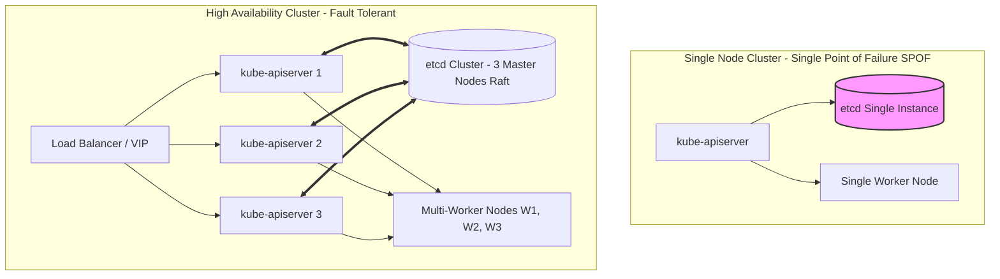
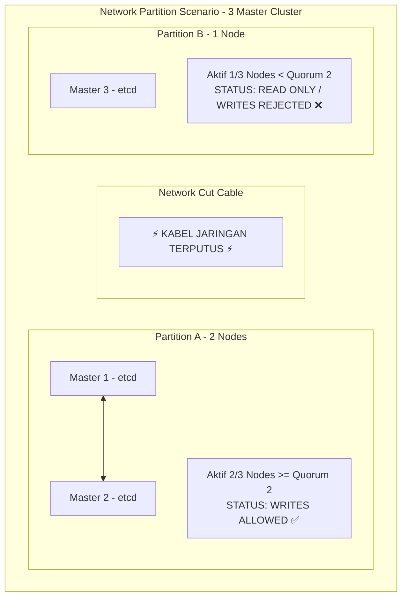
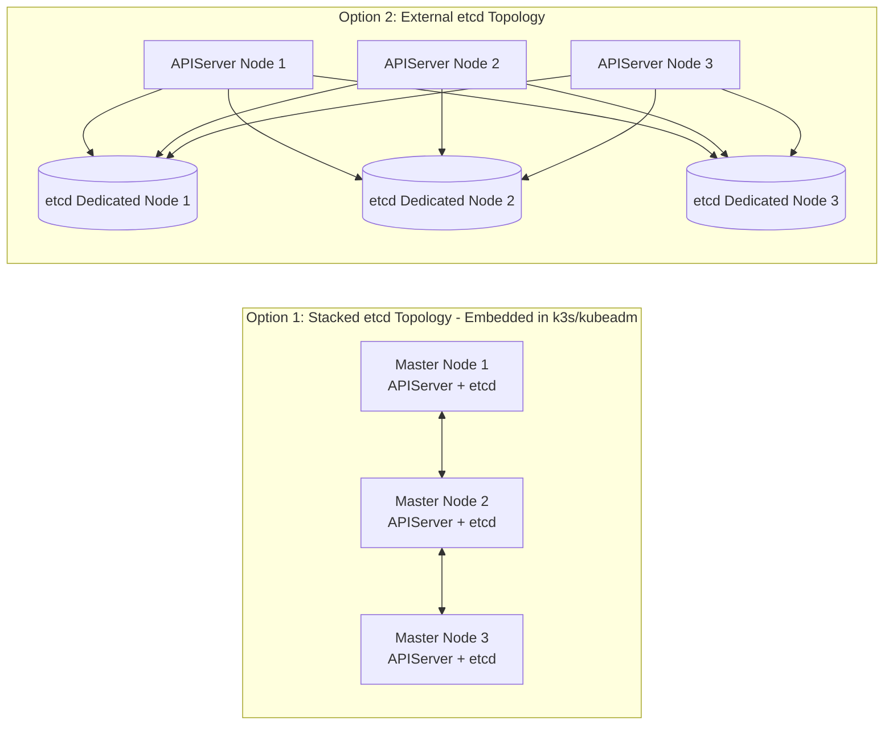

# Minggu 13 — Modul 01: High Availability (HA) Architecture & etcd Quorum Mathematics

## 🎯 Tujuan Pembelajaran
Setelah menyelesaikan modul ini, Anda akan mampu:
1. Memahami prinsip dasar **High Availability (HA)** pada Kubernetes Control Plane dan Data Plane.
2. Menjelaskan mekanisme kerja **etcd Distributed Key-Value Store** berbasis **Raft Consensus Algorithm**.
3. Menghitung **Quorum etcd** ($Q = \lfloor N/2 \rfloor + 1$) dan memahami alasan matematis mengapa jumlah Master Node **harus ganjil** (3, 5, 7).
4. Menjelaskan ancaman **Split-Brain Syndrome** dan bagaimana etcd mencegah kecacatan data saat terjadi *Network Partition*.
5. Membandingkan arsitektur **Stacked etcd (Embedded)** vs **External etcd**.

---

## 🏛️ 1. Konsep Dasar High Availability (HA) pada Kubernetes

Sebuah cluster Kubernetes dikatakan **High Available (HA)** jika sistem tetap dapat melayani request read/write dan mempertahankan ketersediaan Pod aplikasi meskipun salah satu Node (*Master* atau *Worker*) mengalami kerusakan total (*Hardware Failure*, *Network Cut*, atau *Power Loss*).

### Komponen Kubernetes: Single Node vs High Availability

Dalam arsitektur Single Node (seperti yang kita gunakan pada Minggu 1-12), jika Node tersebut mati, seluruh komponen control plane (`kube-apiserver`, `etcd`, `kube-scheduler`, `kube-controller-manager`) runtuh. 

Dalam arsitektur HA, terdapat minimal **3 Master Node** yang saling terhubung dalam cluster konsensus.

---

## 🧮 2. etcd Consensus Engine & Matematika Quorum

`etcd` adalah otak dari Kubernetes. Semua state cluster (manifest Deployment, Pod IP, ConfigMap, Secret, Service Account) disimpan di dalam etcd secara terdistribusi. etcd menggunakan algoritma konsensus **Raft**.

### Algoritma Raft secara Sederhana:
1. **Leader Election**: Salah satu node etcd dipilih menjadi *Leader*, sedangkan node lainnya menjadi *Follower*. Semua request *write* wajib melalui *Leader*.
2. **Log Replication**: Ketika ada perubahan data (misal `kubectl apply`), Leader menulis log draft dan mengirimkan perubahan tersebut ke seluruh Follower.
3. **Commit**: Jika mayoritas node (**Quorum**) mengonfirmasi bahwa mereka telah menerima data tersebut, Leader menyatakan data resmi *Committed* (tersimpan permanen).

---

### Rumus Quorum etcd

**Quorum** adalah jumlah minimum node etcd yang HARUS aktif dan saling berkomunikasi agar cluster etcd diizinkan menerima operasi *Write* / modifikasi data.

$$\text{Quorum (Q)} = \left\lfloor \frac{N}{2} \right\rfloor + 1$$

Di mana:
- $N$ = Total jumlah node etcd dalam cluster.
- $\lfloor \dots \rfloor$ = Pembulatan ke bawah (*floor*).

$$\text{Toleransi Kegagalan (Fault Tolerance)} = N - Q$$

---

### Tabel Perhitungan Quorum & Toleransi Kegagalan Node

| Jumlah Node ($N$) | Formula Quorum ($Q = \lfloor N/2 \rfloor + 1$) | Minimum Node Wajib Aktif ($Q$) | Maksimum Node Boleh Mati ($N - Q$) | Efisiensi & Rekomendasi SRE |
| :---: | :---: | :---: | :---: | :--- |
| **1** | $\lfloor 1/2 \rfloor + 1 = 0 + 1$ | **1** | **0** | ❌ **SPOF** (Mati 1 = Cluster Outage Total) |
| **2** | $\lfloor 2/2 \rfloor + 1 = 1 + 1$ | **2** | **0** | ❌ **Sangat Buruk!** (Mati 1 = Cluster Outage) |
| **3** | $\lfloor 3/2 \rfloor + 1 = 1 + 1$ | **2** | **1** | ✅ **Rekomendasi Standar HA Minimum** |
| **4** | $\lfloor 4/2 \rfloor + 1 = 2 + 1$ | **3** | **1** | ❌ **Pemborosan!** (Toleransi sama dengan 3 node) |
| **5** | $\lfloor 5/2 \rfloor + 1 = 2 + 1$ | **3** | **2** | ✅ **Rekomendasi Enterprise High Load** |
| **7** | $\lfloor 7/2 \rfloor + 1 = 3 + 1$ | **4** | **3** | ⚠️ Digunakan hanya untuk cluster sangat besar |

---

### Mengapa Jumlah Master Node Harus GANJIL (3, 5, 7)?

Perhatikan perbandingan antara **3 Node** dan **4 Node**:
- Pada **3 Node**, Quorum adalah 2. Jika 1 node mati, masih ada 2 node aktif ($2 \ge 2$), cluster **tetap berjalan**.
- Pada **4 Node**, Quorum adalah 3. Jika 1 node mati, masih ada 3 node aktif ($3 \ge 3$), cluster berjalan. **NAMUN**, jika terjadi *Network Partition* (terputus 2 node di kiri, 2 node di kanan), kedua belah pihak hanya memiliki 2 node aktif ($2 < 3$). Keduanya **GAGAL** mencapai Quorum, sehingga cluster MATI TOTAL!

> 💡 **Prinsip SRE**: Menambahkan node ke-4 TIDAK menambah toleransi kegagalan (sama-sama hanya boleh mati 1 node), tetapi justru meningkatkan risiko hilangnya Quorum saat isolasi jaringan! Oleh karena itu, selalu gunakan jumlah node **ganjil** (3 atau 5).

---

## ⚡ 3. Fenomena Split-Brain Syndrome & Pencegahannya

**Split-Brain** terjadi ketika koneksi jaringan antara node etcd terputus di tengah, membagi cluster menjadi dua kubu terisolasi (Partition A dan Partition B).

### Bagaimana etcd Mencegah Split-Brain?
1. **Partition A (2 Node)**: Memenuhi syarat Quorum ($2 \ge 2$). Partition A menunjuk Leader baru dan **diizinkan** terus menerima perintah `kubectl apply/delete`.
2. **Partition B (1 Node)**: Tidak memenuhi syarat Quorum ($1 < 2$). etcd pada Partition B secara otomatis menolak semua permintaan penulisan (`read-only` atau error `etcdserver: no leader`).
3. **Penyatuan Kembali (Reconciliation)**: Saat jaringan pulih, Partition B akan menyinkronkan data terbaru dari Leader di Partition A secara otomatis.

---

## 🏗️ 4. Opsi Arsitektur Control Plane: Stacked vs External etcd

Terdapat dua pola penyebaran etcd pada Kubernetes Production:

### Perbandingan Stacked vs External etcd

| Fitur | Stacked etcd (Embedded k3s/kubeadm) | External etcd Cluster |
| :--- | :--- | :--- |
| **Kemudahan Provisioning** | **Sangat Mudah** (k3s default dengan `--cluster-init`) | Kompleks (butuh pemeliharaan VM terpisah) |
| **Kebutuhan Hardware** | Hemat (Master Node & etcd berbagi resource) | Butuh 3 VM tambahan khusus etcd |
| **Isolasi Performa** | Beban APIServer dapat memengaruhi latency etcd | etcd mendapat IOPS disk dedicated |
| **Rekomendasi Usage** | **Default k3s**, Edge deployment, Lab & Medium Prod | Enterprise Large Scale (> 500 Node) |

---

## 📌 Checklist Validasi Modul 01
- [x] Memahami arsitektur Control Plane High Availability.
- [x] Mampu menghitung Quorum etcd menggunakan rumus $Q = \lfloor N/2 \rfloor + 1$.
- [x] Paham alasan matematis mengapa jumlah Master Node harus ganjil (3 atau 5).
- [x] Paham bagaimana mekanisme Raft mencegah krisis *Split-Brain Syndrome*.
- [x] Mengetahui perbedaan arsitektur Stacked etcd vs External etcd.
