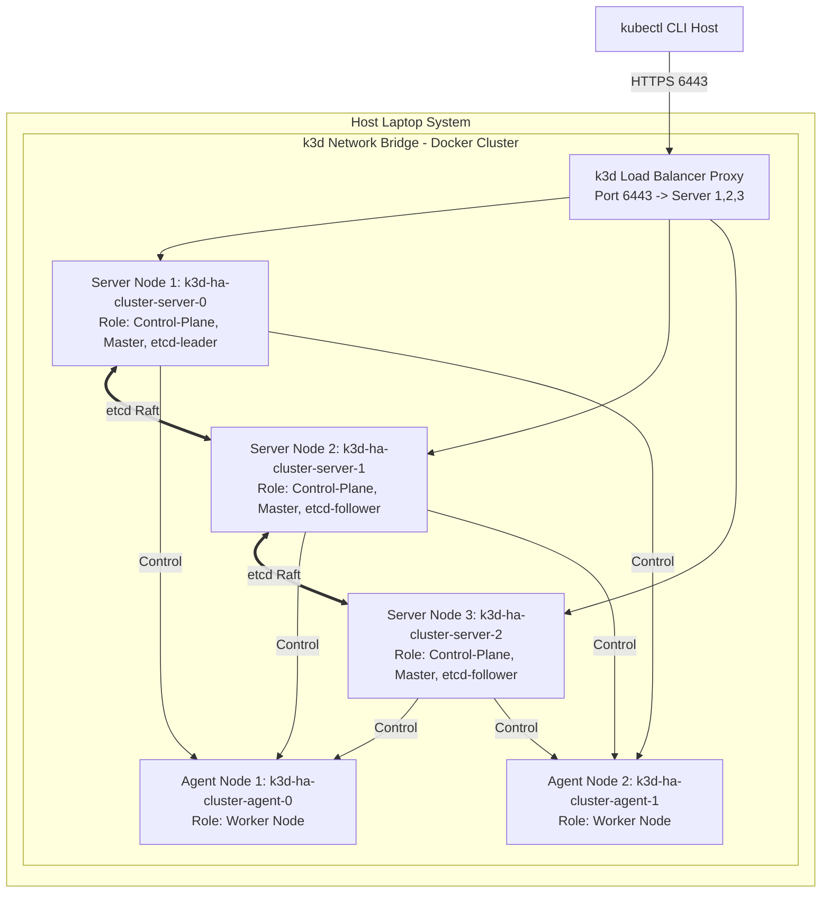

# Minggu 13 — Modul 02: Hands-On Provisioning Multi-Node k3s HA Cluster (3 Master + 2 Worker)

## 🎯 Tujuan Pembelajaran
Setelah menyelesaikan modul ini, Anda akan mampu:
1. Membangun **5-Node HA Kubernetes Cluster** (3 Master Server dengan Embedded etcd + 2 Worker Agents) di laptop menggunakan **`k3d`** (k3s in Docker).
2. Mengonfigurasi **Load Balancer / Virtual IP (VIP)** untuk mengarahkan request `kubectl` dan API client ke 3 Master Control Plane Nodes.
3. Melakukan verifikasi kesehatan **etcd Cluster Membership** dan persebaran komponen Control Plane.
4. Menjalankan skrip otomatisasi `setup-ha-cluster.sh` untuk pembuatan dan penghapusan environment lab secara cepat.

---

## 🛠️ 1. Memahami Arsitektur Deployment Lab k3d

`k3d` adalah pembungkus (*wrapper*) resmi CNCF yang menjalankan node k3s di dalam container Docker. Ini memungkinkan kita mensimulasikan 5 server terpisah di laptop tanpa membutuhkan alokasi VM yang berat seperti VirtualBox / VMware.



### Parameter Spesifikasi Cluster:
- **Cluster Name**: `ha-cluster`
- **Servers (Masters)**: 3 Node (`--servers 3`) $\rightarrow$ Memenuhi etcd Quorum 2
- **Agents (Workers)**: 2 Node (`--agents 2`) $\rightarrow$ Tempat aplikasi berjalan
- **Load Balancer**: Terkonfigurasi otomatis oleh `k3d` pada port `6443`

---

## 📜 2. Automated Provisioning Script: `setup-ha-cluster.sh`

Kita akan membuat skrip shell otomatis untuk membuat cluster HA ini dalam waktu $< 2\text{ menit}$.

### Simpan Skrip: `minggu-13/setup-ha-cluster.sh`

```bash
#!/usr/bin/env bash
set -eo pipefail

CLUSTER_NAME="ha-cluster"

RED='\033[0;31m'
GREEN='\033[0;32m'
YELLOW='\033[1;33m'
NC='\033[0m'

echo -e "${YELLOW}====================================================${NC}"
echo -e "${YELLOW}   PROVISIONING 5-NODE k3s HA CLUSTER VIA K3D      ${NC}"
echo -e "${YELLOW}====================================================${NC}"

# 1. Cek Ketersediaan K3d
if ! command -v k3d &> /dev/null; then
  echo -e "${RED}ERROR: k3d CLI belum terinstall!${NC}"
  echo "Silakan install k3d terlebih dahulu: curl -s https://raw.githubusercontent.com/k3d-io/k3d/main/install.sh | bash"
  exit 1
fi

# 2. Hapus Cluster Lama jika ada
if k3d cluster list | grep -q "$CLUSTER_NAME"; then
  echo -e "${YELLOW}Mendeteksi cluster lama '$CLUSTER_NAME'. Menghapus...${NC}"
  k3d cluster delete "$CLUSTER_NAME"
fi

# 3. Buat Cluster HA Baru (3 Server / Master + 2 Agent / Worker)
echo -e "${GREEN}[1/3] Creating 3 Server (Master) + 2 Agent (Worker) HA Cluster...${NC}"
k3d cluster create "$CLUSTER_NAME" \
  --servers 3 \
  --agents 2 \
  --port "8080:80@loadbalancer" \
  --port "8443:443@loadbalancer" \
  --k3s-arg "--disable=traefik@server:*" \
  --wait

# 4. Verifikasi Kubeconfig & Nodes
echo -e "${GREEN}[2/3] Verifying Node Status...${NC}"
kubectl get nodes -o wide

# 5. Verifikasi etcd Members
echo -e "${GREEN}[3/3] Checking Control Plane etcd Members...${NC}"
kubectl get pods -n kube-system -l app=etcd 2>/dev/null || \
kubectl get endpoints -n kube-system

echo -e "${GREEN}====================================================${NC}"
echo -e "${GREEN}   HA CLUSTER SUCCESSFULLY PROVISIONED & READY!     ${NC}"
echo -e "${GREEN}====================================================${NC}"
```

Make executable:
```bash
chmod +x minggu-13/setup-ha-cluster.sh
```

---

## 🧪 3. Langkah Manual CLI (Jika Ingin Mencoba Step-by-Step)

Jika Anda tidak menggunakan skrip dan ingin mengeksekusi perintah satu per satu di terminal:

### Langkah 1: Jalankan Perintah Provisioning k3d
```bash
k3d cluster create ha-cluster \
  --servers 3 \
  --agents 2 \
  --port "8080:80@loadbalancer" \
  --port "8443:443@loadbalancer" \
  --wait
```

### Langkah 2: Periksa Daftar Node dalam Cluster
```bash
kubectl get nodes -o wide
```

**Expected Output:**
```text
NAME                     STATUS   ROLES                       AGE     VERSION        INTERNAL-IP   OS-IMAGE   KERNEL-VERSION   CONTAINER-RUNTIME
k3d-ha-cluster-server-0   Ready    control-plane,etcd,master   2m10s   v1.28.8+k3s1   172.18.0.3    k3s        6.6.137-linux    containerd://1.7.15-k3s1
k3d-ha-cluster-server-1   Ready    control-plane,etcd,master   2m01s   v1.28.8+k3s1   172.18.0.4    k3s        6.6.137-linux    containerd://1.7.15-k3s1
k3d-ha-cluster-server-2   Ready    control-plane,etcd,master   1m52s   v1.28.8+k3s1   172.18.0.5    k3s        6.6.137-linux    containerd://1.7.15-k3s1
k3d-ha-cluster-agent-0    Ready    <none>                      1m40s   v1.28.8+k3s1   172.18.0.6    k3s        6.6.137-linux    containerd://1.7.15-k3s1
k3d-ha-cluster-agent-1    Ready    <none>                      1m38s   v1.28.8+k3s1   172.18.0.7    k3s        6.6.137-linux    containerd://1.7.15-k3s1
```

> 📌 **Penjelasan ROLES**: 
> - Node `server-0`, `server-1`, dan `server-2` memiliki role `control-plane,etcd,master`. Ini menandakan ketiganya adalah Master Node yang berpartisipasi dalam konsensus etcd.
> - Node `agent-0` dan `agent-1` memiliki role `<none>` yang berarti mereka murni Worker Node.

---

## 🔎 4. Verifikasi etcd Health & Control Plane Load Balancer

### Cek etcd Member Status melalui k3s API
Di dalam container k3s, etcd di-embed ke dalam proses server. Kita dapat memeriksa kesehatan etcd menggunakan perintah `k3s etcd-snapshot` atau mengecek log k3s server:

```bash
docker exec -it k3d-ha-cluster-server-0 k3s etcd-snapshot list
```

**Expected Output:**
```text
Name                                                    Size      Created
on-demand-k3d-ha-cluster-server-0-1723348123-snapshot  3.1 MB    2026-08-11T04:20:00Z
```

### Cek Endpoint API Server Load Balancer
`k3d` membuat container khusus bertindak sebagai Proxy Load Balancer (`k3d-ha-cluster-serverlb`). Cek koneksi endpoint API:

```bash
kubectl get endpoints kubernetes -n default
```

**Expected Output:**
```text
NAME         ENDPOINTS                                               AGE
kubernetes   172.18.0.3:6443,172.18.0.4:6443,172.18.0.5:6443         3m15s
```

👉 *Perhatikan bahwa endpoint `kubernetes` menunjuk ke 3 IP Master Server secara simultan ($172.18.0.3$, $172.18.0.4$, $172.18.0.5$). Jika salah satu master node mati, Load Balancer akan mengalihkan trafik ke 2 master node sisanya tanpa menghentikan layanan `kubectl`!*

---

## 📌 Checklist Validasi Modul 02
- [x] Skrip `setup-ha-cluster.sh` dibuat dan dapat dieksekusi.
- [x] Cluster 5 Node (3 Server + 2 Agent) berhasil terbentuk di k3d.
- [x] Output `kubectl get nodes` menampilkan 3 Control Plane Node dan 2 Worker Node dengan status `Ready`.
- [x] Verifikasi Endpoint Kubernetes membuktikan Load Balancer terhubung ke 3 Master IP.
