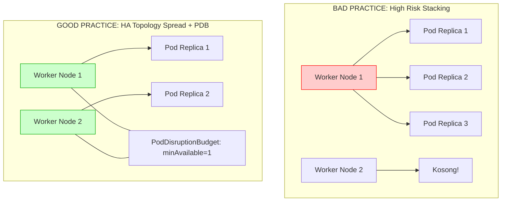

# Minggu 13 — Modul 03: Workload High Availability (PDB, Pod Anti-Affinity & Topology Spread)

## 🎯 Tujuan Pembelajaran
Setelah menyelesaikan modul ini, Anda akan mampu:
1. Menjelaskan perbedaan **Voluntary Disruption** (misal `kubectl drain`, upgrade OS node) dan **Involuntary Disruption** (misal hardware crash, kernel panic).
2. Merancang **PodDisruptionBudget (PDB)** menggunakan `minAvailable` atau `maxUnavailable` untuk menjaga ketersediaan aplikasi saat maintenance node.
3. Mengonfigurasi **Pod Anti-Affinity** agar replica Pod tidak menumpuk di satu node yang sama.
4. Mengonfigurasi **Topology Spread Constraints** (`maxSkew: 1`) untuk meratakan penempatan Pod secara adil di seluruh ketersediaan zona/node.
5. Menguji efektivitas penempatan Pod di cluster multi-node.

---

## 💡 1. Mengapa Multi-Replica Saja TIDAK CUKUP untuk High Availability?

Banyak pemula DevOps beranggapan bahwa cukup menentukan `replicas: 3` pada Deployment, maka aplikasi otomatis aman dari Downtime. Ini adalah kekeliruan fatal!

### Masalah Tanpa Anti-Affinity & PDB:
1. **Node Stacking Anti-Pattern**: Tanpa aturan afinitas, Kubernetes Scheduler dapat menempatkan **seluruh 3 replica Pod di Node Agent 1**. Jika Agent 1 mati, ketiga Pod hancur bersamaan (Downtime Total!).
2. **Uncontrolled Eviction**: Saat SRE melakukan `kubectl drain` pada Agent 1, Kubernetes bisa mematikan 3 Pod sekaligus secara serentak jika tidak dipagari oleh **PodDisruptionBudget**.



---

## 📜 2. Tiga Pilar Utama Workload HA di Kubernetes

### Pilar 1: PodDisruptionBudget (PDB)
PDB menentukan batas minimum Pod yang **wajib tetap hidup** selama proses *Voluntary Disruption* (`kubectl drain`, eviksi node, upgrade cluster).

Terdapat 2 opsi penulisan PDB:
- `minAvailable: 1` (atau `minAvailable: 50%`): Minimal 1 Pod harus tetap berjalan sehat.
- `maxUnavailable: 1` (atau `maxUnavailable: 25%`): Maksimal 1 Pod yang boleh dimatikan dalam satu waktu.

---

### Pilar 2: Pod Anti-Affinity
Aturan scheduler untuk melarang Pod sejenis berada di node yang sama.

Terdapat 2 tingkat ketegasan (*strictness*):
1. **Hard Anti-Affinity** (`requiredDuringSchedulingIgnoredDuringExecution`):
   Scheduler **DILARANG HARUS** menempatkan Pod di node yang sudah memiliki Pod sejenis. Jika jumlah node kurang dari replica Pod, Pod sisa akan `Pending`.
2. **Soft Anti-Affinity** (`preferredDuringSchedulingIgnoredDuringExecution`):
   Scheduler akan **SEBISA MUNGKIN** memisahkan Pod. Jika node tidak cukup, Pod boleh menumpuk di node yang sama (*best-effort*).

---

### Pilar 3: Topology Spread Constraints
Fitur modern Kubernetes untuk membagikan Pod secara merata (*balanced distribution*) berdasarkan label tertentu (seperti `kubernetes.io/hostname` atau `topology.kubernetes.io/zone`).

Parameter Utama:
- `maxSkew: 1`: Selisih jumlah Pod maksimum antar-node adalah 1.
- `topologyKey: kubernetes.io/hostname`: Pembagian dilakukan per-node.
- `whenUnsatisfiable: DoNotSchedule` (Strict) atau `ScheduleAnyway` (Flexible).

---

## 📄 3. Manifest Lengkap Workload HA: `03-ha-workload-pdb.yaml`

Berikut adalah manifest Deployment Go API yang sudah mengintegrasikan **PDB**, **Pod Anti-Affinity**, dan **Topology Spread Constraints**.

### File Manifest: `minggu-13/manifests/03-ha-workload-pdb.yaml`

```yaml
apiVersion: policy/v1
kind: PodDisruptionBudget
metadata:
  name: go-app-pdb
  namespace: prod-app
spec:
  minAvailable: 1
  selector:
    matchLabels:
      app: go-app-ha
---
apiVersion: apps/v1
kind: Deployment
metadata:
  name: go-app-ha
  namespace: prod-app
  labels:
    app: go-app-ha
spec:
  replicas: 4
  selector:
    matchLabels:
      app: go-app-ha
  template:
    metadata:
      labels:
        app: go-app-ha
    spec:
      # 1. Topology Spread Constraints (Rata per Node)
      topologySpreadConstraints:
        - maxSkew: 1
          topologyKey: kubernetes.io/hostname
          whenUnsatisfiable: ScheduleAnyway
          labelSelector:
            matchLabels:
              app: go-app-ha

      # 2. Pod Anti-Affinity (Hindari penumpukan di node sama)
      affinity:
        podAntiAffinity:
          preferredDuringSchedulingIgnoredDuringExecution:
            - weight: 100
              podAffinityTerm:
                labelSelector:
                  matchExpressions:
                    - key: app
                      operator: In
                      values:
                        - go-app-ha
                topologyKey: kubernetes.io/hostname

      containers:
        - name: go-app
          image: nginx:1.25-alpine # Menggunakan nginx alpine sebagai simulasi web service ringan
          ports:
            - containerPort: 80
          resources:
            requests:
              cpu: 50m
              memory: 64Mi
            limits:
              cpu: 100m
              memory: 128Mi
          readinessProbe:
            httpGet:
              path: /
              port: 80
            initialDelaySeconds: 3
            periodSeconds: 5
```

---

## 🧪 4. Langkah Praktis Pengujian & Verifikasi Workload HA

### Langkah 1: Buat Namespace `prod-app` & Apply Manifest HA
```bash
kubectl create namespace prod-app --dry-run=client -o yaml | kubectl apply -f -
kubectl apply -f minggu-13/manifests/03-ha-workload-pdb.yaml
```

### Langkah 2: Periksa Status PodDisruptionBudget (PDB)
```bash
kubectl get pdb -n prod-app
```

**Expected Output:**
```text
NAME         MIN AVAILABLE   MAX UNAVAILABLE   ALLOWED DISRUPTIONS   AGE
go-app-pdb   1               N/A               3                     45s
```

👉 *Penjelasan*: `ALLOWED DISRUPTIONS: 3` berarti karena kita memiliki 4 replica Pod dan `minAvailable: 1`, Kubernetes memperbolehkan maksimal 3 Pod dimatikan secara bersamaan saat maintenance node.

### Langkah 3: Periksa Persebaran Pod di Antar Node
```bash
kubectl get pods -n prod-app -o wide
```

**Expected Output:**
```text
NAME                         READY   STATUS    RESTARTS   AGE   IP           NODE                     NOMINATED NODE
go-app-ha-676b6d5c64-4x8z9   1/1     Running   0          1m    10.42.3.11   k3d-ha-cluster-agent-0   <none>
go-app-ha-676b6d5c64-7m2pl   1/1     Running   0          1m    10.42.4.12   k3d-ha-cluster-agent-1   <none>
go-app-ha-676b6d5c64-8n9ab   1/1     Running   0          1m    10.42.3.15   k3d-ha-cluster-agent-0   <none>
go-app-ha-676b6d5c64-9z1q2   1/1     Running   0          1m    10.42.4.18   k3d-ha-cluster-agent-1   <none>
```

👉 *Perhatikan*: Pod terbagi secara seimbang **2 Pod di `agent-0`** dan **2 Pod di `agent-1`**. Hal ini membuktikan bahwa `topologySpreadConstraints` dan `podAntiAffinity` telah bekerja dengan sempurna!

---

## 📌 Checklist Validasi Modul 03
- [x] Memahami perbedaan *Voluntary Disruption* (drain/upgrade) dan *Involuntary Disruption* (crash).
- [x] Manifest `03-ha-workload-pdb.yaml` ter-apply dengan sukses di namespace `prod-app`.
- [x] Status `kubectl get pdb` mengonfirmasi `ALLOWED DISRUPTIONS > 0`.
- [x] Perintah `kubectl get pods -o wide` membuktikan Pod tersebar merata di seluruh Worker Node.
