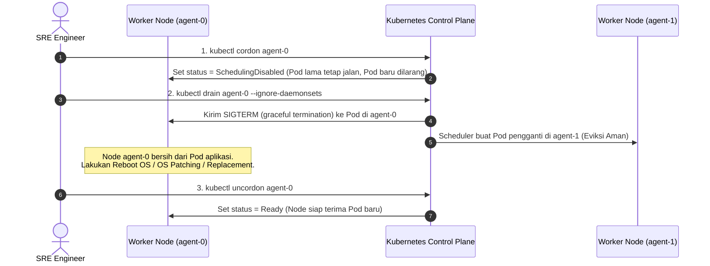
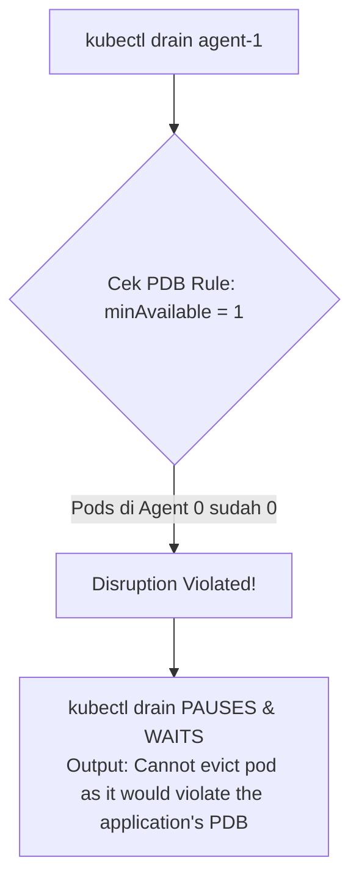

# Minggu 13 — Modul 04: Safe Node Maintenance Operations (`cordon`, `uncordon` & `drain`)

## 🎯 Tujuan Pembelajaran
Setelah menyelesaikan modul ini, Anda akan mampu:
1. Memahami alur kerja pemeliharaan fisik node (*Node OS Patching*, *Kernel Upgrade*, atau *Hardware Replacement*) tanpa menghentikan ketersediaan aplikasi.
2. Menggunakan perintah **`kubectl cordon`** untuk menandai node sebagai `SchedulingDisabled`.
3. Menggunakan perintah **`kubectl drain`** beserta opsi wajib (`--ignore-daemonsets`, `--delete-emptydir-data`) untuk mengevakuasi Pod secara aman.
4. Mengamati bagaimana **PodDisruptionBudget (PDB)** menahan dan melindungi Pod agar tidak terjadi eviksi serentak yang merusak layanan.
5. Memulihkan status node menggunakan **`kubectl uncordon`**.

---

## 🛠️ 1. Konsep Tiga Perintah Pemeliharaan Node

Ketika sebuah server fisik/VM perlu di-reboot atau diganti komponennya, SRE **TIDAK BOLEH** langsung mematikan server tersebut secara mendadak. Kita wajib mengikuti alur evakuasi bertahap berikut:



---

## 📜 2. Perbedaan Cordon vs Drain

| Fitur / Perintah | `kubectl cordon` | `kubectl drain` | `kubectl uncordon` |
| :--- | :--- | :--- | :--- |
| **Fungsi Utama** | Menandai node agar tidak menerima Pod baru | Menandai node AND mengevakuasi seluruh Pod yang ada | Mengembalikan node agar siap menerima Pod baru |
| **Nasib Pod Lama** | **Tetap berjalan** seperti biasa | **Dieviksi (dimatikan)** dan dipindahkan ke node lain | Tetap berjalan (Pod baru bisa mulai dijadwalkan) |
| **Status Node di `get nodes`** | `Ready,SchedulingDisabled` | `Ready,SchedulingDisabled` | `Ready` |
| **Kasus Penggunaan** | Persiapan pemeliharaan mendadak | Eksekusi reboot / pemeliharaan node | Selesai maintenance / node sudah sehat |

---

## 🧪 3. Hands-On Lab: Eksekusi Evakuasi Node Tanpa Downtime

### Langkah 1: Cek Kondisi Awal Pod di `prod-app`
```bash
kubectl get pods -n prod-app -o wide
```

**Expected Output:**
```text
NAME                         READY   STATUS    RESTARTS   AGE   NODE
go-app-ha-676b6d5c64-4x8z9   1/1     Running   0          5m    k3d-ha-cluster-agent-0
go-app-ha-676b6d5c64-7m2pl   1/1     Running   0          5m    k3d-ha-cluster-agent-1
go-app-ha-676b6d5c64-8n9ab   1/1     Running   0          5m    k3d-ha-cluster-agent-0
go-app-ha-676b6d5c64-9z1q2   1/1     Running   0          5m    k3d-ha-cluster-agent-1
```

---

### Langkah 2: Eksekusi `kubectl cordon` pada `k3d-ha-cluster-agent-0`
```bash
kubectl cordon k3d-ha-cluster-agent-0
kubectl get nodes
```

**Expected Output:**
```text
NAME                     STATUS                   ROLES                       AGE
k3d-ha-cluster-server-0   Ready                    control-plane,etcd,master   15m
k3d-ha-cluster-server-1   Ready                    control-plane,etcd,master   15m
k3d-ha-cluster-server-2   Ready                    control-plane,etcd,master   15m
k3d-ha-cluster-agent-0    Ready,SchedulingDisabled <none>                      14m
k3d-ha-cluster-agent-1    Ready                    <none>                      14m
```

> 📌 **Pengamatan**: Status `agent-0` kini menjadi `Ready,SchedulingDisabled`. Jika ada Deployment baru di-apply, tidak ada Pod baru yang ditempatkan di `agent-0`. Namun, 2 Pod lama di `agent-0` **masih tetap hidup**.

---

### Langkah 3: Eksekusi `kubectl drain` pada `k3d-ha-cluster-agent-0`
Jalankan evakuasi Pod dengan menyertakan flag wajib `--ignore-daemonsets` dan `--delete-emptydir-data`:

```bash
kubectl drain k3d-ha-cluster-agent-0 --ignore-daemonsets --delete-emptydir-data
```

**Expected Output Log:**
```text
node/k3d-ha-cluster-agent-0 cordoned
evicting pod prod-app/go-app-ha-676b6d5c64-4x8z9
evicting pod prod-app/go-app-ha-676b6d5c64-8n9ab
pod/go-app-ha-676b6d5c64-4x8z9 evicted
pod/go-app-ha-676b6d5c64-8n9ab evicted
node/k3d-ha-cluster-agent-0 drained
```

---

### Langkah 4: Verifikasi Rescheduling Pod ke Node Sehat
Periksa lokasi Pod sekarang:

```bash
kubectl get pods -n prod-app -o wide
```

**Expected Output:**
```text
NAME                         READY   STATUS    RESTARTS   AGE   NODE
go-app-ha-676b6d5c64-7m2pl   1/1     Running   0          8m    k3d-ha-cluster-agent-1
go-app-ha-676b6d5c64-9z1q2   1/1     Running   0          8m    k3d-ha-cluster-agent-1
go-app-ha-676b6d5c64-x1y2z   1/1     Running   0          25s   k3d-ha-cluster-agent-1
go-app-ha-676b6d5c64-w9v8u   1/1     Running   0          25s   k3d-ha-cluster-agent-1
```

👉 *Hasil*: Seluruh 4 replica Pod secara otomatis bermigrasi dan berjalan aman di `k3d-ha-cluster-agent-1` tanpa mengalami kerugian ketersediaan (*Zero Downtime*) karena dilindungi oleh PDB!

---

### Langkah 5: Pemulihan Node via `kubectl uncordon`
Setelah proses maintenance atau patching pada `agent-0` selesai, kembalikan status node agar dapat menerima Pod kembali:

```bash
kubectl uncordon k3d-ha-cluster-agent-0
kubectl get nodes
```

**Expected Output:**
```text
node/k3d-ha-cluster-agent-0 uncordoned
```

---

## ⚡ 4. Interaksi Antara `kubectl drain` dan PDB

Apa yang terjadi jika Anda mencoba men-drain **SELURUH** Worker Node secara bersamaan?



Jika Anda mengeksekusi `kubectl drain` yang berpotensi melanggar PDB (membuat Pod sehat $< 1$), perintah `drain` akan **TERTAHAN (PAUSE)** secara otomatis dan memunculkan peringatan:

```text
error when evicting pod "go-app-ha-xxx": Cannot evict pod as it would violate the application's PDB.
```

Ini memvalidasi bahwa PDB bertindak sebagai **Sabuk Pengaman (Safety Net)** yang mencegah kecerobohan SRE dalam men-drain terlalu banyak node sekaligus.

---

## 📌 Checklist Validasi Modul 04
- [x] Memahami perbedaan dan alur `cordon` $\rightarrow$ `drain` $\rightarrow$ `uncordon`.
- [x] Perintah `kubectl cordon` berhasil mengubah status node menjadi `SchedulingDisabled`.
- [x] Perintah `kubectl drain` dengan `--ignore-daemonsets` berhasil memindahkan seluruh Pod ke node yang sehat.
- [x] Terbukti bahwa PDB melindungi Pod dari kecelakaan eviksi masif.
- [x] Perintah `kubectl uncordon` mengembalikan status node menjadi `Ready`.
