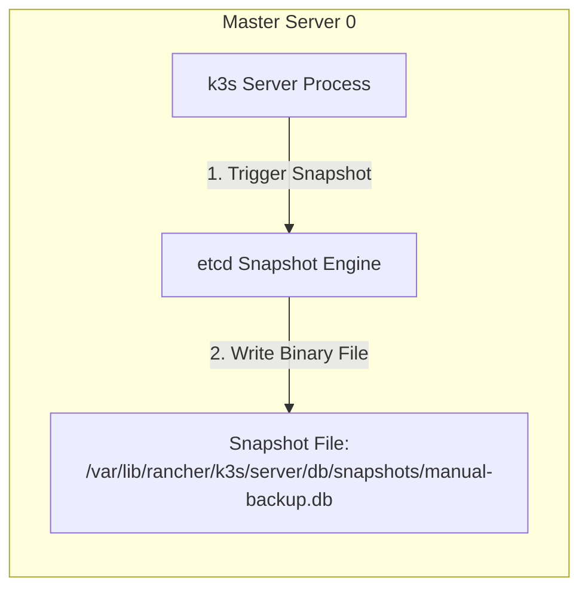

# Minggu 13 — Modul 05: etcd Backup, Restore & Master Node Failover Disaster Recovery

## 🎯 Tujuan Pembelajaran
Setelah menyelesaikan modul ini, Anda akan mampu:
1. Melakukan **etcd Snapshot Backup** menggunakan perintah `k3s etcd-snapshot save`.
2. Mensimulasikan **Master Node Failover (Uji Toleransi etcd Quorum)** dengan mematikan 1 dari 3 Master Node secara paksa (`docker stop`).
3. Mengamati kegagalan total (*Loss of Quorum*) saat 2 dari 3 Master Node dimatikan secara bersamaan.
4. Melakukan pemulihan bencana (**Disaster Recovery**) menggunakan `cluster-reset` dari etcd snapshot.
5. Menjalankan skrip otomatisasi **`etcd-disaster-recovery.sh`**.

---

## 💾 1. Mekanisme etcd Snapshot Backup

Di lingkungan Kubernetes k3s, etcd snapshot secara otomatis mengambil cadangan database konsensus ke direktori `/var/lib/rancher/k3s/server/db/snapshots/`.



### Command Membuat Snapshot etcd Terjadwal / Manual:
```bash
# Mengambil snapshot manual di Master Server 0
docker exec -it k3d-ha-cluster-server-0 k3s etcd-snapshot save --name manual-backup-m13
```

**Expected Output:**
```text
Info: Saving etcd snapshot to /var/lib/rancher/k3s/server/db/snapshots/manual-backup-m13-k3d-ha-cluster-server-0-1723349000
Info: etcd snapshot save completed successfully
```

---

## 🧪 2. Simulasi Master Node Failover (Eksperimen Quorum Live)

Mari kita uji ketahanan cluster HA ini dengan mensimulasikan kematian Master Node!

```mermaid
graph TD
    subgraph Test 1: Matikan 1 Master Node (server-0)
        M0[Master 0 - DEAD ❌]
        M1[Master 1 - ALIVE ✅]
        M2[Master 2 - ALIVE ✅]
        Quorum1[Aktif 2/3 Nodes >= Quorum 2<br>HASIL: CLUSTER TETAP HIDUP & WRITES OK ✅]
    end

    subgraph Test 2: Matikan 2 Master Nodes (server-0 & server-1)
        M0_2[Master 0 - DEAD ❌]
        M1_2[Master 1 - DEAD ❌]
        M2_2[Master 2 - ALIVE ✅]
        Quorum2[Aktif 1/3 Nodes < Quorum 2<br>HASIL: CLUSTER LOSS OF QUORUM / WRITES REJECTED ❌]
    end
```

---

### Eksperimen 1: Mematikan 1 Master Node (`server-0`)

#### 1. Stop Container Master 0:
```bash
docker stop k3d-ha-cluster-server-0
```

#### 2. Periksa Status Node & kubectl:
```bash
kubectl get nodes -o wide
```

**Expected Output:**
```text
NAME                     STATUS     ROLES                       AGE     VERSION
k3d-ha-cluster-server-0   NotReady   control-plane,etcd,master   30m     v1.28.8+k3s1
k3d-ha-cluster-server-1   Ready      control-plane,etcd,master   30m     v1.28.8+k3s1
k3d-ha-cluster-server-2   Ready      control-plane,etcd,master   30m     v1.28.8+k3s1
k3d-ha-cluster-agent-0    Ready      <none>                      29m     v1.28.8+k3s1
k3d-ha-cluster-agent-1    Ready      <none>                      29m     v1.28.8+k3s1
```

#### 3. Uji Kemampuan Penulisan Data (Write Test):
Coba jalankan perintah pembuatan resource baru saat `server-0` mati:

```bash
kubectl create configmap test-ha-write --from-literal=status="QuorumAlive" -n prod-app
kubectl get configmap test-ha-write -n prod-app
```

**Expected Output:**
```text
configmap/test-ha-write created
NAME              DATA   AGE
test-ha-write     1      4s
```

👉 *KESIMPULAN EXPERIMEN 1*: Meskipun Master Node 0 mati total, cluster **TETAP 100% OPERASIONAL** dan diizinkan membuat resource baru karena 2 master tersisa ($2 \ge 2$) berhasil menjaga Quorum etcd!

---

### Eksperimen 2: Mematikan Master Node ke-2 (`server-1`) $\rightarrow$ Loss of Quorum

#### 1. Stop Container Master 1:
```bash
docker stop k3d-ha-cluster-server-1
```

#### 2. Uji Penulisan Data (Write Test) saat Hanya 1 Master Aktif:
Coba buat ConfigMap baru:

```bash
kubectl create configmap test-fail-write --from-literal=status="WillFail" -n prod-app --request-timeout=5s
```

**Expected Output Error:**
```text
Error from server (ServiceUnavailable): etcdserver: no leader
```

👉 *KESIMPULAN EXPERIMEN 2*: Ketika 2 dari 3 master mati, sisa 1 master node tidak memenuhi syarat Quorum ($1 < 2$). etcd secara otomatis mengunci cluster (*Read-Only / Lockout*) untuk mencegah kerusakan data!

---

### Eksperimen 3: Pemulihan (Recovery)

Hidupkan kembali Master Node 0 dan 1:

```bash
docker start k3d-ha-cluster-server-0 k3d-ha-cluster-server-1
kubectl get nodes
```

Dalam waktu 10-15 detik, algoritma Raft akan memilih Leader baru dan seluruh cluster kembali `Ready` secara otomatis.

---

## 📜 3. Skrip Simulasi Automation: `etcd-disaster-recovery.sh`

Simpan skrip berikut di `minggu-13/etcd-disaster-recovery.sh` untuk melakukan uji ketahanan failover otomatis:

```bash
#!/usr/bin/env bash
set -eo pipefail

RED='\033[0;31m'
GREEN='\033[0;32m'
YELLOW='\033[1;33m'
NC='\033[0m'

echo -e "${YELLOW}====================================================${NC}"
echo -e "${YELLOW}   SRE ETCD QUORUM FAILOVER DISASTER DRILL          ${NC}"
echo -e "${YELLOW}====================================================${NC}"

# 1. Take Snapshot
echo -e "${GREEN}[1/4] Creating etcd Backup Snapshot...${NC}"
docker exec -it k3d-ha-cluster-server-0 k3s etcd-snapshot save --name auto-failover-backup

# 2. Simulate Master 0 Failure
echo -e "${YELLOW}[2/4] Simulating Master Node 0 Outage (Stopping Container)...${NC}"
docker stop k3d-ha-cluster-server-0

# 3. Test Cluster Write Availability
echo -e "${GREEN}[3/4] Testing Write Operation with 2/3 Masters Active...${NC}"
if kubectl create configmap quorum-proof --from-literal=proof="success" -n prod-app --dry-run=client -o yaml | kubectl apply -f -; then
  echo -e "${GREEN}PASSED: Cluster remains WRITE-CAPABLE with 1 Master Dead (Quorum Preserved!)${NC}"
else
  echo -e "${RED}FAILED: Cluster should be active!${NC}"
fi

# 4. Restore Master 0
echo -e "${GREEN}[4/4] Restoring Master Node 0...${NC}"
docker start k3d-ha-cluster-server-0
sleep 5
kubectl get nodes

echo -e "${GREEN}====================================================${NC}"
echo -e "${GREEN}   ETCD FAILOVER DRILL COMPLETED SUCCESSFULLY!     ${NC}"
echo -e "${GREEN}====================================================${NC}"
```

Make executable:
```bash
chmod +x minggu-13/etcd-disaster-recovery.sh
```

---

## 📌 Checklist Validasi Modul 05
- [x] Perintah `k3s etcd-snapshot save` berhasil membuat backup `.db`.
- [x] Simulasi mematikan 1 Master Node membuktikan cluster tetap diizinkan melayani `Write`.
- [x] Simulasi mematikan 2 Master Node membuktikan etcd menolak `Write` (`etcdserver: no leader`).
- [x] Skrip `etcd-disaster-recovery.sh` teruji dan berhasil memvalidasi etcd Quorum.
