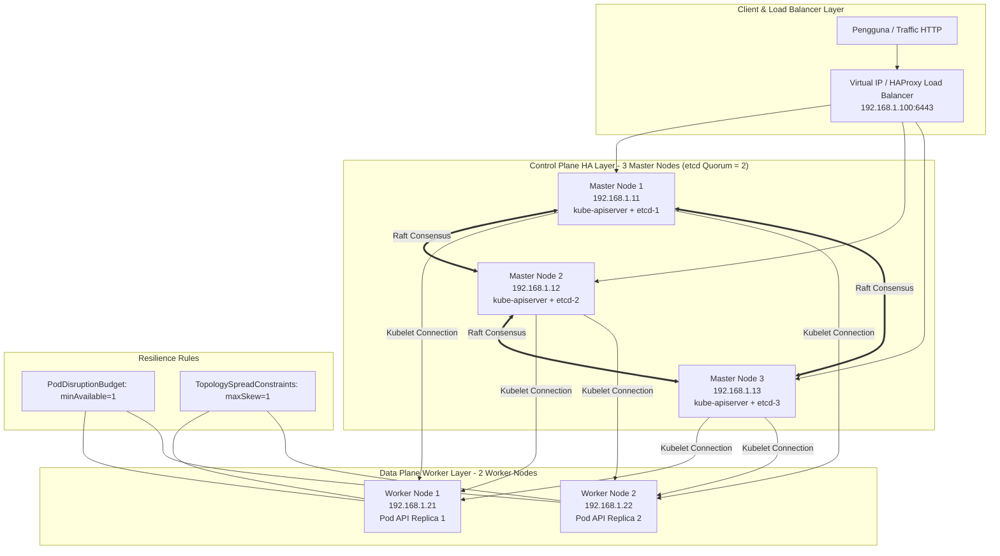
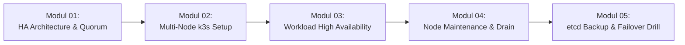

# Minggu 13 — High Availability (HA) Kubernetes Cluster & etcd Quorum Management

Selamat datang di **Minggu 13** dari Roadmap SRE Lanjutan! Setelah pada 12 minggu pertama Anda berhasil membangun *Single-Node Mini Production Platform* dan mensimulasikan insiden produksi, di modul ini Anda akan melangkah ke level profesional: **High Availability (HA) Infrastructure**.

---

## 🎯 Gambaran Umum & Tujuan Pembelajaran

Di lingkungan produksi nyata (*enterprise*), satu buah server (Node) dapat mengalami kegagalan kapan saja (*hardware crash*, mati listrik, gangguan jaringan, atau *maintenance OS*). Jika cluster Kubernetes hanya memiliki 1 Master Node atau Pod aplikasi hanya berjalan di 1 Node, seluruh layanan bisnis akan mengalami **Downtime Total**.

Pada modul Minggu 13 ini, Anda akan mempelajari bagaimana merancang, membangun, mengoperasikan, dan memulihkan cluster Kubernetes yang **High Available (HA)** tahan terhadap kegagalan hardware tanpa downtime (*Zero-Downtime Resilience*).

### Kompetensi Utama yang Akan Anda Kuasai:
1. **Teori & Konsep HA Cluster**: Memahami etcd Raft Distributed Consensus, perhitungan **Quorum** ($Q = \lfloor N/2 \rfloor + 1$), dan pencegahan **Split-Brain Syndrome**.
2. **Setup Multi-Node k3s/RKE2 Cluster & MetalLB**: Mengkonfigurasi 3 Master Node (Control Plane dengan Embedded etcd) + 2 Worker Node menggunakan `multipass` / `k3d` di laptop, serta mengonfigurasi **MetalLB** (Layer 2 IPAddressPool) untuk pengalokasian IP LoadBalancer On-Premise.
3. **Workload Resilience & Anti-Affinity**: Menerapkan **PodDisruptionBudget (PDB)**, **Pod Anti-Affinity**, dan **Topology Spread Constraints** agar Pod tersebar merata di node yang berbeda.
4. **Operasi Node Maintenance**: Menguasai perintah `kubectl cordon`, `kubectl uncordon`, dan `kubectl drain` secara aman tanpa memicu *outage* pada aplikasi.
5. **Manajemen etcd Snapshot & Disaster Recovery**: Melakukan *backup/restore* etcd database dan mensimulasikan *Master Node Failover* (mematikan 1 Master Node dan menguji konsistensi Quorum).

---

## 🏗️ Peta Arsitektur High Availability (3 Master + 2 Worker)

Berikut adalah arsitektur fisik dan logis dari HA Cluster yang akan kita simulasikan:

---

## 🗺️ Panduan & Alur Belajar (Modul Navigation)

Untuk menguasai materi ini secara terstruktur, ikuti 5 modul praktis secara berurutan:

### Rincian Modul Pembelajaran:

| Modul | Judul Materi | Deskripsi & Fokus Utama | Artefak Hasil Lab |
| :---: | :--- | :--- | :--- |
| **`01-ha-architecture-quorum.md`** | High Availability Architecture & etcd Quorum | Memahami konsensus Raft, rumus Quorum ($N/2 + 1$), bahaya Split-Brain, dan perbandingan Single-Node vs Multi-Node. | Diagram Konsep & Rumus Quorum |
| **`02-multinode-k3s-setup.md`** | Multi-Node k3s HA Cluster Installation | Panduan step-by-step provisioning 3 Master + 2 Worker nodes menggunakan `k3d` multi-node container di laptop. | Script `setup-ha-cluster.sh` & Manifest |
| **`03-high-availability-workload.md`** | Workload Resilience (PDB & Anti-Affinity) | Konfigurasi PodDisruptionBudget (PDB), Pod Anti-Affinity, dan TopologySpreadConstraints pada Go API application. | Manifest `03-ha-workload-pdb.yaml` |
| **`04-node-maintenance-cordon-drain.md`** | Safe Node Maintenance (`cordon` & `drain`) | Prosedur OS patching / node maintenance tanpa downtime menggunakan `kubectl cordon`, `uncordon`, dan `drain`. | Log simulasi drain & bukti Pod migration |
| **`05-etcd-backup-restore-failover.md`** | etcd Snapshot, Disaster Recovery & Master Failover | Praktik *etcd snapshot save/restore*, simulasi mematikan 1 Master Node, dan menguji toleransi kesalahan Quorum. | Backup `.db` snapshot & Log Cluster Reset |

---

## 🛠️ Prasyarat (Prerequisites) Sebelum Memulai

Sebelum menjalankan lab pada Minggu 13, pastikan laptop Anda memenuhi persyaratan dasar berikut:

1. **Software Installed**:
   - `k3d` (v5.x+) atau `Docker Desktop` / `Rancher Desktop`. (Jika belum ada `k3d`, gunakan perintah install cepat: `curl -s https://raw.githubusercontent.com/k3d-io/k3d/main/install.sh | bash`).
   - `kubectl` CLI tool.
2. **Resource Laptop Minimal**:
   - RAM bebas: $\ge 4\text{ GB}$ (karena kita akan menjalankan 5 node ringan di dalam container Docker).
   - Storage bebas: $\ge 5\text{ GB}$.

---

## 📌 Rules & Tips Praktik Bagi IT Pemula

1. **Pahami Rumus Quorum (Ganjil)**: Selalu gunakan jumlah Master Node ganjil (3, 5, atau 7). Jangan gunakan 2 atau 4 master node karena tidak memberikan tambahan toleransi kesalahan (*Fault Tolerance*).
2. **Uji Destruktif dengan Aman**: Jangan ragu untuk mematikan node (*stop container*) pada Modul 05, karena cluster berjalan di dalam container `k3d` terisolasi di laptop Anda.
3. **Periksa PDB Sebelum Drain**: Sebelum mengeksekusi `kubectl drain`, pastikan jumlah Pod yang sehat melebihi `minAvailable` yang ditentukan di PDB.

---

## 🏆 Checklist Kelulusan Minggu 13
- [ ] Mampu menjelaskan rumus Quorum etcd dan mengapa jumlah Master Node harus ganjil.
- [ ] Cluster 3 Master + 2 Worker k3s berhasil berjalan di laptop dan terverifikasi `kubectl get nodes`.
- [ ] Manifest PDB dan Topology Spread Constraints diterapkan pada `go-app` deployment.
- [ ] Berhasil melakukan `kubectl drain` pada salah satu worker node tanpa terjadi HTTP Error 5xx pada aplikasi.
- [ ] Berhasil mengambil snapshot etcd dan mensimulasikan pemulihan saat 1 Master Node dimatikan secara paksa.
