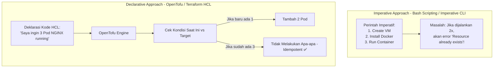
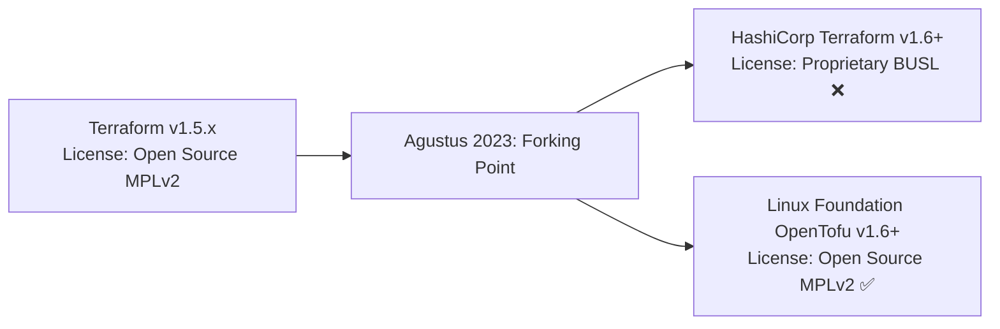
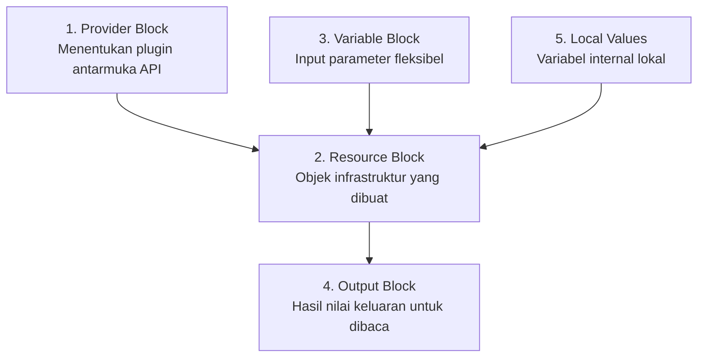

# Minggu 14 — Modul 01: Infrastructure as Code (IaC) Fundamentals & OpenTofu Basics

## 🎯 Tujuan Pembelajaran
Setelah menyelesaikan modul ini, Anda akan mampu:
1. Menjelaskan perbedaan paradigma **Declarative** (Menentukan HASIL AKHIR) vs **Imperative** (Menentukan LANGKAH-LANGKAH).
2. Memahami latar belakang sejarah perpisahan **OpenTofu** dan HashiCorp Terraform (Lisensi BUSL vs Open Source MPLv2).
3. Menguasai sintaksis **HCL (HashiCorp Configuration Language)**: Provider, Resource, Variable, Output, dan Local Values.
4. Menulis dan mengeksekusi siklus hidup OpenTofu: `tofu init` $\rightarrow$ `tofu fmt` $\rightarrow$ `tofu validate` $\rightarrow$ `tofu plan` $\rightarrow$ `tofu apply` $\rightarrow$ `tofu destroy`.

---

## 💡 1. Paradigma IaC: Declarative vs Imperative

Sebelum mempelajari tool IaC, penting untuk memahami dua pendekatan fundamental dalam mengotomatisasi infrastruktur:



### Perbandingan Declarative vs Imperative

| Parameter | Imperative (Imperatif) | Declarative (Deklaratif) |
| :--- | :--- | :--- |
| **Fokus Utama** | *Bagaimana* cara membuat (*HOW*) | *Apa* hasil akhir yang diinginkan (*WHAT*) |
| **Contoh Tool** | Bash script, Python script, AWS CLI commands | **OpenTofu**, Terraform, Kubernetes Manifest, CloudFormation |
| **Idempotensitas** | Sulit dicapai (butuh banyak pengkondisian `if-else`) | **Otomatis & Bawaan** (*Built-in Idempotency*) |
| **Pemeliharaan State** | Tidak mencatat status infrastruktur sebelumnya | Mencatat status dalam file **State File (`.tfstate`)** |

---

## 📜 2. Sejarah & Alasan Memilih OpenTofu Dibanding Terraform

Pada Agustus 2023, HashiCorp mengubah lisensi Terraform dari *Open Source* (MPLv2) menjadi *Business Source License* (BUSL v1.1) yang membatasi penggunaan komersial.

Sebagai tanggapan, Linux Foundation bersama komunitas open source global meluncurkan **OpenTofu** sebagai *fork* 100% open source, independen, dan kompatibel sepenuhnya dengan seluruh ekosistem Terraform (HCL, Providers, dan Modules).



> 💡 **Mengapa SRE Menggunakan OpenTofu?**  
> OpenTofu menjamin tidak ada jebakan lisensi vendor (*vendor lock-in*), sepenuhnya didukung oleh Linux Foundation, dan menggunakan sintaksis HCL yang persis sama dengan Terraform.

---

## 🏗️ 3. Komponen Utama Sintaksis HCL (HashiCorp Configuration Language)

Sebuah proyek OpenTofu terdiri dari blok-blok bangunan (*building blocks*) HCL berikut:



### 1. Provider Block
Provider adalah plugin yang memungkinkan OpenTofu berkomunikasi dengan API cloud provider (AWS, GCP, Azure), Kubernetes, Docker, atau SaaS.
```hcl
terraform {
  required_providers {
    docker = {
      source  = "kreuzwerker/docker"
      version = "~> 3.0.0"
    }
  }
}

provider "docker" {}
```

### 2. Resource Block
Resource mendefinisikan objek infrastruktur nyata yang ingin dibuat.
```hcl
resource "docker_image" "nginx" {
  name         = "nginx:1.25-alpine"
  keep_locally = false
}

resource "docker_container" "web_server" {
  image = docker_image.nginx.image_id
  name  = var.container_name
  ports {
    internal = 80
    external = var.external_port
  }
}
```

### 3. Variable & Output Block
```hcl
variable "container_name" {
  type        = string
  default     = "opentofu-web-lab"
  description = "Nama container web yang diprovisi"
}

variable "external_port" {
  type        = number
  default     = 8888
}

output "container_ip_address" {
  value       = docker_container.web_server.ipc_mode
  description = "Alamat IP container"
}

output "web_url" {
  value       = "http://localhost:${var.external_port}"
  description = "URL akses web server"
}
```

---

## 🧪 4. Hands-On Lab: Menulis & Mengaplikasikan Kode OpenTofu

Mari kita praktikan pembuatan infrastruktur web container menggunakan OpenTofu di dalam direktori `minggu-14/tofu/`!

### Langkah 1: Buat File `minggu-14/tofu/main.tf`
```hcl
terraform {
  required_version = ">= 1.6.0"
  required_providers {
    docker = {
      source  = "kreuzwerker/docker"
      version = "~> 3.0.0"
    }
  }
}

provider "docker" {}

variable "container_name" {
  type    = string
  default = "tofu-demo-nginx"
}

variable "host_port" {
  type    = number
  default = 8085
}

resource "docker_image" "nginx" {
  name         = "nginx:1.25-alpine"
  keep_locally = false
}

resource "docker_container" "nginx_app" {
  image = docker_image.nginx.image_id
  name  = var.container_name
  ports {
    internal = 80
    external = var.host_port
  }
}

output "app_url" {
  value = "http://localhost:${var.host_port}"
}
```

---

### Langkah 2: Eksekusi Siklus Hidup Command OpenTofu

#### A. Inisialisasi Project (`tofu init`)
Mengunduh plugin provider yang dibutuhkan dari registry:
```bash
cd minggu-14/tofu
tofu init
```

**Expected Output:**
```text
Initializing the backend...
Initializing provider plugins...
- Finding kreuzwerker/docker versions matching "~> 3.0.0"...
- Installing kreuzwerker/docker v3.0.2...
OpenTofu has been successfully initialized!
```

#### B. Format & Validasi Kode (`tofu fmt` & `tofu validate`)
```bash
tofu fmt       # Merapikan indentasi kode HCL secara otomatis
tofu validate  # Memeriksa sintaksis kode
```

**Expected Output:**
```text
Success! The configuration is valid.
```

#### C. Simulasi Rencana Eksekusi (`tofu plan`)
Melihat preview perubahan apa saja yang akan dilakukan **sebelum** diterapkan ke infrastruktur nyata:
```bash
tofu plan
```

**Expected Output:**
```text
OpenTofu used the selected providers to generate the following execution plan:

  # docker_container.nginx_app will be created
  + resource "docker_container" "nginx_app" {
      + name  = "tofu-demo-nginx"
      + ports {
          + external = 8085
          + internal = 80
        }
    }

Plan: 2 to add, 0 to change, 0 to destroy.
```

#### D. Penerapan Kode ke Infrastruktur (`tofu apply`)
```bash
tofu apply -auto-approve
```

**Expected Output:**
```text
docker_image.nginx: Creating...
docker_container.nginx_app: Creating...
docker_container.nginx_app: Creation complete after 2s [id=a1b2c3d4...]

Apply complete! Resources: 2 added, 0 changed, 0 destroyed.

Outputs:

app_url = "http://localhost:8085"
```

#### E. Verifikasi Web Server Aktif:
```bash
curl -I http://localhost:8085
```

**Expected Output:**
```text
HTTP/1.1 200 OK
Server: nginx/1.25.4
```

---

## 📌 Checklist Validasi Modul 01
- [x] Memahami perbedaan paradigma Declarative vs Imperative.
- [x] Memahami alasan kepindahan dari Terraform ke OpenTofu.
- [x] Berhasil menguasai blok bangunan HCL (Provider, Resource, Variable, Output).
- [x] Berhasil mengeksekusi urutan perintah `tofu init` $\rightarrow$ `fmt` $\rightarrow$ `validate` $\rightarrow$ `plan` $\rightarrow$ `apply`.
- [x] Web container NGINX berhasil berjalan dan terverifikasi via `curl`.
