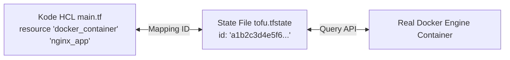
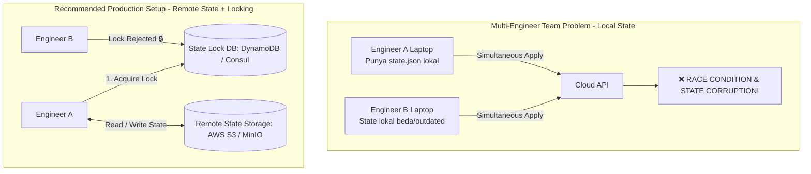
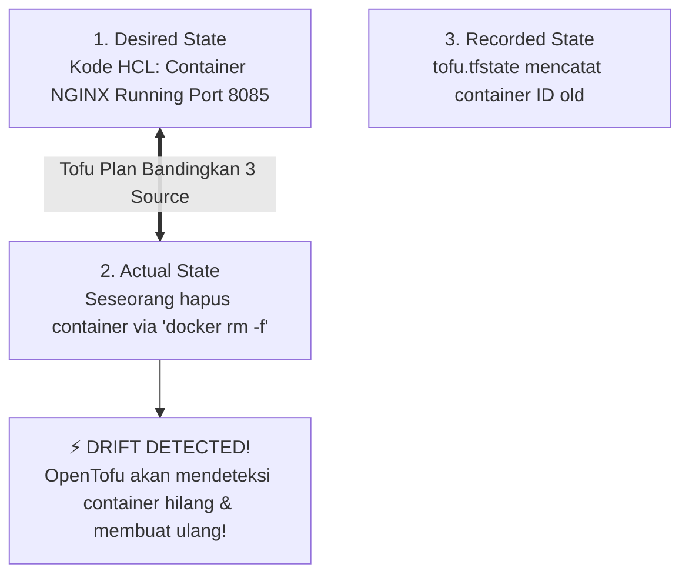

# Minggu 14 — Modul 02: State Management & Infrastructure Drift Detection

## 🎯 Tujuan Pembelajaran
Setelah menyelesaikan modul ini, Anda akan mampu:
1. Memahami fungsi vital file **OpenTofu State (`tofu.tfstate`)** sebagai *single source of truth*.
2. Menguasai perintah inspeksi state: `tofu state list`, `tofu state show`, dan `tofu state pull`.
3. Memahami konsep **Infrastructure Drift** (perubahan manual tak terotorisasi yang merusak konsistensi).
4. Mensimulasikan skenario timbulnya drift pada lingkungan lab.
5. Mendeteksi drift menggunakan `tofu plan` dan mereparasi infrastruktur kembali ke status patuh (*remediation*) menggunakan `tofu apply`.

---

## 📂 1. Peran Penting State File (`tofu.tfstate`)

Saat Anda menjalankan `tofu apply`, OpenTofu membuat file JSON bernama `tofu.tfstate`. File ini memetakan variabel yang ada di kode HCL dengan ID objek nyata di provider API.



### Mengapa State File Sangat Penting?
1. **Performance Indexing**: OpenTofu tidak perlu memindai seluruh akun cloud Anda; ia hanya memindai objek yang tercatat di state file.
2. **Dependency Management**: State mencatat urutan pembuatan resource (misal: Subnet dibuat sebelum VM).
3. **Metadata Storage**: Menyimpan atribut rahasia atau internal yang dihasilkan provider (seperti IP address, ARN, atau MAC Address).

---

## 🔒 2. Local State vs Remote State & State Locking

Di lingkungan produksi dengan banyak engineer (tim SRE), menyimpan `tofu.tfstate` di laptop lokal adalah **BENCANA**.



### Konfigurasi Remote State Backend (S3 Contoh):
```hcl
terraform {
  backend "s3" {
    bucket         = "company-opentofu-states"
    key            = "prod/network/terraform.tfstate"
    region         = "ap-southeast-1"
    dynamodb_table = "opentofu-state-locks"
    encrypt        = true
  }
}
```

---

## 🔍 3. Perintah Inspeksi State (`tofu state`)

OpenTofu menyediakan sub-command `tofu state` untuk memeriksa isi state tanpa perlu membuka file JSON secara manual.

```bash
# 1. Menampilkan seluruh resource yang terdaftar di state
tofu state list
```
**Expected Output:**
```text
docker_container.nginx_app
docker_image.nginx
```

```bash
# 2. Menampilkan rincian detail atribut dari satu resource
tofu state show docker_container.nginx_app
```
**Expected Output:**
```text
# docker_container.nginx_app:
resource "docker_container" "nginx_app" {
    command      = [ "nginx", "-g", "daemon off;" ]
    hostname     = "a1b2c3d4e5f6"
    id           = "a1b2c3d4e5f67890..."
    image        = "sha256:123456789..."
    ipc_mode     = "private"
    name         = "tofu-demo-nginx"
    ports {
        external = 8085
        internal = 80
    }
}
```

---

## 💥 4. Apa Itu Infrastructure Drift?

**Infrastructure Drift** terjadi ketika seseorang mengubah, menghapus, atau menghentikan resource secara manual (lewat CLI, SSH, atau GUI Portal) tanpa memperbarui kode HCL OpenTofu.



---

## 🧪 5. Hands-On Lab: Simulasi, Deteksi & Remediase Drift

Mari kita simulasikan kecelakaan di mana seseorang mematikan dan menghapus container NGINX secara sengaja dari luar OpenTofu!

### Langkah 1: Pastikan Container Berjalan dari Modul 01
```bash
cd minggu-14/tofu
tofu state list
```

---

### Langkah 2: Suntikkan Manual Drift (Hapus Container via Docker CLI)
Bayangkan ada staf IT junior yang tidak sengaja menghapus container ini menggunakan docker command:

```bash
# Hapus container secara manual tanpa sepengetahuan OpenTofu!
docker rm -f tofu-demo-nginx
```

Periksa via docker:
```bash
docker ps | grep tofu-demo-nginx || echo "Container Hilang dari Docker!"
```

---

### Langkah 3: Deteksi Drift Menggunakan `tofu plan`
Sekarang, jalankan `tofu plan` dari terminal OpenTofu:

```bash
tofu plan
```

**Expected Output Log:**
```text
docker_container.nginx_app: Refreshing state... [id=a1b2c3d4...]

OpenTofu detected the following changes made outside of OpenTofu since the last perform:

  # docker_container.nginx_app has been deleted
  - resource "docker_container" "nginx_app" {
      - id = "a1b2c3d4e5f6..." -> null
    }

Unless you have made equivalent changes to your code, or intend to "tofu apply" to replace these objects, 
OpenTofu will recreate the deleted objects.

Plan: 1 to add, 0 to change, 0 to destroy.
```

👉 *Penjelasan*: OpenTofu secara cerdas mendeteksi bahwa container `tofu-demo-nginx` telah hilang di alam nyata, padahal di kode HCL container tersebut **seharusnya ADA**.

---

### Langkah 4: Eksekusi Remediase Otomatis (`tofu apply`)
Untuk mengembalikan infrastruktur ke kondisi patuh (*compliant*), cukup jalankan `apply`:

```bash
tofu apply -auto-approve
```

**Expected Output Log:**
```text
docker_container.nginx_app: Creating...
docker_container.nginx_app: Creation complete after 1s [id=f9e8d7c6...]

Apply complete! Resources: 1 added, 0 changed, 0 destroyed.
```

Verifikasi kembali:
```bash
curl -I http://localhost:8085
```

**Hasil**: Container otomatis dibuat ulang dan service pulih tanpa perlu menulis ulang script bash sama sekali!

---

## 📌 Checklist Validasi Modul 02
- [x] Memahami fungsi file `tofu.tfstate` sebagai peta infrastruktur.
- [x] Memahami konsep Remote State dan State Locking untuk mencegah race condition di tim SRE.
- [x] Berhasil mengeksekusi `tofu state list` dan `tofu state show`.
- [x] Berhasil mensimulasikan *Infrastructure Drift* dengan menghapus container via Docker CLI.
- [x] Berhasil mendeteksi drift via `tofu plan` dan mereparasi infrastruktur via `tofu apply`.
