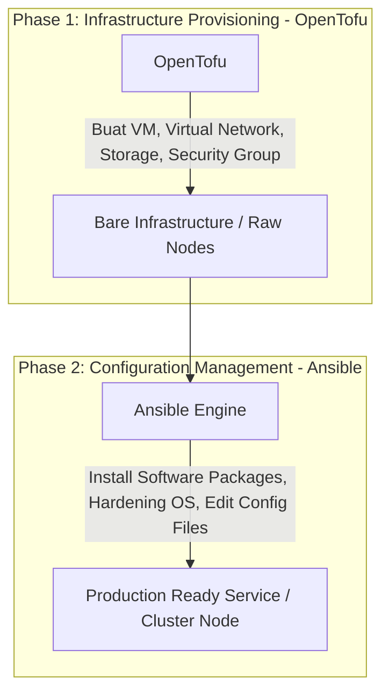
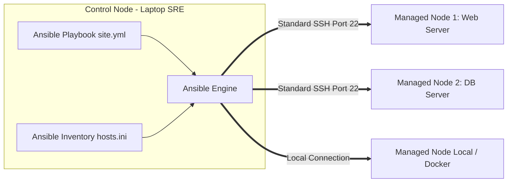

# Minggu 14 — Modul 03: Ansible Configuration Management & Idempotency

## 🎯 Tujuan Pembelajaran
Setelah menyelesaikan modul ini, Anda akan mampu:
1. Memahami peran **Ansible** sebagai *Configuration Management Tool* dan pembagian tugas dengan OpenTofu.
2. Menjelaskan arsitektur **Agentless** berbasis SSH yang dimiliki oleh Ansible.
3. Menulis file **Ansible Inventory** (format INI atau YAML) dan mendefinisikan grup host.
4. Menulis **Ansible Playbook** terstruktur menggunakan modul-modul standar (`apt`, `systemd`, `file`, `copy`, `template`).
5. Memahami dan menguji prinsip **Idempotensitas** (Status: `ok` vs `changed` vs `failed`).

---

## 💡 1. OpenTofu vs Ansible: Pembagian Peran SRE

Di industri SRE/DevOps, terdapat aturan emas (*Golden Rule*) dalam mengotomatiskan infrastruktur:



### Tabel Perbandingan Peran OpenTofu vs Ansible

| Parameter | OpenTofu | Ansible |
| :--- | :--- | :--- |
| **Kategori Utama** | *Infrastructure Provisioner* | *Configuration Manager & Orchestrator* |
| **Kekuatan Utama** | Membuat & menghapus resource cloud | Mengonfigurasi isi dalam OS (packages, users, files, services) |
| **Arsitektur** | State-driven (berbasis file `tfstate`) | Task-driven (berbasis Playbook YAML) |
| **Konektivitas** | API Cloud Provider (HTTPS REST) | **Agentless** via SSH (Linux) atau WinRM (Windows) |

---

## 🏛️ 2. Arsitektur Agentless Ansible

Banyak tool konfigurasi lama (seperti Chef atau Puppet) mengharuskan kita menginstall *Agent Daemon* di setiap server target. 

Ansible tampil beda dengan arsitektur **Agentless**: Control Node (laptop Anda) hanya membutuhkan koneksi **SSH biasa** dan Python ke Managed Nodes.



---

## 📜 3. Komponen Utama Ansible: Inventory, Playbook & Modules

### 1. Inventory (`hosts.ini`)
Inventory mendefinisikan alamat IP atau hostname server target, dikelompokkan berdasarkan peran (*grouping*).

```ini
[webservers]
192.168.1.21 ansible_user=ubuntu
192.168.1.22 ansible_user=ubuntu

[dbservers]
192.168.1.30 ansible_user=ubuntu

[all:vars]
ansible_python_interpreter=/usr/bin/python3
```

---

### 2. Playbook (`site.yml`)
Playbook adalah dokumen YAML yang berisi daftar tugas (*tasks*) yang wajib dijalankan pada grup host tertentu.

```yaml
---
- name: Configure Webservers Baseline
  hosts: webservers
  become: true # Run commands with sudo privileges
  tasks:
    - name: Ensure NGINX package is installed
      ansible.builtin.apt:
        name: nginx
        state: present
        update_cache: yes

    - name: Ensure NGINX service is running and enabled on boot
      ansible.builtin.systemd:
        name: nginx
        state: started
        enabled: yes

    - name: Copy custom HTML index file
      ansible.builtin.copy:
        content: "<h1>Managed by Ansible Idempotently!</h1>\n"
        dest: /var/www/html/index.html
        mode: '0644'
```

---

## 🧪 4. Hands-On Lab: Menulis & Mengeksekusi Playbook Ansible

Mari kita buat Ansible Inventory dan Playbook di dalam direktori `minggu-14/ansible/`!

### Langkah 1: Buat File Inventory `minggu-14/ansible/hosts.ini`
Untuk kebutuhan lab lokal, kita akan mengonfigurasi koneksi `localhost` (mode local tanpa butuh SSH key):

```ini
[local_nodes]
localhost ansible_connection=local
```

---

### Langkah 2: Buat File Playbook `minggu-14/ansible/configure-web.yml`

```yaml
---
- name: Automated Local Node Configuration Lab
  hosts: local_nodes
  tasks:
    - name: 1. Create target directory structure
      ansible.builtin.file:
        path: /tmp/ansible-lab-app
        state: directory
        mode: '0755'

    - name: 2. Deploy application configuration file
      ansible.builtin.copy:
        content: |
          APP_NAME="Ansible-Configured-App"
          ENVIRONMENT="production"
          MAX_CONNECTIONS=100
        dest: /tmp/ansible-lab-app/app.conf
        mode: '0644'

    - name: 3. Verify configuration file exists
      ansible.builtin.command:
        cmd: cat /tmp/ansible-lab-app/app.conf
      register: app_config_output

    - name: 4. Display result message
      ansible.builtin.debug:
        msg: "Config File Content: {{ app_config_output.stdout_lines }}"
```

---

### Langkah 3: Eksekusi Playbook Pertama Kali (Uji Eksekusi)

Jalankan perintah `ansible-playbook`:

```bash
cd minggu-14/ansible
ansible-playbook -i hosts.ini configure-web.yml
```

**Expected Output Log (Run 1):**
```text
PLAY [Automated Local Node Configuration Lab] **********************************

TASK [Gathering Facts] *********************************************************
ok: [localhost]

TASK [1. Create target directory structure] ************************************
changed: [localhost]

TASK [2. Deploy application configuration file] ********************************
changed: [localhost]

TASK [3. Verify configuration file exists] *************************************
changed: [localhost]

TASK [4. Display result message] ***********************************************
ok: [localhost] => {
    "msg": "Config File Content: ['APP_NAME=\"Ansible-Configured-App\"', 'ENVIRONMENT=\"production\"', 'MAX_CONNECTIONS=100']"
}

PLAY RECAP *********************************************************************
localhost                  : ok=5    changed=3    unreachable=0    failed=0
```

👉 *Pengamatan Run 1*: Terlihat indikator **`changed=3`**. Artinya Ansible baru saja membuat folder dan file konfigurasi baru.

---

### Langkah 4: Uji Idempotensitas (Jalankan Playbook untuk Kedua Kalinya)

Tanpa merubah kode apa pun, jalankan kembali perintah yang **SAMA PERSIS**:

```bash
ansible-playbook -i hosts.ini configure-web.yml
```

**Expected Output Log (Run 2):**
```text
PLAY [Automated Local Node Configuration Lab] **********************************

TASK [Gathering Facts] *********************************************************
ok: [localhost]

TASK [1. Create target directory structure] ************************************
ok: [localhost]

TASK [2. Deploy application configuration file] ********************************
ok: [localhost]

TASK [3. Verify configuration file exists] *************************************
changed: [localhost]

TASK [4. Display result message] ***********************************************
ok: [localhost]

PLAY RECAP *********************************************************************
localhost                  : ok=5    changed=1    unreachable=0    failed=0
```

> 💡 **Analisis Idempotensitas (Perbedaan Run 1 vs Run 2)**:
> - Pada Run 2, Task 1 dan Task 2 bernilai **`ok`** (bukan `changed`). 
> - Ansible mengetahui bahwa folder `/tmp/ansible-lab-app` dan file `app.conf` **sudah sesuai dengan spesifikasi yang diminta**, sehingga Ansible TIDAK MELAKUKAN perubahaan berulang! Ini adalah bukti nyata **Idempotency**.

---

## 📌 Checklist Validasi Modul 03
- [x] Memahami pembagian peran OpenTofu (Provisioning) vs Ansible (Configuration).
- [x] Memahami keunggulan arsitektur *Agentless* berbasis SSH.
- [x] Berhasil membuat Inventory `hosts.ini` dan Playbook YAML.
- [x] Berhasil menjalankan `ansible-playbook` dan mengamati laporan `changed` vs `ok`.
- [x] Terbukti bahwa Ansible bersifat *Idempotent* pada eksekusi berulang.
