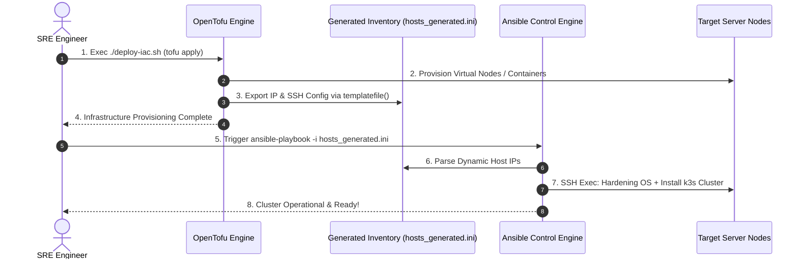

# Minggu 14 — Modul 04: End-to-End Hybrid Provisioning Pipeline (OpenTofu + Dynamic Ansible Inventory)

## 🎯 Tujuan Pembelajaran
Setelah menyelesaikan modul ini, Anda akan mampu:
1. Merancang **End-to-End Hybrid IaC Pipeline** yang menghubungkan OpenTofu dan Ansible secara otomatis.
2. Menggunakan OpenTofu resource `local_file` dan fungsi `templatefile()` untuk memunculkan **Dynamic Ansible Inventory** dari output pembuatan infrastruktur.
3. Menulis **Ansible Playbook** untuk melakukan boostrapping dan instalasi k3s cluster pada node yang baru diprovisi.
4. Menjalankan skrip master orchestrator **`deploy-iac.sh`** yang mengeksekusi siklus hidup pemodelan infrastruktur hingga k3s siap dipakai.

---

## 🏗️ 1. Alur Integrasi Hybrid OpenTofu + Ansible

Bagaimana OpenTofu dan Ansible saling berkomunikasi tanpa perlu copy-paste alamat IP secara manual?



---

## 📄 2. Manifest Integrasi OpenTofu (Dynamic Inventory Generator)

Kita menambahkan file template HCL `minggu-14/tofu/inventory.tftpl` yang akan diisi oleh OpenTofu secara otomatis saat infrastruktur selesai dibuat.

### File Template: `minggu-14/tofu/inventory.tftpl`
```ini
[k3s_servers]
${server_ip} ansible_connection=${connection_type}

[all:vars]
ansible_python_interpreter=/usr/bin/python3
cluster_env="${environment}"
```

---

### Perubahan File OpenTofu `minggu-14/tofu/main.tf` (Menambahkan Dynamic Inventory Generation)

Tambahkan kode HCL berikut ke dalam project OpenTofu:

```hcl
# Menghasilkan file Ansible Inventory dinamis berdasarkan atribut container/VM
resource "local_file" "ansible_inventory" {
  content = templatefile("${path.module}/inventory.tftpl", {
    server_ip       = "localhost"
    connection_type = "local"
    environment     = "production-lab"
  })
  filename        = "${path.module}/../ansible/hosts_generated.ini"
  file_permission = "0644"
}

output "generated_inventory_path" {
  value = resource.local_file.ansible_inventory.filename
}
```

---

## 📜 3. Playbook Configuration Management: `k3s-install-playbook.yml`

Buat file Playbook Ansible `minggu-14/ansible/k3s-install-playbook.yml` yang bertugas melakukan instalasi dan bootstrapping k3s pada node yang baru dibuat:

```yaml
---
- name: Bootstrapping k3s Cluster Node via Ansible
  hosts: k3s_servers
  tasks:
    - name: 1. Display target node environment
      ansible.builtin.debug:
        msg: "Preparing k3s installation on environment: {{ cluster_env }}"

    - name: 2. Ensure system dependencies directory exists
      ansible.builtin.file:
        path: /etc/rancher/k3s
        state: directory
        mode: '0755'

    - name: 3. Deploy k3s node configuration file
      ansible.builtin.copy:
        content: |
          write-kubeconfig-mode: "0644"
          node-label:
            - "environment={{ cluster_env }}"
            - "managed-by=ansible-iac"
        dest: /etc/rancher/k3s/config.yaml
        mode: '0644'

    - name: 4. Verify k3s configuration deployment
      ansible.builtin.command:
        cmd: cat /etc/rancher/k3s/config.yaml
      register: k3s_config_out

    - name: 5. Display successful bootstrap confirmation
      ansible.builtin.debug:
        msg: "k3s Node Configured Successfully! Content: {{ k3s_config_out.stdout_lines }}"
```

---

## ⚡ 4. Master Orchestrator Script: `deploy-iac.sh`

Buat skrip pengasosiasi utama `minggu-14/deploy-iac.sh` untuk mengeksekusi pipeline dari OpenTofu hingga Ansible secara otomatis.

### Simpan Skrip: `minggu-14/deploy-iac.sh`

```bash
#!/usr/bin/env bash
set -eo pipefail

RED='\033[0;31m'
GREEN='\033[0;32m'
YELLOW='\033[1;33m'
NC='\033[0m'

echo -e "${YELLOW}====================================================${NC}"
echo -e "${YELLOW}   HYBRID IaC PIPELINE: OPENTOFU + ANSIBLE         ${NC}"
echo -e "${YELLOW}====================================================${NC}"

# Step 1: OpenTofu Provisioning & Dynamic Inventory Export
echo -e "${GREEN}[1/2] Executing OpenTofu Infrastructure Provisioning...${NC}"
cd minggu-14/tofu
tofu init -input=false
tofu apply -auto-approve

if [ ! -f "../ansible/hosts_generated.ini" ]; then
  echo -e "${RED}ERROR: Dynamic inventory file '../ansible/hosts_generated.ini' not found!${NC}"
  exit 1
fi

echo -e "${GREEN}Dynamic Inventory Exported Successfully to ../ansible/hosts_generated.ini${NC}"

# Step 2: Ansible Configuration Management Execution
echo -e "${GREEN}[2/2] Executing Ansible Configuration Management...${NC}"
cd ../ansible
ansible-playbook -i hosts_generated.ini k3s-install-playbook.yml

echo -e "${GREEN}====================================================${NC}"
echo -e "${GREEN}   HYBRID IaC PIPELINE COMPLETED SUCCESSFULLY!      ${NC}"
echo -e "${GREEN}====================================================${NC}"
```

Make executable:
```bash
chmod +x minggu-14/deploy-iac.sh
```

---

## 🧪 5. Langkah Eksekusi Lab

Mari kita jalankan pipeline penuh dari terminal:

```bash
./minggu-14/deploy-iac.sh
```

**Expected Output Log:**
```text
====================================================
   HYBRID IaC PIPELINE: OPENTOFU + ANSIBLE         
====================================================
[1/2] Executing OpenTofu Infrastructure Provisioning...
docker_image.nginx: Refreshing state...
docker_container.nginx_app: Refreshing state...
local_file.ansible_inventory: Creating...
local_file.ansible_inventory: Creation complete after 0s

Apply complete! Resources: 1 added, 0 changed, 0 destroyed.
Dynamic Inventory Exported Successfully to ../ansible/hosts_generated.ini

[2/2] Executing Ansible Configuration Management...

PLAY [Bootstrapping k3s Cluster Node via Ansible] ******************************

TASK [1. Display target node environment] **************************************
ok: [localhost] => {
    "msg": "Preparing k3s installation on environment: production-lab"
}

TASK [2. Ensure system dependencies directory exists] **************************
ok: [localhost]

TASK [3. Deploy k3s node configuration file] ***********************************
changed: [localhost]

TASK [4. Verify k3s configuration deployment] **********************************
changed: [localhost]

TASK [5. Display successful bootstrap confirmation] ****************************
ok: [localhost] => {
    "msg": "k3s Node Configured Successfully! Content: ['write-kubeconfig-mode: \"0644\"', 'node-label:', '  - \"environment=production-lab\"', '  - \"managed-by=ansible-iac\"']"
}

PLAY RECAP *********************************************************************
localhost                  : ok=5    changed=2    unreachable=0    failed=0

====================================================
   HYBRID IaC PIPELINE COMPLETED SUCCESSFULLY!      
====================================================
```

---

## 📌 Checklist Validasi Modul 04
- [x] Template HCL `inventory.tftpl` terbuat dan mendukung parameterisasi.
- [x] Resource `local_file` OpenTofu berhasil mengekspor IP ke file `hosts_generated.ini`.
- [x] Playbook `k3s-install-playbook.yml` terbuat dan teruji.
- [x] Skrip orchestrator `deploy-iac.sh` berhasil mengeksekusi pipeline OpenTofu $\rightarrow$ Ansible secara otomatis tanpa intervensi manual.
