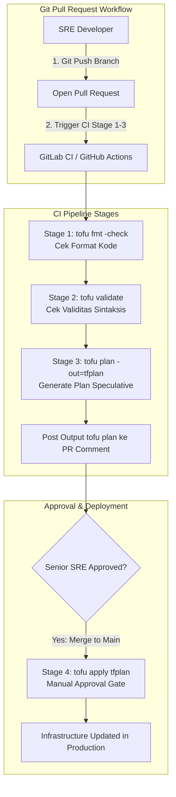
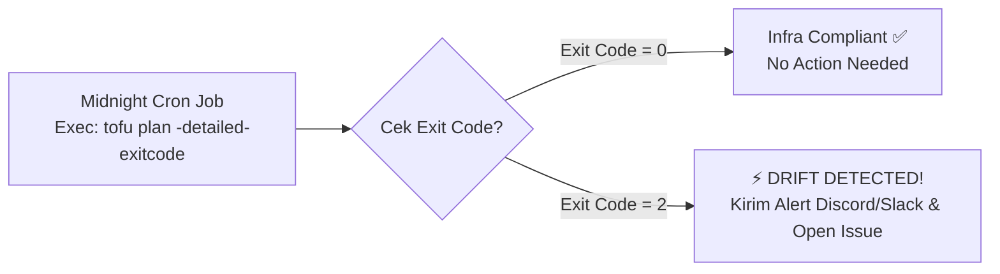

# Minggu 14 — Modul 05: IaC CI/CD Pipeline & Automated Drift Detection Cron

## 🎯 Tujuan Pembelajaran
Setelah menyelesaikan modul ini, Anda akan mampu:
1. Memahami praktik terbaik penerapan **CI/CD Pipeline untuk Infrastructure as Code (IaC)**.
2. Membangun 4 Stage Pipeline IaC: **Format Check**, **Validation**, **Plan Generation**, dan **Manual Apply Gate**.
3. Mengonfigurasi **Scheduled Automated Drift Detection** menggunakan flag `tofu plan -detailed-exitcode`.
4. Mengintegrasikan notifikasi peringatan jika terdeteksi perubahan manual liar di luar pipeline GitOps.

---

## 🏗️ 1. Arsitektur Pipeline CI/CD untuk IaC

Di tim SRE enterprise, tidak ada seorang pun yang boleh mengeksekusi `tofu apply` langsung dari laptop lokal. Semua perubahan infrastruktur Wajib melalui **Pull Request (PR) Code Review** dan diaudit oleh **CI/CD Pipeline**.



---

## ⏰ 2. Konsep Automated Drift Detection Cron (Nightly Audit)

Bagaimana cara mengetahui jika ada orang yang masuk ke console AWS/GCP atau Docker CLI pukul 02:00 pagi dan mengubah konfigurasi tanpa ketahuan?

Kita membuat **Scheduled Cron CI Job** yang berjalan otomatis setiap malam menggunakan perintah khusus:

```bash
tofu plan -detailed-exitcode -input=false
```

### Arti Status Exit Code:
- **`Exit Code = 0`**: Succeeded with 0 changes. (Infrastruktur 100% **Patuh / Compliant**).
- **`Exit Code = 1`**: System/Provider Error. (Gagal eksekusi query API).
- **`Exit Code = 2`**: Succeeded with non-empty diff. (**DRIFT DETECTED!** Ada perbedaan antara kode HCL dan kenyataan infrastruktur).



---

## 📄 3. Manifest Pipeline GitLab CI: `05-iac-gitlab-ci.yaml`

Berikut adalah file contoh konfigurasi pipeline `.gitlab-ci.yml` yang mencakup 4 stage utama dan 1 scheduled drift detection job.

### File Manifest: `minggu-14/manifests/05-iac-gitlab-ci.yaml`

```yaml
stages:
  - validate
  - plan
  - apply
  - drift-check

variables:
  TOFU_ROOT_DIR: "minggu-14/tofu"

# Templating reusable job
.tofu_base:
  image: ghcr.io/opentofu/opentofu:1.6.2
  before_script:
    - cd ${TOFU_ROOT_DIR}
    - tofu init -input=false

# Stage 1 & 2: Format & Validate
lint_and_validate:
  extends: .tofu_base
  stage: validate
  script:
    - tofu fmt -check
    - tofu validate
  rules:
    - if: $CI_PIPELINE_SOURCE == "merge_request_event"
    - if: $CI_COMMIT_BRANCH == "main"

# Stage 3: Speculative Plan
plan_infrastructure:
  extends: .tofu_base
  stage: plan
  script:
    - tofu plan -input=false -out=tfplan
  artifacts:
    name: "tofu-plan-$CI_COMMIT_SHA"
    paths:
      - ${TOFU_ROOT_DIR}/tfplan
    expire_in: 7 days
  rules:
    - if: $CI_PIPELINE_SOURCE == "merge_request_event"
    - if: $CI_COMMIT_BRANCH == "main"

# Stage 4: Manual Approval Gate for Production Apply
apply_infrastructure:
  extends: .tofu_base
  stage: apply
  script:
    - tofu apply -input=false tfplan
  dependencies:
    - plan_infrastructure
  when: manual # Wajib mendapatkan klik persetujuan manual dari Senior SRE
  rules:
    - if: $CI_COMMIT_BRANCH == "main"

# Scheduled Job: Automated Nightly Drift Check
scheduled_drift_detection:
  extends: .tofu_base
  stage: drift-check
  script:
    - |
      echo "==> Running Nightly Automated Drift Check..."
      if ! tofu plan -detailed-exitcode -input=false; then
        EXIT_CODE=$?
        if [ $EXIT_CODE -eq 2 ]; then
          echo "=========================================================="
          echo "⚠️ DRIFT DETECTED: Infrastructure is out of sync with Git!"
          echo "=========================================================="
          # Integrasi webhook notifikasi Discord / Slack
          curl -X POST -H "Content-Type: application/json" \
               -d '{"content": "🚨 **SRE ALERT**: Infrastructure Drift Detected in OpenTofu Production State!"}' \
               $DISCORD_WEBHOOK_URL
          exit 2
        else
          echo "ERROR: OpenTofu plan failed with error code $EXIT_CODE"
          exit 1
        fi
      else
        echo "✅ SUCCESS: Infrastructure is 100% compliant with HCL code."
      fi
  rules:
    - if: $CI_PIPELINE_SOURCE == "schedule" # Hanya berjalan pada jadwal Cron
```

---

## 🧪 4. Menjalankan Simulation Drift Detection CLI di Laptop

Kita dapat mensimulasikan logika `exitcode = 2` ini secara lokal di terminal laptop:

```bash
cd minggu-14/tofu

# 1. Jalankan plan dengan detailed-exitcode saat kondisi normal (Compliant)
tofu plan -detailed-exitcode
echo "Exit Code saat Compliant: $?"
```
*Hasil Exit Code*: `0`

```bash
# 2. Hapus container secara manual di luar OpenTofu
docker rm -f tofu-demo-nginx

# 3. Jalankan plan kembali dengan detailed-exitcode
tofu plan -detailed-exitcode || EXIT_CODE=$?
echo "Exit Code saat Drift: $EXIT_CODE"
```
*Hasil Exit Code*: `2` (Membuktikan bahwa CI Script dapat mendeteksi drift secara otomatis!).

---

## 📌 Checklist Validasi Modul 05
- [x] Memahami 4 stage utama pipeline CI/CD IaC (`fmt`, `validate`, `plan`, `apply`).
- [x] Memahami fungsi *Manual Approval Gate* pada `tofu apply`.
- [x] Memahami penggunaan flag `tofu plan -detailed-exitcode` untuk membedakan status `0` (clean), `1` (error), dan `2` (drift).
- [x] Manifest `.gitlab-ci.yml` terstruktur dengan skrip notifikasi otomatis saat terjadi drift.
