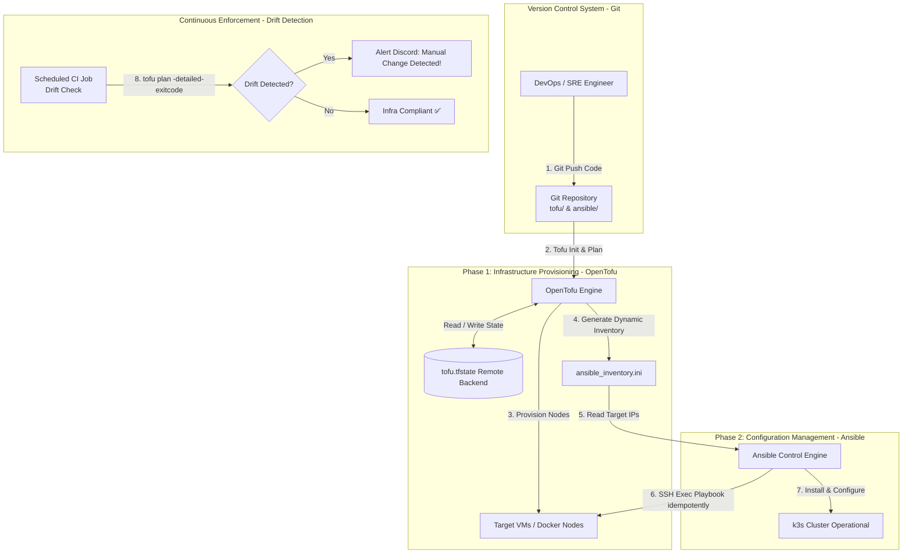
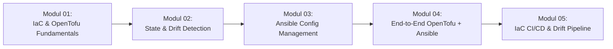

# Minggu 14 — Infrastructure as Code (OpenTofu, Ansible, State Management & Drift Detection)

Selamat datang di **Minggu 14** dari Roadmap SRE Lanjutan! Pada minggu lalu (Minggu 13), Anda telah menguasai arsitektur High Availability (HA) Kubernetes Cluster. Di modul ini, kita akan masuk ke pondasi utama otomatisasi infrastruktur modern: **Infrastructure as Code (IaC)**.

---

## 🎯 Gambaran Umum & Tujuan Pembelajaran

Di era cloud-native, mengonfigurasi server secara manual melalui klik-klik GUI atau mengeksekusi perintah SSH secara ad-hoc (*ClickOps*) adalah **Dosa Besar SRE**. Mengapa? Karena pendekatan manual tidak dapat diulang (*non-reproducible*), rentan kesalahan manusia (*human-error*), tidak terlacak sejarahnya (*no audit trail*), dan tidak dapat di-rollback jika terjadi kesalahan.

**Infrastructure as Code (IaC)** adalah praktik mengelola dan memprovisi infrastruktur IT (server, jaringan, storage, Kubernetes cluster) melalui file definisi kode yang *declarative*, terversi di Git, dan terotomatisasi.

### Kompetensi Utama yang Akan Anda Kuasai:
1. **Konsep IaC & OpenTofu**: Memahami paradigma *Declarative vs Imperative*, perbedaan OpenTofu (Open Source MPLv2) vs Terraform (BUSL License), HCL Syntax, Provider, Resource, dan Variables.
2. **State Management & Drift Detection**: Mengelola file status infrastruktur (`tofu.tfstate`), *Remote State Backend*, *State Locking*, serta mendeteksi dan memperbaiki **Infrastructure Drift** (perubahan manual tak terotorisasi pada infrastruktur).
3. **Configuration Management dengan Ansible**: Menguasai konsep *Agentless Infrastructure Management*, Ansible Inventory, Playbook, Roles, Modules, dan sifat **Idempotency**.
4. **End-to-End Hybrid Pipeline (OpenTofu + Ansible)**: Menggabungkan OpenTofu untuk memprovisi infrastruktur dasar dan merelay *Dynamic Inventory* ke Ansible untuk menginstal dan mengonfigurasi cluster k3s.
5. **GitOps IaC CI/CD Pipeline**: Membangun pipeline GitLab CI / GitHub Actions untuk mengeksekusi `tofu fmt`, `validate`, `plan`, dan `apply` dengan *Manual Approval Gate* serta *Automated Drift Detection*.

---

## 🏗️ Peta Arsitektur Pipeline IaC (OpenTofu + Ansible)

Berikut adalah alur kerja otomatisasi infrastruktur yang akan kita bangun:

---

## 🗺️ Panduan & Alur Belajar (Modul Navigation)

Ikuti 5 modul praktis secara berurutan untuk menguasai IaC dari dasar hingga otomatisasi CI/CD:

### Rincian Modul Pembelajaran:

| Modul | Judul Materi | Deskripsi & Fokus Utama | Artefak Hasil Lab |
| :---: | :--- | :--- | :--- |
| **`01-iac-fundamentals-opentofu.md`** | IaC Fundamentals & OpenTofu Basics | Deklaratif vs Imperatif, sejarah OpenTofu vs Terraform, HCL syntax, provider, resource, variables, outputs. | Kode OpenTofu (`main.tf`, `variables.tf`) |
| **`02-opentofu-state-drift.md`** | State Management & Drift Detection | Peran `tofu.tfstate`, remote backend, state lock, `tofu state` inspection, dan deteksi/remediasi *Infrastructure Drift*. | File state & Laporan `tofu plan` drift |
| **`03-ansible-configuration-management.md`** | Ansible Configuration Management | Arsitektur *Agentless* SSH, Inventory (INI/YAML), Playbooks, Roles, Modules (`apt`, `systemd`, `template`), Idempotency. | Playbook Ansible (`site.yml`, `roles/`) |
| **`04-provisioning-k3s-opentofu-ansible.md`** | End-to-End OpenTofu + Ansible Provisioning | Merangkai OpenTofu (provision node + export dynamic inventory) dengan Ansible (instalasi k3s cluster otomatis). | Script `deploy-iac.sh` & Generated Inventory |
| **`05-iac-ci-pipeline-drift-detection.md`** | IaC CI/CD Pipeline & Automated Drift Check | Membangun pipeline GitLab CI (`tofu fmt`, `validate`, `plan`, `apply` gate) dan *Scheduled Drift Check Cron*. | `.gitlab-ci.yml` / GitHub Workflow IaC |

---

## 🛠️ Prasyarat (Prerequisites) Sebelum Memulai

Sebelum menjalankan lab pada Minggu 14, pastikan software berikut telah terinstall di laptop Anda:

1. **OpenTofu CLI**:
   - Install via brew/curl: `brew install opentofu` atau `curl -s https://packagecloud.io/install/repositories/opentofu/opentofu/script.deb.sh | sudo bash && sudo apt install tofu`.
   - Cek versi: `tofu version` ($\ge 1.6.0$).
2. **Ansible Core**:
   - Install via python/pip/brew: `brew install ansible` atau `pip install ansible-core`.
   - Cek versi: `ansible --version` ($\ge 2.15$).
3. **Docker Desktop / k3d**:
   - Untuk mensimulasikan target node VM yang akan diprovisi dan dikonfigurasi.

---

## 📌 Rules & Tips Praktik Bagi IT Pemula

1. **Jangan Pernah Edit `tofu.tfstate` Secara Manual**: File state adalah *single source of truth* OpenTofu. Merubah isi JSON state secara manual dapat merusak dependency graph infrastruktur Anda.
2. **Pahami Prinsip Idempotensitas (Idempotency)**: Kode IaC dan Ansible Playbook yang baik harus bisa dijalankan **100 kali berturut-turut** tanpa merusak atau merubah apa pun jika kondisi target sudah sesuai spesifikasi.
3. **Gunakan OpenTofu untuk Infrastruktur, Ansible untuk Konfigurasi**: 
   - OpenTofu unggul dalam *Provisioning* (Membuat VM, Network, Disk).
   - Ansible unggul dalam *Configuration* (Install packages, edit config file, restart service).

---

## 🏆 Checklist Kelulusan Minggu 14
- [ ] Memahami perbedaan Deklaratif vs Imperatif serta alasan memilih OpenTofu dibanding Terraform.
- [ ] Berhasil menulis kode HCL OpenTofu untuk memprovisi resource lokal/container.
- [ ] Berhasil mendeteksi dan mereparasi *Infrastructure Drift* menggunakan `tofu plan`.
- [ ] Berhasil menulis Ansible Playbook yang *idempotent* untuk mengonfigurasi node.
- [ ] Berhasil merangkai integrasi OpenTofu $\rightarrow$ Dynamic Inventory $\rightarrow$ Ansible k3s installation.
- [ ] Memahami struktur pipeline CI/CD untuk IaC dengan *manual approval gate*.
