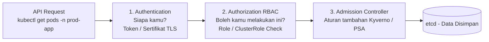

# Minggu 15 — Modul 01: RBAC & Least Privilege Service Account Management

## 🎯 Tujuan Pembelajaran
Setelah menyelesaikan modul ini, Anda akan mampu:
1. Menjelaskan mekanisme otorisasi **RBAC (Role-Based Access Control)** pada Kubernetes API Server.
2. Membedakan **Role vs ClusterRole** dan **RoleBinding vs ClusterRoleBinding**.
3. Merancang kebijakan hak akses berdasarkan prinsip **Least Privilege** (Hak Minimum).
4. Membuat **Service Account** khusus untuk aplikasi dan CI/CD pipeline dengan akses yang dibatasi secara presisi.
5. Memverifikasi kebijakan akses menggunakan perintah `kubectl auth can-i`.

---

## 🏛️ 1. Arsitektur Otorisasi API Request Kubernetes

Setiap request ke `kube-apiserver` (dari `kubectl`, Pod, atau CI/CD) wajib melewati 3 tahap:



---

## 📖 2. Empat Sumber Daya Utama RBAC

### 1. Role (Namespace-scoped)
Mendefinisikan sekumpulan izin (*permissions*) terhadap resource Kubernetes **dalam satu namespace saja**.

```yaml
apiVersion: rbac.authorization.k8s.io/v1
kind: Role
metadata:
  name: app-reader-role
  namespace: prod-app
rules:
  - apiGroups: [""]            # "" = Core API Group (Pod, Service, ConfigMap...)
    resources: ["pods", "configmaps"]
    verbs: ["get", "list", "watch"]  # Verbs yang diizinkan
```

### 2. ClusterRole (Cluster-wide)
Definisi izin yang berlaku di **seluruh namespace** atau untuk resource yang tidak berbasis namespace (seperti `Node`, `PersistentVolume`).

```yaml
apiVersion: rbac.authorization.k8s.io/v1
kind: ClusterRole
metadata:
  name: deployment-manager-clusterrole
rules:
  - apiGroups: ["apps"]
    resources: ["deployments"]
    verbs: ["get", "list", "watch", "create", "update", "patch"]
```

### 3. RoleBinding
Mengikatkan (**bind**) sebuah Role ke satu atau lebih identitas (User, Group, atau ServiceAccount) **dalam satu namespace**.

```yaml
apiVersion: rbac.authorization.k8s.io/v1
kind: RoleBinding
metadata:
  name: app-reader-rolebinding
  namespace: prod-app
subjects:
  - kind: ServiceAccount
    name: go-app-serviceaccount
    namespace: prod-app
roleRef:
  kind: Role
  name: app-reader-role
  apiGroup: rbac.authorization.k8s.io
```

### 4. ServiceAccount
Identitas yang dikenali oleh Kubernetes dan diberikan kepada Pod untuk berkomunikasi dengan `kube-apiserver`.

```yaml
apiVersion: v1
kind: ServiceAccount
metadata:
  name: go-app-serviceaccount
  namespace: prod-app
automountServiceAccountToken: false  # Nonaktifkan auto-mount (default on = INSECURE!)
```

---

## ⚠️ 3. Bahaya Default Service Account

Secara *default*, setiap Pod di Kubernetes mendapatkan token `default` ServiceAccount dengan hak akses standar yang **sangat luas**. Token ini di-mount otomatis ke dalam Pod di lokasi:
```text
/var/run/secrets/kubernetes.io/serviceaccount/token
```

> 💡 **Risiko Keamanan**: Jika Pod aplikasi terkompromi (misal via code injection), penyerang memiliki akses token `default` ServiceAccount dan dapat mengeksekusi perintah `kubectl` terhadap cluster!

**Mitigasi**: Selalu atur `automountServiceAccountToken: false` pada ServiceAccount, kecuali Pod memang perlu mengakses Kubernetes API.

---

## 📄 4. Manifest Lengkap RBAC untuk Aplikasi & CI/CD

### File Manifest: `minggu-15/manifests/01-rbac-app-serviceaccount.yaml`

```yaml
# 1. ServiceAccount Khusus untuk Aplikasi Go API
apiVersion: v1
kind: ServiceAccount
metadata:
  name: go-app-serviceaccount
  namespace: prod-app
  labels:
    managed-by: security-baseline
automountServiceAccountToken: false
---
# 2. Role: Izin baca ConfigMap & Secret di namespace prod-app
apiVersion: rbac.authorization.k8s.io/v1
kind: Role
metadata:
  name: app-config-reader
  namespace: prod-app
rules:
  - apiGroups: [""]
    resources: ["configmaps"]
    verbs: ["get", "list", "watch"]
---
# 3. RoleBinding: Ikat Role ke ServiceAccount aplikasi
apiVersion: rbac.authorization.k8s.io/v1
kind: RoleBinding
metadata:
  name: go-app-config-reader-binding
  namespace: prod-app
subjects:
  - kind: ServiceAccount
    name: go-app-serviceaccount
    namespace: prod-app
roleRef:
  kind: Role
  name: app-config-reader
  apiGroup: rbac.authorization.k8s.io
---
# 4. ServiceAccount Khusus untuk GitLab CI/CD Pipeline
apiVersion: v1
kind: ServiceAccount
metadata:
  name: cicd-deploy-serviceaccount
  namespace: prod-app
automountServiceAccountToken: true
---
# 5. ClusterRole Terbatas: Izin deploy di namespace spesifik saja
apiVersion: rbac.authorization.k8s.io/v1
kind: ClusterRole
metadata:
  name: cicd-deployer-clusterrole
rules:
  - apiGroups: ["apps"]
    resources: ["deployments", "replicasets"]
    verbs: ["get", "list", "watch", "create", "update", "patch"]
  - apiGroups: [""]
    resources: ["services", "configmaps"]
    verbs: ["get", "list", "watch", "create", "update", "patch"]
---
# 6. RoleBinding: Batasi ClusterRole hanya berlaku di namespace prod-app
apiVersion: rbac.authorization.k8s.io/v1
kind: RoleBinding
metadata:
  name: cicd-deploy-binding
  namespace: prod-app
subjects:
  - kind: ServiceAccount
    name: cicd-deploy-serviceaccount
    namespace: prod-app
roleRef:
  kind: ClusterRole
  name: cicd-deployer-clusterrole
  apiGroup: rbac.authorization.k8s.io
```

---

## 🧪 5. Hands-On Lab: Apply & Verifikasi RBAC

### Langkah 1: Apply Manifest
```bash
kubectl apply -f minggu-15/manifests/01-rbac-app-serviceaccount.yaml
```

### Langkah 2: Verifikasi Akses dengan `kubectl auth can-i`

Perintah `kubectl auth can-i` sangat berguna untuk **menguji aturan RBAC** sebelum aplikasi atau pipeline CI/CD dijalankan.

```bash
# Uji: Apakah SA go-app boleh LIST pods di prod-app?
kubectl auth can-i list pods --namespace=prod-app \
  --as=system:serviceaccount:prod-app:go-app-serviceaccount
```
**Expected Output:**
```text
no
```

```bash
# Uji: Apakah SA go-app boleh GET configmaps di prod-app?
kubectl auth can-i get configmaps --namespace=prod-app \
  --as=system:serviceaccount:prod-app:go-app-serviceaccount
```
**Expected Output:**
```text
yes
```

```bash
# Uji: Apakah SA cicd-deploy boleh CREATE deployments di prod-app?
kubectl auth can-i create deployments --namespace=prod-app \
  --as=system:serviceaccount:prod-app:cicd-deploy-serviceaccount
```
**Expected Output:**
```text
yes
```

```bash
# Uji Penting: Apakah SA cicd-deploy boleh akses namespace LAIN?
kubectl auth can-i create deployments --namespace=monitoring \
  --as=system:serviceaccount:prod-app:cicd-deploy-serviceaccount
```
**Expected Output:**
```text
no
```

> 💡 **Penjelasan**: Walaupun kita menggunakan `ClusterRole`, RoleBinding membatasinya hanya berlaku di namespace `prod-app`. SA `cicd-deploy-serviceaccount` **tidak bisa** mengakses namespace `monitoring`. Inilah kunci pembatasan akses via RBAC!

---

## 📌 Checklist Validasi Modul 01
- [x] Memahami alur 3 tahap: Authentication → Authorization RBAC → Admission Controller.
- [x] Memahami perbedaan Role vs ClusterRole dan RoleBinding vs ClusterRoleBinding.
- [x] Berhasil membuat ServiceAccount, Role, dan RoleBinding via manifest.
- [x] Berhasil menggunakan `kubectl auth can-i` untuk memverifikasi akses secara tepat.
- [x] Memahami bahaya `automountServiceAccountToken: true` (default) dan cara mengatasinya.
