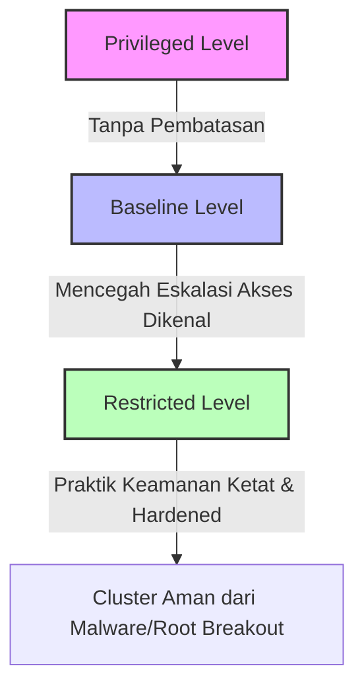

# Modul 02 — Pod Security Admission (PSA) & Pod Security Standards

## 1. Konsep Dasar Pod Security Standards (PSS) & PSA

Dalam Kubernetes modern (v1.25+), **PodSecurityPolicy (PSP)** telah disusupkan dan digantikan secara resmi oleh **PodSecurity Admission (PSA)**. PSA adalah mekanisme bawaan Kubernetes API Server untuk membatasi hak akses dan kapabilitas Pod yang dijalankan di cluster berdasarkan namespace label.

Terdapat 3 tingkatan **Pod Security Standards (PSS)**:



### Tabel Perbandingan PSS Levels

| PSS Level | Deskripsi | Aturan Utama | Use Case |
| :--- | :--- | :--- | :--- |
| **Privileged** | Tanpa batasan sama sekali. Pod memiliki akses penuh seperti Node host. | Mengizinkan `privileged: true`, host PID/IPC/Network, mounting host path secara bebas. | System DaemonSet (Cilium, Calico, kube-proxy, Log Collector). |
| **Baseline** | Mencegah eskalasi hak akses yang berbahaya namun tetap ramah konfigurasi default aplikasi umum. | Dilarang `privileged: true`, dilarang `hostNetwork/hostPID`, menolak kapabilitas Linux berbahaya (`CAP_SYS_ADMIN`). | Aplikasi umum bisnis/mikroservis (Spring Boot, Node.js default). |
| **Restricted** | Praktik hardening Pod tingkat tinggi dan sangat ketat sesuai CIS Benchmark. | Wajib `runAsNonRoot: true`, `allowPrivilegeEscalation: false`, `drop: ALL` capabilities, `seccompProfile: RuntimeDefault`. | Production Workload yang terekspos ke internet publik. |

---

## 2. Mode Penegakan PSA (Enforcement Modes)

PSA dikontrol sepenuhnya melalui **Labels** pada objek Namespace. Terdapat 3 mode penegakan yang dapat berjalan secara bersisian:

1. **`enforce`**: Pod yang melanggar aturan akan **DITOLAK secara langsung** oleh Kube-API Server saat pembuatan deployment/pod.
2. **`warn`**: Pod yang melanggar tetap **DIIZINKAN berjalan**, namun memberikan pesan peringatan (*warning header*) di terminal saat pengguna menjalankan `kubectl apply`.
3. **`audit`**: Pod yang melanggar tetap **DIIZINKAN**, namun pelanggaran dicatat ke dalam *Audit Log Server* Kubernetes untuk keperluan forensik dan kepatuhan.

Syntax Label Namespace:
```yaml
pod-security.kubernetes.io/<mode>: <level>
pod-security.kubernetes.io/<mode>-version: <version>
```

---

## 3. Hands-on Lab: Menguji PSA pada Namespace

### Langkah 1: Buat Namespace dengan Label Restricted PSA
Jalankan perintah berikut untuk mengaplikasikan manifest namespace yang diberi label Restricted PSA:

```bash
kubectl apply -f minggu-15/manifests/02-psa-namespace-labels.yaml
```

*Output yang Diharapkan:*
```text
namespace/secured-apps created
pod/hardened-nginx created
```

### Langkah 2: Menguji Penolakan Pod yang Tidak Patuh (Non-Compliant Pod)

Coba jalankan pod pengujian yang berjalan sebagai `root` dan meminta hak `privileged: true` di dalam namespace `secured-apps`:

```bash
kubectl run unsafe-test --image=nginx --namespace=secured-apps --privileged
```

*Output yang Diharapkan (API Server Menolak Pod):*
```text
Error from server (Forbidden): pods "unsafe-test" is forbidden: violates PodSecurity "restricted:latest": 
privileged (container "unsafe-test" must not set securityContext.privileged=true), 
allowPrivilegeEscalation != false (container "unsafe-test" must set securityContext.allowPrivilegeEscalation=false), 
unrestricted capabilities (container "unsafe-test" must set securityContext.capabilities.drop=["ALL"]), 
runAsNonRoot != true (pod or container "unsafe-test" must set securityContext.runAsNonRoot=true), 
seccompProfile (pod or container "unsafe-test" must set securityContext.seccompProfile.type to "RuntimeDefault" or "Localhost")
```

> **Penjelasan**: API Server memblokir Pod *sebelum* container sempat di-pull atau di-schedule ke Worker Node!

---

## 4. Struktur Security Context Hardened Pod (Restricted Compliant)

Berikut adalah struktur `securityContext` tingkat Pod dan Container yang wajib diimplementasikan agar lolos penegakan PSA Restricted:

```yaml
spec:
  securityContext:
    runAsNonRoot: true
    runAsUser: 10001
    runAsGroup: 10001
    fsGroup: 10001
    seccompProfile:
      type: RuntimeDefault
  containers:
  - name: app
    image: nginxinc/nginx-unprivileged:alpine
    securityContext:
      allowPrivilegeEscalation: false
      readOnlyRootFilesystem: true
      capabilities:
        drop:
        - ALL
```

### Penjelasan Parameter Keamanan:
- `runAsNonRoot: true`: Memastikan Kubelet menolak kontainer jika binary didalamnya mencoba berjalan sebagai UID 0 (root).
- `allowPrivilegeEscalation: false`: Mencegah proses anak memperoleh privilege lebih tinggi daripada proses induk (seperti penggunaan `sudo` atau SUID binary).
- `readOnlyRootFilesystem: true`: Mengunci sistem berkas container sehingga malware tidak bisa mengunduh atau menginstal file biner jahat di runtime (direktori sementara dapat menggunakan `emptyDir`).
- `seccompProfile`: Membatasi sistem panggilan (*syscall*) Linux ke kernel menggunakan profil bawaan Runtime (Docker/containerd).

---

## 5. Ringkasan & Checklist Keamanan Pod

1. **Selalu terapkan PSA Minimal Baseline** di seluruh namespace non-system.
2. **Gunakan Level Restricted** untuk seluruh namespace aplikasi produksi.
3. **Gunakan Mode Warn & Audit terlebih dahulu** pada cluster eksis sebelum mengaktifkan `enforce` agar tidak merusak workload lama yang belum kompatibel.
