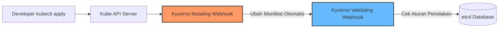

# Modul 03 — Policy Engine dengan Kyverno

## 1. Pengenalan Policy Engine & Kenapa Menggunakan Kyverno

Meskipun **Pod Security Admission (PSA)** sangat efektif untuk memvalidasi Pod Security Standards, PSA memiliki keterbatasan:
- PSA hanya bisa memvalidasi spesifikasi Pod/PodTemplate.
- PSA tidak bisa mengubah (*mutate*) manifest secara otomatis.
- PSA tidak bisa membuat (*generate*) resource tambahan secara otomatis saat ada resource baru dibuat.
- PSA hanya menggunakan label namespace standar Kubernetes.

Untuk kebutuhan tata kelola cluster (*Cluster Governance*) yang fleksibel dan menyeluruh, kita memerlukan **Policy Engine Kubernetes**.



### Mengapa Kyverno?
Dibandingkan alternatif seperti Open Policy Agent (OPA) / Gatekeeper yang memerlukan bahasa kustom Rego, **Kyverno** dirancang khusus untuk Kubernetes dengan format **Declarative YAML murni**. Developer dan DevOps engineer tidak perlu mempelajari bahasa baru!

---

## 2. 3 Mode Operasi Kyverno (Validate, Mutate, Generate)

| Tipe Rule | Fungsi Utama | Contoh Penggunaan SRE / DevOps |
| :--- | :--- | :--- |
| **Validate** | Menolak resource yang melanggar aturan kebijakan keamanan atau konvensi penamaan. | Memastikan Pod memiliki label `owner` & `environment`, menolak image dengan tag `:latest`. |
| **Mutate** | Mengubah atau menambah field dalam manifest secara otomatis sebelum disimpan ke etcd. | Auto-inject `securityContext`, auto-inject sidecar container, menambahkan default annotations. |
| **Generate** | Membuat resource Kubernetes baru secara otomatis ketika ada trigger resource lain dibuat. | Membuat `ResourceQuota` dan `NetworkPolicy` default otomatis saat Namespace baru dibuat. |

---

## 3. Instalasi Kyverno Menggunakan Helm

Untuk menginstal Kyverno di cluster Kubernetes/k3d lokal:

```bash
# 1. Tambahkan Helm Repo Kyverno
helm repo add kyverno https://kyverno.github.io/kyverno/
helm repo update

# 2. Instal Kyverno ke Namespace kyverno
helm install kyverno kyverno/kyverno --namespace kyverno --create-namespace

# 3. Verifikasi Pod Kyverno Controller sudah Running
kubectl get pods -n kyverno
```

*Output yang Diharapkan:*
```text
NAME                                           READY   STATUS    RESTARTS   AGE
kyverno-admission-controller-6d778d9b8-x29qf   1/1     Running   0          45s
kyverno-background-controller-84b5c77c-jkl89  1/1     Running   0          45s
kyverno-cleanup-controller-74567cbbd-mnopq     1/1     Running   0          45s
kyverno-reports-controller-58748dcc8-qwert     1/1     Running   0          45s
```

---

## 4. Hands-on Lab: Menerapkan Policy Rules Kyverno

### Langkah 1: Apply ClusterPolicy Kyverno
Terapkan 3 aturan Kyverno (Validate, Mutate, Generate) dari manifest:

```bash
kubectl apply -f minggu-15/manifests/03-kyverno-policies.yaml
```

*Output yang Diharapkan:*
```text
clusterpolicy.kyverno.io/enforce-environment-label created
clusterpolicy.kyverno.io/mutate-default-securitycontext created
clusterpolicy.kyverno.io/generate-default-quota created
```

### Langkah 2: Uji Penolakan Validate Rule (Tanpa Label Environment)

Coba jalankan Pod tanpa label `environment`:

```bash
kubectl run test-pod --image=nginx -n default
```

*Output yang Diharapkan (Kyverno Menolak Pod):*
```text
Error from server (Forbidden): admission webhook "validate.kyverno.svc-fail" denied the request: 

resource Pod/default/test-pod was blocked due to the following policies

enforce-environment-label:
  check-environment-label: 'Setiap Pod WAJIB memiliki label ''environment'' dengan nilai ''dev'', ''staging'', atau ''prod''.'
```

### Langkah 3: Uji Pod yang Lolos Validation & Menguji Mutation Rule

Jalankan Pod yang menyertakan label `environment=dev`:

```bash
kubectl run test-pod-ok --image=nginx --labels=environment=dev -n default
```

*Output:* `pod/test-pod-ok created`

Periksa spesifikasi Pod yang berhasil dibuat untuk membuktikan bahwa **Mutate Rule** bekerja secara otomatis meng-inject `runAsNonRoot: true`:

```bash
kubectl get pod test-pod-ok -o yaml | grep -A 3 securityContext
```

*Output yang Diharapkan:*
```yaml
  securityContext:
    runAsNonRoot: true
```

### Langkah 4: Uji Generate Rule pada Namespace Baru

Buat namespace baru bernama `testing-namespace`:

```bash
kubectl create namespace testing-namespace
```

Periksa apakah `ResourceQuota` bernama `default-quota` berhasil digenerate secara otomatis oleh Kyverno di namespace tersebut:

```bash
kubectl get resourcequota -n testing-namespace
```

*Output yang Diharapkan:*
```text
NAME            AGE   REQUEST.CPU   REQUEST.MEMORY   LIMIT.CPU   LIMIT.MEMORY
default-quota   5s    0/4           0/8Gi            0/8         0/16Gi
```

---

## 5. Meninjau Policy Reports

Kyverno secara otomatis memindai cluster di background dan membuat objek **PolicyReport** untuk mendeteksi workload lama yang tidak patuh terhadap kebijakan baru:

```bash
kubectl get policyreports -A
```

Atau menggunakan plugin CLI Kyverno untuk memindai manifest di pipeline CI/CD lokal tanpa harus menginstalnya di cluster:

```bash
# Contoh pengujian lokal menggunakan kyverno CLI
kyverno test minggu-15/manifests/
```

---

## 6. Ringkasan Modul

1. **Kyverno** menyediakan Policy-as-Code bawaan Kubernetes tanpa bahasa pemrograman tambahan.
2. Aturan **Validate** menjaga standar arsitektur dan penamaan.
3. Aturan **Mutate** membantu developer agar Pod otomatis terkonfigurasi aman (*secure by default*).
4. Aturan **Generate** menyederhanakan penyediaan infrastruktur multi-tenancy (*Namespace Provisioning*).
