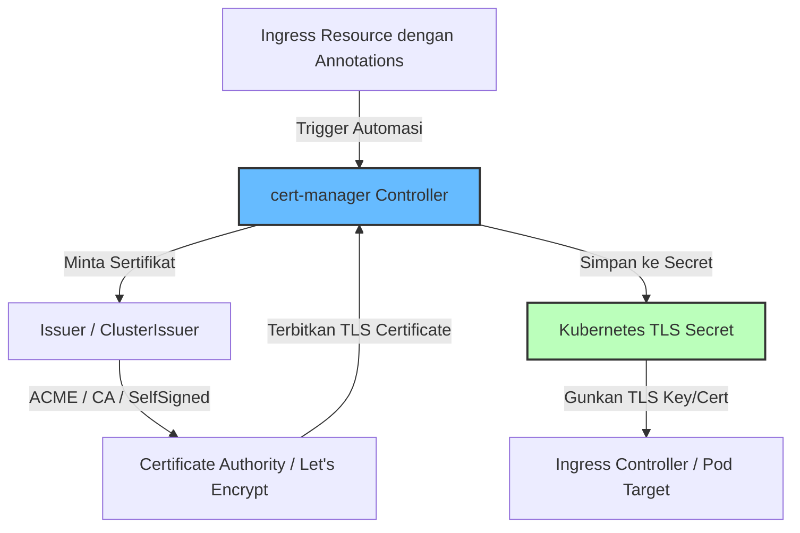

# Modul 04 — Automasi TLS & Sertifikat dengan cert-manager

## 1. Konsep Dasar TLS di Kubernetes & Peran cert-manager

Enkripsi **TLS (Transport Layer Security)** memastikan komunikasi data antara klien luar (*end-user*) dan Ingress Controller, maupun antar mikroservis internal cluster, terenkripsi (*mTLS*).

Mengelola sertifikat TLS secara manual (generate RSA key, buat CSR, minta penandatanganan CA, update Kubernetes TLS Secret sebelum kedaluwarsa) sangat rawan kesalahan (*human error*) dan risiko outage akibat sertifikat kedaluwarsa.

**cert-manager** adalah Kubernetes add-on otomatisasi lifecycle sertifikat TLS (Penerbitan, Pembaruan/Auto-Renewal, dan Pembatalan).



---

## 2. Komponen Utama cert-manager

1. **`Issuer` vs `ClusterIssuer`**:
   - `Issuer`: Hanya berlaku untuk 1 namespace spesifik.
   - `ClusterIssuer`: Berlaku secara global untuk seluruh namespace di dalam cluster.
2. **`Certificate`**: Custom Resource Definition (CRD) yang mendefinisikan detail TLS certificate (DNS Names, masa berlaku `duration`, kapan harus di-renew `renewBefore`, dan nama `secretName` target).
3. **Supported Certificate Providers**:
   - **ACME** (Let's Encrypt - HTTP-01 / DNS-01 challenge untuk domain publik).
   - **CA** (Private Internal Certificate Authority untuk lingkungan lokal/staging/intranet).
   - **Vault** (HashiCorp Vault PKI Engine).
   - **SelfSigned** (Sertifikat buatan sendiri untuk pengujian dev).

---

## 3. Instalasi cert-manager via Helm

Instal `cert-manager` beserta CRD resminya:

```bash
# 1. Tambahkan Helm Repo Jetstack cert-manager
helm repo add jetstack https://charts.jetstack.io
helm repo update

# 2. Instal cert-manager dengan mengaktifkan CRD otomatis
helm install cert-manager jetstack/cert-manager \
  --namespace cert-manager \
  --create-namespace \
  --set crds.enabled=true

# 3. Verifikasi Status Pod cert-manager
kubectl get pods -n cert-manager
```

*Output yang Diharapkan:*
```text
NAME                                       READY   STATUS    RESTARTS   AGE
cert-manager-7848698d-x29qf                1/1     Running   0          40s
cert-manager-cainjector-544485bf-jkl89     1/1     Running   0          40s
cert-manager-webhook-598d9cc9-qwert        1/1     Running   0          40s
```

---

## 4. Hands-on Lab: Provisioning Private CA & Auto-Renewal Sertifikat

### Langkah 1: Apply ClusterIssuer & Certificate Manifest
Jalankan perintah berikut untuk mengonfigurasi `SelfSigned Issuer`, `Internal CA`, `Certificate`, dan `Ingress`:

```bash
kubectl apply -f minggu-15/manifests/04-cert-manager-issuers.yaml
```

*Output yang Diharapkan:*
```text
clusterissuer.cert-manager.io/selfsigned-issuer created
certificate.cert-manager.io/my-internal-ca created
clusterissuer.cert-manager.io/internal-ca-issuer created
certificate.cert-manager.io/api-service-cert created
ingress.networking.k8s.io/secure-api-ingress created
```

### Langkah 2: Verifikasi Status Penerbitan Certificate

Periksa objek `certificate` dan pastikan status `READY` bernilai `True`:

```bash
kubectl get certificates -n secured-apps
```

*Output yang Diharapkan:*
```text
NAME               READY   SECRET                   AGE
api-service-cert   True    api-service-tls-secret   15s
```

Periksa juga Secret Kubernetes TLS yang otomatis dibuat oleh cert-manager:

```bash
kubectl get secret api-service-tls-secret -n secured-apps -o wide
```

*Output yang Diharapkan:*
```text
NAME                     TYPE                DATA   AGE
api-service-tls-secret   kubernetes.io/tls   2      20s
```

### Langkah 3: Menginspeksi Detail Sertifikat TLS dengan OpenSSL

Kita dapat mengekstrak sertifikat dari Secret Kubernetes dan menginspeksi tanggal kedaluwarsa serta Subject Alternative Names (SAN) menggunakan OpenSSL:

```bash
kubectl get secret api-service-tls-secret -n secured-apps -o jsonpath='{.data.tls\.crt}' | base64 -d | openssl x509 -noout -text | grep -A 2 "Subject Alternative Name"
```

*Output yang Diharapkan:*
```text
            X509v3 Subject Alternative Name: 
                DNS:api.local.internal, DNS:api.secured-apps.svc.cluster.local
```

### Langkah 4: Uji Koneksi HTTPS pada Ingress API

Lakukan pengujian HTTP/HTTPS menggunakan `curl` dengan flag `-k` (*allow insecure/custom CA*):

```bash
curl -kv https://api.local.internal --resolve api.local.internal:443:127.0.0.1
```

---

## 5. Mekanisme Auto-Renewal (Pembaruan Otomatis)

cert-manager secara konstan memantau tanggal kedaluwarsa seluruh sertifikat di cluster.

Jika `duration` diatur **2160h (90 hari)** dan `renewBefore` diatur **360h (15 hari)**, maka pada hari ke-75 cert-manager akan secara otomatis:
1. Membuat permintaan penandatanganan sertifikat baru (*CSR*).
2. Meminta sertifikat baru ke `Issuer`.
3. Memperbarui isi Secret TLS (`tls.crt` dan `tls.key`).
4. Ingress Controller (seperti NGINX) akan secara dinamis meng-reload TLS secret tanpa memicu downtime/restart pod.

---

## 6. Ringkasan Modul

1. **cert-manager** mengeliminasi bahaya *outage* akibat sertifikat kedaluwarsa melalui fitur Pembaruan Otomatis (*Auto-Renewal*).
2. **`ClusterIssuer`** menyederhanakan penyediaan TLS untuk seluruh tim developer di cluster.
3. Integrasi **Ingress Annotation** (`cert-manager.io/cluster-issuer`) memungkinkan developer memperoleh sertifikat SSL/TLS HTTPS valid hanya dengan menambahkan 1 baris kode di YAML Ingress.
