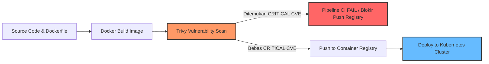

# Modul 05 — Container Image Vulnerability Scanning & SBOM dengan Trivy

## 1. Konsep DevSecOps & Container Image Scanning

Dalam siklus pengembangan perangkat lunak modern (**DevSecOps**), pengujian keamanan tidak boleh dilakukan hanya saat aplikasi sudah berjalan di produksi (*shift-right*), melainkan harus dimulai sejak tahap pengembangan dan integrasi (*shift-left*).

**Container Image Vulnerability Scanning** adalah proses pemindaian berkas gambar kontainer (*container image layers*) untuk mendeteksi kelemahan keamanan yang dikenal (**CVE — Common Vulnerabilities and Exposures**) pada OS packages (Alpine, Debian, Ubuntu) maupun Application Dependencies (npm, pip, maven, go modules).



---

## 2. Mengapa Menggunakan Trivy?

**Trivy** (oleh Aqua Security) adalah alat pemindai keamanan *open-source* yang sangat cepat, akurat, dan serbaguna. 

### Keunggulan Utama Trivy:
1. **Cakupan Pemindaian Luas**: Mampu memindai Container Images, Local Filesystem, Git Repositories, Kubernetes Manifests/Helm Charts, dan VM Images.
2. **Kecepatan Tinggi & Akurat**: Memiliki basis data CVE lokal yang di-update secara otomatis setiap hari.
3. **Mendukung Generator SBOM (Software Bill of Materials)**: Menghasilkan manifest SBOM berstandar CycloneDX dan SPDX untuk kepatuhan lisensi dan audit keamanan.
4. **Integrasi CI/CD Mudah**: Sangat ringan dan mudah diintegrasikan ke dalam GitLab CI, GitHub Actions, Jenkins, dan Tekton.

---

## 3. Instalasi Trivy CLI

Untuk menginstal Trivy di Linux/macOS:

```bash
# macOS via Homebrew
brew install aquasecurity/trivy/trivy

# Ubuntu/Debian Linux
sudo apt-get install wget apt-transport-https gnupg lsb-release
wget -qO - https://aquasecurity.github.io/trivy-repo/deb/public.key | gpg --dearmor | sudo tee /usr/share/keyrings/trivy.gpg > /dev/null
echo "deb [signed-by=/usr/share/keyrings/trivy.gpg] https://aquasecurity.github.io/trivy-repo/deb $(lsb_release -sc) main" | sudo tee -a /etc/list.d/trivy.list
sudo apt-get update && sudo apt-get install trivy
```

---

## 4. Hands-on Lab: Memindai Image & Menganalisis Severity CVE

### Langkah 1: Memindai Image Publik yang Rentan (Vulnerable Image)

Mari kita pindai image `python:3.9-slim` lama yang memiliki beberapa vulnerability yang diketahui:

```bash
trivy image python:3.9-slim
```

*Output yang Diharapkan (Ringkasan Vulnerability berdasarkan Severity):*
```text
python:3.9-slim (debian 11.7)

Total: 124 (UNKNOWN: 0, LOW: 72, MEDIUM: 32, HIGH: 16, CRITICAL: 4)

┌──────────────┬────────────────┬──────────┬───────────────────┬───────────────┬────────────────────────────────────────────────────────┐
│   Library    │ Vulnerability  │ Severity │ Installed Version │ Fixed Version │                         Title                          │
├──────────────┼────────────────┼──────────┼───────────────────┼───────────────┼────────────────────────────────────────────────────────┤
│ zlib1g       │ CVE-2023-45853 │ CRITICAL │ 1:1.2.11.dfsg-2+deb11u2 │ 1:1.2.11.dfsg-2+deb11u3 │ zlib: Integer overflow in zipOpenNewFileInZip4        │
│ libssl1.1    │ CVE-2023-3817  │ HIGH     │ 1.1.1n-0+deb11u4  │ 1.1.1n-0+deb11u5  │ openssl: excess time spent checking DH keys           │
└──────────────┴────────────────┴──────────┴───────────────────┴───────────────┴────────────────────────────────────────────────────────┘
```

### Langkah 2: Memfilter Hasil Hanya untuk HIGH & CRITICAL CVE

Dalam operasional harian, kita sering kali ingin mengabaikan kerentanan kelas LOW/MEDIUM agar fokus pada ancaman serius:

```bash
trivy image --severity HIGH,CRITICAL python:3.9-slim
```

### Langkah 3: Menggunakan Flag `--exit-code` untuk Automasi Quality Gate CI/CD

Kita dapat mengonfigurasi Trivy agar mengembalikan exit code `1` jika ditemukan Vulnerability ber-severity **CRITICAL**. Ini akan secara otomatis membatalkan *pipeline* CI/CD agar kontainer berbahaya tidak dapat dipublikasikan ke Registry atau Kubernetes:

```bash
trivy image --exit-code 1 --severity CRITICAL python:3.9-slim
```

*Output:* `Exit status 1` (Pipeline CI Gagal & Mengabaikan Deployment).

### Langkah 4: Membandingkan dengan Distroless / Alpine Image (Hardened Image)

Bandingkan jumlah kerentanan antara image berbasis OS lengkap dengan **Alpine** atau **Google Distroless**:

```bash
trivy image python:3.9-alpine
```

*Output:*
```text
python:3.9-alpine (alpine 3.18.2)
Total: 0 (UNKNOWN: 0, LOW: 0, MEDIUM: 0, HIGH: 0, CRITICAL: 0)
```
> **Pelajaran Keamanan**: Menggunakan base image minimal (seperti Alpine atau Distroless) secara drastis mengurangi *attack surface* kontainer Anda!

---

## 5. Software Bill of Materials (SBOM) dengan Trivy

**SBOM (Software Bill of Materials)** adalah daftar inventaris lengkap seluruh komponen perangkat lunak, dependensi, dan pustaka yang digunakan dalam kontainer. SBOM sangat penting untuk transparansi rantai pasok perangkat lunak (*Software Supply Chain Security*).

Membuat berkas SBOM berformat **CycloneDX JSON**:

```bash
trivy image --format cyclonedx --output sbom.json python:3.9-alpine
```

---

## 6. Ringkasan & Best Practices DevSecOps

1. **Shift-Left Security**: Lakukan pemindaian image sedini mungkin di pipeline CI/CD sebelum image di-push ke Container Registry.
2. **Gunakan Minimal Base Images**: Pilih base image minimal seperti `alpine`, `distroless`, atau `unprivileged` untuk mengurangi jumlah CVE secara signifikan.
3. **Blokir CRITICAL Vulnerabilities**: Konfigurasikan `--exit-code 1 --severity CRITICAL` pada CI/CD Quality Gate.
4. **Simpan Dokumen SBOM**: Dokumentasikan SBOM untuk setiap rilis produksi untuk kemudahan audit kepatuhan (*compliance audit*).
