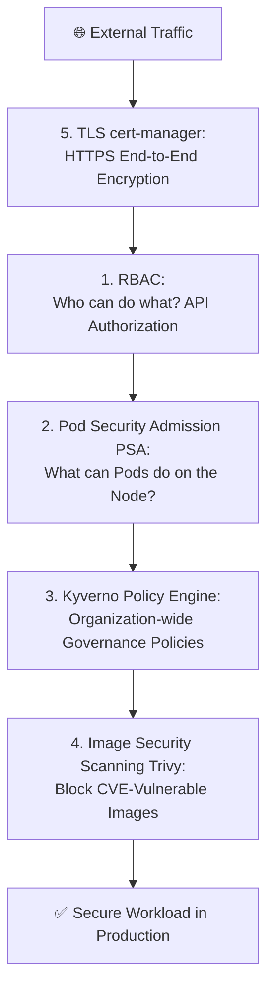
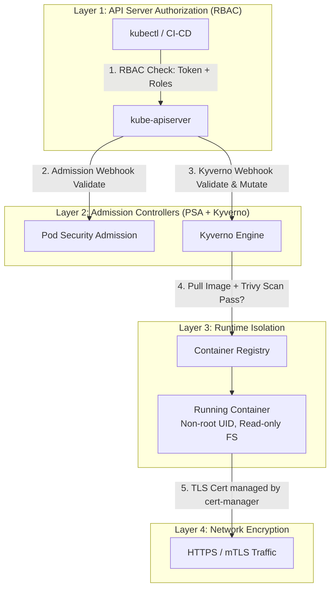
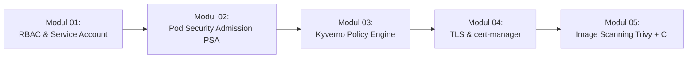

# Minggu 15 — Security Baseline: RBAC, PSA, Kyverno, TLS cert-manager & Image Scanning

Selamat datang di **Minggu 15** dari Roadmap SRE Lanjutan! Pada minggu lalu Anda telah menguasai Infrastructure as Code dengan OpenTofu dan Ansible. Di modul ini, kita masuk ke salah satu pondasi terpenting di lingkungan produksi nyata: **Security Baseline** — lapisan pertahanan keamanan berlapis-lapis pada platform Kubernetes Anda.

---

## 🎯 Gambaran Umum & Tujuan Pembelajaran

Sebuah cluster Kubernetes yang tidak dikonfigurasi keamanannya dengan benar adalah *open door* bagi penyerang. Dalam insiden nyata, celah keamanan tidak selalu datang dari bug kode aplikasi, tetapi lebih sering dari:
- **Hak akses yang terlalu longgar** (Pod dengan akses root ke seluruh cluster).
- **Tidak ada kebijakan keamanan** (Container dengan `privileged: true` bisa bobol seluruh node).
- **Sertifikat TLS expired** yang tidak terdeteksi (downtime mendadak saat sertifikat mati).
- **Image container tidak di-scan** (vulnerable image dengan CVE kritis lolos masuk ke production).

Pada Minggu 15 ini, Anda akan membangun **Security Baseline** yang komprehensif menggunakan 5 lapisan pertahanan:

### Kompetensi Utama yang Akan Anda Kuasai:
1. **RBAC (Role-Based Access Control)**: Mengonfigurasi Role, ClusterRole, RoleBinding, dan Service Account dengan prinsip *Least Privilege* agar setiap komponen hanya bisa mengakses resource yang diperlukan.
2. **Pod Security Admission (PSA)**: Menerapkan PSA Standards (Privileged/Baseline/Restricted) untuk mengontrol kemampuan Pod di tingkat OS Linux (*privilege escalation*, *hostPID*, *hostNetwork*).
3. **Kyverno Policy Engine**: Menginstal dan mengelola kebijakan tata kelola kluster (ClusterPolicy) dengan kemampuan *validate*, *mutate*, dan *generate* resource secara otomatis.
4. **TLS Automation dengan cert-manager**: Mengonfigurasi penerbitan dan perpanjangan sertifikat TLS secara otomatis menggunakan Issuer `SelfSigned`, `CA`, atau `ACME Let's Encrypt`.
5. **Image Scanning dengan Trivy**: Mengintegrasikan `trivy` dalam pipeline CI/CD GitLab untuk mendeteksi CVE kritis pada image container sebelum deploy ke production.

---

## 🏗️ Arsitektur Defense-in-Depth Security Baseline

Keamanan platform Kubernetes yang baik tidak bergantung pada satu alat saja. Prinsipnya adalah **Defense-in-Depth** (Pertahanan Berlapis):

---

## 🗺️ Panduan & Alur Belajar (Modul Navigation)

Ikuti 5 modul praktis secara berurutan:

### Rincian Modul Pembelajaran:

| Modul | Judul Materi | Deskripsi & Fokus Utama | Artefak Hasil Lab |
| :---: | :--- | :--- | :--- |
| **`01-rbac-service-account.md`** | RBAC & Least Privilege Principle | Role, ClusterRole, RoleBinding, ClusterRoleBinding, Service Account token mounting, `kubectl auth can-i`. | Manifest `01-rbac-*.yaml` |
| **`02-pod-security-admission.md`** | Pod Security Admission (PSA) Standards | PSA Levels (Privileged/Baseline/Restricted), enforcement modes (enforce/warn/audit), pengujian pembuatan Pod yang melanggar PSA. | Manifest `02-psa-*.yaml` |
| **`03-kyverno-policy-engine.md`** | Kyverno Governance Policy Engine | Install Kyverno, ClusterPolicy for validate/mutate/generate, Policy Reports, exception management. | Manifest `03-kyverno-*.yaml` |
| **`04-tls-cert-manager.md`** | TLS Automation dengan cert-manager | Instalasi cert-manager, Issuer (`SelfSigned`, `CA`), Certificate Resource, automatic renewal, TLS Secret binding ke Ingress. | Manifest `04-cert-*.yaml` |
| **`05-image-scanning-trivy.md`** | Image Security Scanning (Trivy + CI) | Instalasi Trivy, scan image CLI, integrasi stage CI/CD GitLab, threshold CRITICAL/HIGH exit code, SBOM output. | `.gitlab-ci.yml` Security Stage |

---

## 🛠️ Prasyarat (Prerequisites) Sebelum Memulai

1. **Cluster Kubernetes**: Cluster k3s berjalan (dari Minggu 13 cluster HA, atau `k3d cluster create devcluster` sebagai fallback).
2. **Trivy CLI** (untuk Modul 05):
   - Install: `brew install aquasecurity/trivy/trivy` atau `curl -sfL https://raw.githubusercontent.com/aquasecurity/trivy/main/contrib/install.sh | sh -s -- -b /usr/local/bin`.

---

## 📌 Konsep Kunci yang Wajib Dipahami

### 🔑 Prinsip Least Privilege (Hak Minimum)
> "Setiap identitas dan komponen wajib memiliki hak akses sesedikit mungkin yang cukup untuk menyelesaikan tugasnya, tidak lebih."

- Pod aplikasi yang hanya perlu **membaca** ConfigMap di namespace `prod-app` → Buat ServiceAccount dengan Role `configmap-reader` yang **hanya** boleh `get/list ConfigMaps` di namespace `prod-app`.
- CI/CD pipeline yang perlu deploy ke cluster → Buat ServiceAccount dengan ClusterRole yang **hanya** boleh `apply/update` Deployment di namespace `prod-app`, bukan `delete` Pod atau membaca Secret.

---

## 🏆 Checklist Kelulusan Minggu 15
- [ ] Mampu membuat Role, ClusterRole, RoleBinding, dan memverifikasi akses menggunakan `kubectl auth can-i`.
- [ ] Berhasil mengaktifkan PSA mode `restricted` pada namespace `prod-app` dan membuktikan Pod yang menggunakan `privileged: true` ditolak.
- [ ] Berhasil install Kyverno dan membuat ClusterPolicy minimal yang mewajibkan label `app` pada setiap Pod baru.
- [ ] Berhasil menginstal cert-manager dan membuat Certificate TLS `SelfSigned` yang terpasang ke Ingress.
- [ ] Berhasil menjalankan `trivy image nginx:latest` dan memahami laporan CVE yang dihasilkan.
