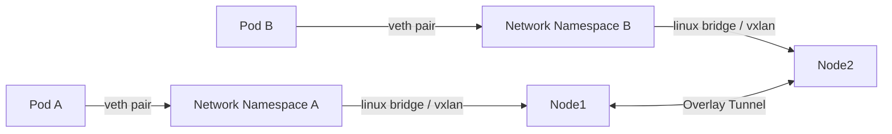

# Modul 01 — Container Network Interface (CNI) & Cilium eBPF Datapath

## 1. Masalah yang Harus Dipecahkan CNI

Bayangkan Anda memiliki Pod A di Worker Node 1 (IP `10.0.1.5`) dan Pod B di Worker Node 2 (IP `10.0.2.7`). Keduanya ada di dalam cluster Kubernetes. Pertanyaan mendasarnya:

> **Bagaimana paket data dari Pod A sampai ke Pod B, padahal keduanya:**
> - Berada di host kernel Linux yang berbeda?
> - Berada di Network Namespace yang berbeda (terisolasi)?
> - Mungkin ada di subnet IP fisik yang berbeda?

**Container Network Interface (CNI)** adalah standar plugin yang menjawab pertanyaan ini. Kubernetes TIDAK mengatur jaringan sendiri — Kube-API Server hanya mendelegasikannya ke **plugin CNI** yang memenuhi spesifikasi CNI v1.0+.



### Persyaratan Mutlak Jaringan Kubernetes
1. Setiap Pod mendapatkan **IP address uniknya sendiri** (tanpa NAT).
2. Pod di Node berbeda **saling berkomunikasi tanpa NAT**.
3. Pod dan Service **saling berkomunikasi tanpa NAT**.
4. Agent external (ssh, kubectl) **dapat berkomunikasi dengan Pod** tanpa NAT.

---

## 2. CNI Populer di Industri

| Plugin CNI | Model Datapath | Catatan |
| :--- | :--- | :--- |
| **Flannel** | Linux Bridge / VXLAN | Sederhana, ringan, namun fitur terbatas. |
| **Calico** | iptables / eBPF | Matang, NetworkPolicy kuat, namun kompleks. |
| **Weave Net** | VxLAN UDP | Mesh routing otomatis, namun skala terbatas. |
| **Cilium** | **eBPF** (XDP/TC) | Generasi baru, transparan, observabilitas bawaan. |
| **AWS VPC CNI** | Native AWS ENI | Setiap Pod = native AWS IP. |

---

## 3. eBPF & Cilium — Mengapa Revolusioner?

**eBPF (Extended Berkeley Packet Filter)** adalah teknologi yang memungkinkan program kecil (sandbox) dijalankan langsung **di dalam Kernel Linux** tanpa memuat modul kernel baru atau meng-compile ulang kernel.

Pada Kubernetes tradisional, konektivitas Service ⇄ Pod bergantung pada **iptables** (ratusan ribu rules yang harus di-iterasi setiap paket). Ini menjadi sangat lambat di cluster dengan 5000+ Service.

**Cilium** mengganti iptables dengan program eBPF yang dipasang di hook **TC (Traffic Control)** dan **XDP (eXpress Data Path)**. Hasilnya:

```mermaid
graph TD
    Packet[Network Packet] -->|XDP/TC Hook| eBPF[eBPF Datapath di Kernel Linux]
    eBPF -->|1 Keputusan Tanpa Iterasi| Forward[Direct Forwarding / Drop / Redirect]
    
    subgraph Traditional[iptables Mode Lama]
        ipt[Packet] --> PREROUTING
        PREROUTING -->|Rantai 1| RULE1
        RULE1 -->|Rantai 2| RULE2
        RULE2 -->|Rantai 3| RULE3
        RULE3 -->|Iterasi Linear O(n)| FWD[Drop/Forward]
    end
    
    style eBPF fill:#6bf,stroke:#333,stroke-width:2px
    style FWD fill:#f96,stroke:#333,stroke-width:2px
```

### Keunggulan Cilium eBPF:
1. **Throughput tinggi**: bypass iptables & userspace proxy.
2. **Latency rendah**: keputusan paket dalam sekali langkah (*O(1)* Hash Map).
3. **NetworkPolicy berbasis identitas** (bukan IP): `policy based on Labels`, bukan IP address.
4. **Observabilitas L7**: enxerga HTTP/gRPC/DNS query tanpa sidecar.
5. **Transparan**: tidak perlu ubah pods/aplikasi.

---

## 4. Hands-on Lab: Instalasi Cilium pada k3d/k3s

### Langkah 1: Mempersiapkan Environment k3d (Disable Flannel bawaan k3d)

Jika Anda menggunakan k3d bawaan yang otomatis mengaktifkan Flannel, kita perlu me-recreate cluster tanpa CNI bawaan:

```bash
# Hapus cluster lama (jika ada)
k3d cluster delete my-cluster

# Buat cluster baru dengan mengosongkan CNI (--no-flannel)
k3d cluster create my-cluster \
  --servers 1 \
  --agents 2 \
  --k3s-arg "--disable=traefik,servicelb,metrics-server,local-storage" \
  --no-flannel
```

### Langkah 2: Instal Cilium via Helm

```bash
# Tambahkan Repo Cilium
helm repo add cilium https://helm.cilium.io/
helm repo update

# Install Cilium (Mode Routing Native + Bandwidth Manager)
helm install cilium cilium/cilium \
  --namespace kube-system \
  --set kubeProxyReplacement=true \
  --set bpf.masquerade=true \
  --set bandwidthManager.enabled=true \
  --set hubble.enabled=true \
  --set hubble.relay.enabled=true \
  --set hubble.ui.enabled=true \
  --set ipam.mode=kubernetes
```

*Output yang Diharapkan:*
```text
NAME: cilium
LAST DEPLOYED: ...
NAMESPACE: kube-system
STATUS: deployed
REVISION: 1
TEST SUITE: None
```

### Langkah 3: Verifikasi Status Cilium

```bash
# Tunggu semua Pod Cilium Running
kubectl get pods -n kube-system -l k8s-app=cilium

# Jalankan Cilium connectivity test (self-check eBPF Datapath)
cilium connectivity test
```

*Output yang Diharapkan (Ringkasan):*
```text
✅ [pod-to-pod] cilium-test/client-7f8d9 → cilium-test/echo-9c4f1
✅ [pod-to-service] cilium-test/client-7f8d9 → cilium-test/echo-service
✅ [pod-to-external] cilium-test/client-7f8d9 → 1.1.1.1
✅ [dns-resolution] cilium-test/client-7f8d9 → kubernetes.default
89/89 tests passed
```

---

## 5. Menerapkan CiliumNetworkPolicy (Identity-Based Policy)

Berbeda dengan NetworkPolicy Kubernetes native (berbasis IP/podSelector), CiliumNetworkPolicy memperkenalkan **Politik berbasis identitas** (Berdasarkan label Pod).

```bash
kubectl apply -f minggu-16/manifests/01-cilium-policies.yaml
```

*Output yang Diharapkan:*
```text
ciliumclusterwidenetworkpolicy.cilium.io/allow-dns-egress created
ciliumnetworkpolicy.cilium.io/allow-frontend-to-backend created
ciliumnetworkpolicy.cilium.io/deny-other-ingress created
```

### Penjelasan Policy:
- **`allow-dns-egress`**: Mengizinkan SEMUA Pod (selector `{}`) keluar ke kube-dns CoreDNS (port 53 UDP/TCP).
- **`allow-frontend-to-backend`**: Hanya Pod berlabel `app: backend` yang boleh ingress dari Pod berlabel `app: frontend` di port 8080.
- **`deny-other-ingress`**: Menolak ingress dari Pod berlabel `app: untrusted-client`.

---

## 6. Ringkasan Modul

1. **CNI** adalah jembatan antara Kernel Linux dan Pod agar jaringan Kubernetes dapat terjadi.
2. **Cilium** menggunakan **eBPF** untuk mengambil keputusan jaringan langsung di Kernel (O(1)), sehingga sangat cepat.
3. **CiliumNetworkPolicy** memberi kita policy berbasis *label/identitas*, bukan berbasis IP address yang dinamis.
4. **Cilium connectivity test** adalah "jurus sakti" untuk verifikasi eBPF datapath setelah instalasi.
