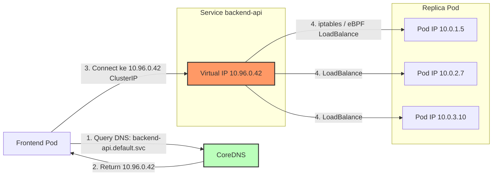

# Modul 02 — Service Discovery & CoreDNS

## 1. Masalah Service Discovery di Lingkungan Dinamis

Dalam Kubernetes, IP Pod adalah **sumber daya yang sangat dinamis**:
- Pod di-scale up/down → IP baru.
- Pod restart karena error → IP berubah.
- Pod di-evict ke Node berbeda → IP berubah.

Mustahil bagi aplikasi frontend untuk mengingat alamat IP backend secara hard-coded. Solusinya: **Service** dan **DNS Otomatis**.



---

## 2. Cara Kerja CoreDNS di Kubernetes

**CoreDNS** adalah server DNS default di Kubernetes. Ia membaca **Service** dan **Endpoint** dari Kube-API Server, lalu secara otomatis membuat record A & SRV.

### Format FQDN (Fully Qualified Domain Name) Kubernetes:

```text
<service-name>.<namespace>.svc.cluster.local
```

| Nama Layanan | Namespace | FQDN |
| :--- | :--- | :--- |
| `kubernetes` | `default` | `kubernetes.default.svc.cluster.local` |
| `backend-api` | `production` | `backend-api.production.svc.cluster.local` |
| `metrics` | `monitoring` | `metrics.monitoring.svc.cluster.local` |

---

## 3. Hands-on Lab: DNS Query & Headless Service

### Langkah 1: Buat Namespace dan Pod Pengujian

```bash
kubectl create namespace production
kubectl apply -f minggu-16/manifests/02-headless-service-dns.yaml
```

*Output yang Diharapkan:*
```text
service/backend-api created
statefulset.apps/backend created
pod/dns-test created
```

### Langkah 2: DNS Query Biasa (Service ClusterIP)

Masuk ke Pod `dns-test` dan uji DNS Lookup:

```bash
kubectl exec -it dns-test -n production -- nslookup backend-api
```

*Output yang Diharapkan:*
```text
Server:    10.96.0.10
Address 1: 10.96.0.10 kube-dns.kube-system.svc.cluster.local

Name:      backend-api
Address 1: 10.96.0.42  <-- INI ADALAH VIRTUAL IP CLUSTER SERVICE
```

### Langkah 3: DNS Query dengan FQDN Lengkap

```bash
kubectl exec -it dns-test -n production -- nslookup backend-api.production.svc.cluster.local
```

*Output yang Diharapkan:*
```text
Name:      backend-api.production.svc.cluster.local
Address 1: 10.96.0.42
```

### Langkah 4: Uji DNS Query Resolusi dari Pod ke Pod (Service Backend)

```bash
kubectl exec -it dns-test -n production -- wget -q -O - http://backend-api:8080
```

*Output yang Diharapkan:*
```text
<!DOCTYPE html>
<html>
<head>
<title>Welcome to nginx!</title>
...
```

### Langkah 5: Uji Headless Service (DNS Langsung ke Pod)

Karena Headless Service (`clusterIP: None`) tidak mengalokasikan Virtual IP, DNS akan mengembalikan **banyak A Record IP Pod** secara langsung (khas untuk StatefulSet):

```bash
kubectl exec -it dns-test -n production -- nslookup backend-api-0.backend-api.production.svc.cluster.local
```

*Output yang Diharapkan:*
```text
Name:      backend-api-0.backend-api.production.svc.cluster.local
Address 1: 10.0.1.5  <-- INI ADALAH IP Pod langsung (BUKAN ClusterIP)
```

---

## 4. Konfigurasi DNS Kustom per Pod (DNSConfig)

Untuk Pod yang berkomunikasi dengan Active Directory / Database eksternal di domain internal perusahaan, kita bisa custom pencarian DNS-nya:

```yaml
dnsConfig:
  nameservers:
    - 1.2.3.4  # Corporate DNS server
  searches:
    - my-corp.com
  options:
    - name: ndots
      value: "2"
```

**Logika `ndots: 2`**:
- `ndots` adalah jumlah dot (.) pada hostname query.
- Jika nama yang di-query memiliki kurang dari 2 dot, Kubernetes akan **menambahkan suffix search list** (misal `my-corp.com`).
- Contoh: query `mysql` → DNS akan mencoba `mysql.my-corp.com` sebelum akhirnya mencari ke root DNS.
- Contoh: query `mysql.db.prod` (3 dots) → pencarian domain langsung, tanpa suffix.

---

## 5. Memahami DNS Search List otomatis

Setiap Pod Kubernetes otomatis dimasukkan ke dalam **search list** namespace-nya:

```bash
kubectl exec -it dns-test -n production -- cat /etc/resolv.conf
```

*Output yang Diharapkan:*
```text
nameserver 10.96.0.10
search production.svc.cluster.local svc.cluster.local cluster.local
options ndots:5
```

Artinya, query `backend-api` akan otomatis mencoba:
1. `backend-api.production.svc.cluster.local` ✅ (Cocok!)
2. `backend-api.svc.cluster.local`
3. `backend-api.cluster.local`
4. `backend-api` (kemudian fallback ke upstream DNS)

---

## 6. Ringkasan Modul

1. **CoreDNS** adalah "buku telepon" dinamis Kubernetes — Service dibuat, DNS record langsung terdaftar.
2. **FQDN** lengkap: `<service>.<namespace>.svc.cluster.local`.
3. **Headless Service** (`clusterIP: None`) langsung resolve ke IP Pod (berguna untuk StatefulSet).
4. **DNSConfig** per Pod memungkinkan custom nameserver (untuk Active Directory, internal DB) tanpa harus menggangu cluster DNS.
