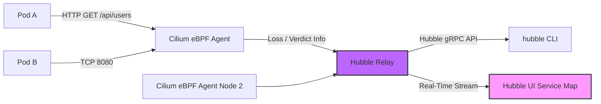

# Modul 03 — Hubble Network Observability

## 1. Apa Itu Hubble?

**Hubble** adalah lapisan observabilitas jaringan untuk Cilium. Bayangkan Hubble sebagai **"Wireshark Real-Time"** untuk lalu lintas Service Mesh di Kubernetes Anda — namun dengan pendekatan *zero-touch* (tidak perlu sidecar, agentless di Node).

Hubble membaca data dari **eBPF Datapath** Cilium (yang sudah dibahas di Modul 01) dan menerjemahkan paket-paket jaringan menjadi **Network Flow** yang mudah dimengerti manusia.



---

## 2. Komponen Arsitektur Hubble

| Komponen | Fungsi |
| :--- | :--- |
| **Hubble Client (`hubble`)** | CLI di laptop lokal untuk query log lalu lintas. |
| **Hubble Agent** (DaemonSet) | Berjalan di setiap Node, membaca flow dari Cilium eBPF. |
| **Hubble Relay** | Mengumpulkan & meng-aggregate data dari semua Hubble Agent. |
| **Hubble UI** | Dashboard visual berbasis Grafana-style (Service Map & Flow Logs). |

---

## 3. Hands-on Lab: Memantau Lalu Lintas Cluster dengan Hubble

### Langkah 1: Mengaktifkan Hubble dan Port-Forward

Karena Cilium sudah diinstal dengan `hubble.enabled=true` (pada Modul 01), langkah ini tinggal melakukan port-forward ke Hubble Relay.

```bash
# Aktifkan Hubble Relay API untuk query
cilium hubble enable

# Port-forward Hubble Relay API ke lokal (Background)
cilium hubble port-forward &

# Cek Status Hubble
hubble status
```

*Output yang Diharapkan:*
```text
Healthcheck (via unix:///var/run/cilium/hubble.sock):
  Hubble Relay:    Ok
  Hubble Cluster:  Ok
  Hubble Spoke:    Ok
Current/Max Flows: 1,287 / 4,096 (31.41%)
```

### Langkah 2: Memantau Semua L3/L4 Flows (Realtime)

```bash
# Tampilkan semua flow di seluruh cluster
hubble observe --type l4 --all
```

*Output yang Diharapkan:*
```text
TIMESTAMP             SOURCE                  DESTINATION              TYPE     VERDICT
Aug 11 09:15:23.421   production/backend-0    production/frontend-0    L4      FORWARDED
Aug 11 09:15:23.872   kube-system/coredns-0   kube-system/coredns-0    L4      FORWARDED
Aug 11 09:15:24.115   production/backend-0    1.1.1.1                  L4      FORWARDED
```

### Langkah 3: Memantau L7 HTTP Traffic (Yang Tidak Bisa Dilihat CNI Lain!)

```bash
# Tampilkan traffic HTTP GET yang melewati Cilium
hubble observe --type l7 --protocol http
```

*Output yang Diharapkan:*
```text
TIMESTAMP             SOURCE                  DESTINATION              TYPE     VERDICT   SUMMARY
Aug 11 09:16:10.234   production/frontend-0   production/backend-0    L7       FORWARDED  HTTP/1.1 GET http://backend-api:8080/api/users
Aug 11 09:16:11.789   production/frontend-0   production/backend-0    L7       FORWARDED  HTTP/1.1 POST http://backend-api:8080/api/orders
```

### Langkah 4: Memantau Drop Flows (Traffic yang Ditolak oleh NetworkPolicy)

```bash
# Filter traffic yang DITOLAK oleh NetworkPolicy
hubble observe --verdict DROPPED
```

*Output yang Diharapkan:*
```text
TIMESTAMP             SOURCE                          DESTINATION                TYPE     VERDICT   SUMMARY
Aug 11 09:17:02.456   production/untrusted-client-0   production/backend-0      L4       DROPPED   TCP Flags: SYN
Aug 11 09:17:02.789   production/untrusted-client-0   production/backend-0      L4       DROPPED   TCP Flags: SYN
```

> **Nilai tak ternilai untuk Security Audit**: Kita bisa melihat SIAPA yang mencoba menyerang Pod kita dan OTOMATIS DITOLAK oleh Cilium policy!

### Langkah 5: Mengakses Hubble UI (Service Map Visual)

```bash
# Port-forward Hubble UI di background
kubectl port-forward -n kube-system svc/hubble-ui 12000:80 &

# Buka di browser: http://localhost:12000
```

Anda akan melihat **Service Map** (topologi traffic service) dan **Flow Logs** dalam format visual interaktif.

Untuk mengekspos Hubble UI lewat Ingress (pada environment produksi/shared):

```bash
kubectl apply -f minggu-16/manifests/03-hubble-ui-expose.yaml
```

---

## 4. L7 Protocol Parsing (Magic Cilium)

Yang menakjubkan dari Cilium + Hubble adalah tanpa mengubah aplikasi (tanpa Envoy sidecar), kita bisa **membaca nama domain & path HTTP** yang lewat:

```bash
# Monitor DNS queries
hubble observe --type l7 --protocol dns

# Monitor Kafka messages
hubble observe --type l7 --protocol kafka

# Monitor gRPC calls
hubble observe --type l7 --protocol grpc
```

Ini memungkinkan **Application-Level Network Policy** seperti:
- "Tolak HTTP POST ke `/api/admin/*` dari Pod mana pun" (di Modul 04).
- "Hanya izinkan GET /api/search, tolak POST".

---

## 5. Ringkasan Modul

1. **Hubble** memberi *Network Observability* berbasis eBPF — tanpa sidecar, tanpa overhead.
2. **L3/L4 Flow** melihat koneksi TCP/UDP dasar (siapa bicara dengan siapa via port berapa).
3. **L7 Flow** melihat **isi protokol** (HTTP path, DNS query, gRPC method) — sesuatu yang mustahil dengan tcpdump biasa.
4. **Verdict DROPPED** adalah alarm dini untuk serangan siber, membantu audit keamanan pasif.
