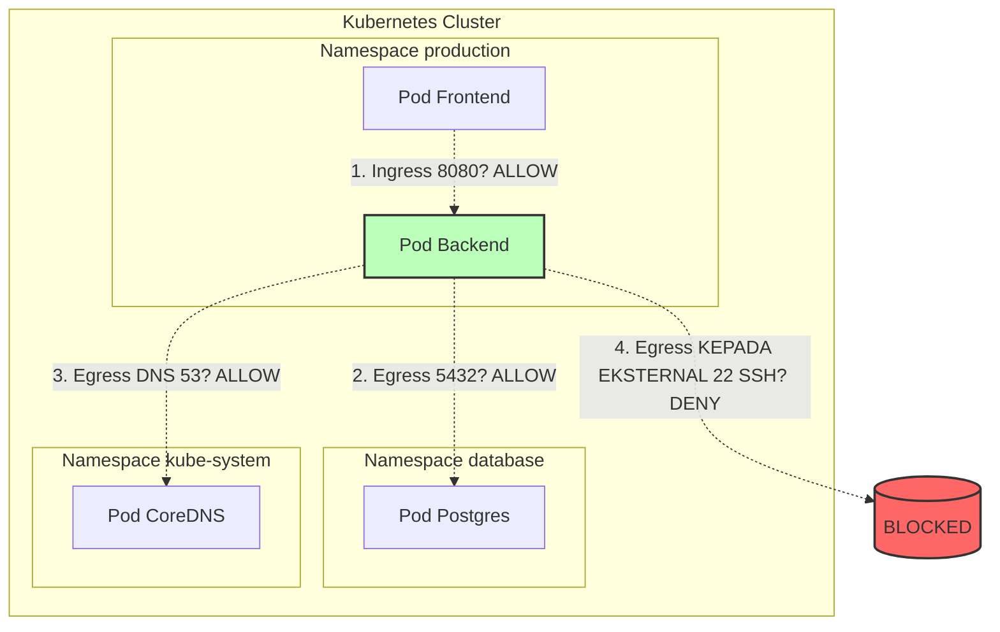

# Modul 04 — NetworkPolicy & Microsegmentation

## 1. Konsep NetworkPolicy (Microsegmentation)

**NetworkPolicy** adalah *firewall* tingkat-Pod Kubernetes (Layer 3/4). Ia menentukan **siapa** boleh bicara dengan **siapa**, **port berapa**, dan **arah mana** (masuk/ingress atau keluar/egress).

Ini mengadopsi prinsip **Zero Trust** & **Microsegmentation** dari keamanan siber enterprise: jangan pernah percaya traffic hanya karena berada dalam "jaringan internal cluster".



### Penting: NetworkPolicy Tidak Langsung Aktif
**NetworkPolicy tidak langsung aktif** di Kubernetes. Ia butuh CNI yang mendukung enforcement.
- Didukung penuh: **Cilium** (yang kita pakai), **Calico**, **Weave Net**.
- Tidak didukung: Flannel (kecuali di-upgrade ke Flannel + host-proxy).

---

## 2. Anatomi NetworkPolicy

```yaml
apiVersion: networking.k8s.io/v1
kind: NetworkPolicy
metadata:
  name: <nama>
  namespace: <namespace>
spec:
  podSelector: {}  # Kosong = semua Pod di namespace
  policyTypes: [Ingress, Egress]
  ingress:
  - from:
    - podSelector:
        matchLabels:
          app: frontend
    ports:
    - protocol: TCP
      port: 8080
  egress:
  - to:
    - namespaceSelector:
        matchLabels:
          kubernetes.io/metadata.name: database
```

### Selector Selector Penting:

| Selector | Target |
| :--- | :--- |
| `podSelector` | Pod dengan label tertentu (di namespace yang sama). |
| `namespaceSelector` | Semua Pod di namespace yang memiliki label tertentu. |
| Kombinasi `podSelector + namespaceSelector` (dalam satu item `-`) | Pod tertentu di namespace tertentu. |
| `ipBlock` | Range IP eksternal (CIDR). |

---

## 3. Hands-on Lab: Default-Deny + Allow-List

### Langkah 1: Siapkan Namespace Production dengan Pod Uji

```bash
kubectl create namespace production
kubectl create namespace database
kubectl create namespace staging

# Deploy Backend (Production)
kubectl run backend --image=nginxinc/nginx-unprivileged:alpine --labels=app=backend --namespace=production --port=8080

# Deploy Frontend (Production)
kubectl run frontend --image=nginxinc/nginx-unprivileged:alpine --labels=app=frontend --namespace=production --port=8080

# Deploy Database (Database)
kubectl run postgres --image=postgres:alpine --labels=app=postgres --namespace=database --env POSTGRES_PASSWORD=secret
```

### Langkah 2: Terapkan Default-Deny All (Blokir SEMUA)

```bash
kubectl apply -f minggu-16/manifests/04-network-policy-microsegmentation.yaml
```

*Output yang Diharapkan:*
```text
networkpolicy.networking.k8s.io/default-deny-all created
networkpolicy.networking.k8s.io/allow-frontend-to-backend created
networkpolicy.networking.k8s.io/allow-backend-egress created
```

### Langkah 3: Verifikasi Isolasi (Traffic Harus Gagal)

Coba akses backend dari frontend (seharusnya GAGAL karena default-deny menolak semua):

```bash
kubectl exec -n production frontend -- wget -q -O - --timeout=3 http://backend:8080
```

*Output yang Diharapkan:*
```text
wget: error: timeout
command terminated with exit code 1
```

> **Bukti**: Frontend tidak bisa menghubungi backend karena `default-deny-all` memblokir semua traffic masuk.

### Langkah 4: Verifikasi Allow-List (Traffic Berhasil)

Coba akses backend dari frontend lagi (sekarang HARUS BERHASIL karena `allow-frontend-to-backend` mengizinkan):

```bash
# Tunggu 1-2 detik untuk propagasi policy
kubectl exec -n production frontend -- wget -q -O - http://backend:8080
```

*Output yang Diharapkan:*
```text
<!DOCTYPE html>
<html>
<head>
<title>Welcome to nginx!</title>
...
```

### Langkah 5: Verifikasi Egress Rule (DNS & DB)

Masuk ke pod backend dan coba DNS resolve (HARUS BERHASIL karena allow egress DNS):

```bash
kubectl exec -n production backend -- nslookup postgres.database.svc.cluster.local
```

*Output yang Diharapkan:*
```text
Server:    10.96.0.10
Address 1: 10.96.0.10 kube-dns.kube-system.svc.cluster.local

Name:      postgres.database.svc.cluster.local
Address 1: 10.0.X.X
```

Coba koneksi ke database (HARUS BERHASIL port 5432):

```bash
kubectl exec -n production backend -- sh -c "nc -zv postgres.database.svc.cluster.local 5432"
```

*Output yang Diharapkan:*
```text
postgres.database.svc.cluster.local (10.0.X.X:5432) open
```

Coba koneksi SSH ke host manapun (HARUS GAGAL karena egress SSH tidak diizinkan):

```bash
kubectl exec -n production backend -- sh -c "nc -zv 1.1.1.1 22"
```

*Output yang Diharapkan:*
```text
nc: connect to 1.1.1.1 port 22 (tcp) failed: Connection timed out
```

---

## 4. Order of Evaluation (Aturan Aditif)

Perhatikan: **NetworkPolicy bersifat ADITIF** (tidak ada deny rule eksplisit). Prinsipnya:

1. Jika ada **NetworkPolicy** di namespace yang mencakup Pod X, maka semua traffic **yang tidak diizinkan eksplisit** akan ditolak.
2. Jika ada **beberapa NetworkPolicy** yang mencakup Pod X, traffic akan diizinkan jika **SALAH SATU** policy mengizinkannya (OR logic).

### Contoh Praktis:
- `default-deny-all` memblokir semua.
- `allow-frontend-to-backend` mengizinkan ingress dari frontend.
- `allow-monitoring` mengizinkan ingress dari monitoring Pod.
- **Hasil**: Pod backend menerima traffic dari frontend ATAU monitoring, tetapi bukan dari Pod lain.

---

## 5. Memverifikasi dengan Cilium/Hubble

NetworkPolicy enforcement dapat diverifikasi langsung dengan Hubble (yang sudah kita pelajari di Modul 03):

```bash
hubble observe --namespace production --verdict DROPPED
```

*Output yang Diharapkan:*
```text
TIMESTAMP             SOURCE                          DESTINATION         TYPE     VERDICT   SUMMARY
Aug 11 09:25:03.123   production/frontend-0           production/backend-0  L4      DROPPED   TCP Flags: SYN  (Sesaat)
```

> Setelah policy allow diaktifkan, verdict akan berubah menjadi `FORWARDED`.

---

## 6. Ringkasan Modul

1. **NetworkPolicy** mengadopsi **Zero Trust microsegmentation** — tidak ada信任 implisit di dalam cluster.
2. **Default-Deny + Allow-List** adalah best practice: blokir semua, lalu izinkan yang spesifik.
3. Gunakan **`podSelector`** dan **`namespaceSelector`** untuk menentukan sumber/tujuan berdasarkan label (bukan IP).
4. Kombinasikan dengan **Hubble** untuk forensik dan verifikasi bahwa policy berfungsi sesuai desain.
