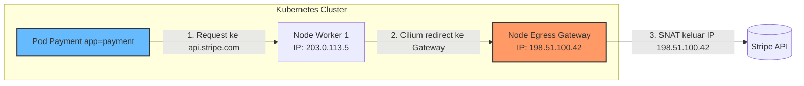

# Modul 05 — Cilium Egress Gateway & Bandwidth Management

## 1. Tantangan Egress Traffic dari Cluster Kubernetes

Dalam arsitektur Kubernetes, ada beberapa skenario di mana Pod perlu **memiliki IP publik statis** saat melakukan komunikasi keluar:

1. **Whitelisting IP oleh API Pihak Ketiga**: Misal provider payment gateway (Stripe, Midtrans) yang hanya mengizinkan IP server tertentu.
2. **Compliance Audit**: Regulator mensyaratkan traffic keluar berasal dari IP yang bisa dilacak.
3. **Geo-Restriction**: API yang membatasi akses berdasarkan negara/region.

Pada cluster multi-node, **Pod A** bisa di-schedule ke Node mana saja, sehingga traffic keluar bisa datang dari IP Node mana saja — tidak predictable.

**Egress Gateway** (diimplementasikan oleh Cilium) memaksa SNAT traffic keluar dari Pod tertentu agar **selalu melewati Node Gateway tertentu**, memberikan IP keluar yang stabil.



---

## 2. Persiapan Egress Gateway Node

Untuk menggunakan Cilium Egress Gateway, kita perlu:
1. Minimal 1 node yang di-label `cilium.io/egress-gateway=true`.
2. Cilium dengan fitur Egress Gateway aktif (default di Cilium 1.10+).

```bash
# Label Node sebagai Egress Gateway
kubectl label node <nama-node> cilium.io/egress-gateway=true

# Verifikasi label
kubectl get nodes --show-labels | grep egress-gateway
```

---

## 3. Hands-on Lab: Konfigurasi Egress Gateway

### Langkah 1: Deploy Cilium EgressGatewayPolicy

```bash
kubectl apply -f minggu-16/manifests/05-egress-gateway-bandwidth.yaml
```

*Output yang Diharapkan:*
```text
ciliumegressgatewaypolicy.cilium.io/payment-egress created
deployment.apps/payment created
```

### Langkah 2: Verifikasi Pod Berjalan

```bash
kubectl get pods -n production -l app=payment
```

*Output:* `payment-XXXX   1/1   Running`

### Langkah 3: Uji Traffic Keluar dari Pod Payment

Untuk membuktikan bahwa egress IP kita *benar-benar* IP Node Gateway, kita akan melakukan request ke API eksternal yang mengembalikan IP publik kita:

```bash
# Masuk ke Pod Payment
kubectl exec -it -n production $(kubectl get pod -n production -l app=payment -o name | head -1) -- sh

# Di dalam Pod, request ke api.ipify.org
curl https://api.ipify.org
```

*Output yang Diharapkan:*
```text
198.51.100.42  <-- INI HARUS IP NODE EGRESS GATEWAY, BUKAN IP WORKER NODE
```

### Langkah 4: Verifikasi Traffic Internal TIDAK Melalui Gateway

Egress Gateway Policy dikonfigurasi dengan `excludedCIDRs: 10.0.0.0/8`, artinya traffic **internal cluster** (antar Pod) tidak akan mengalami SNAT, sehingga tetap efisien:

```bash
# Uji traffic internal (HARUS menggunakan IP Pod Asli, bukan IP Gateway)
kubectl exec -it -n production $(kubectl get pod -n production -l app=payment -o name | head -1) -- curl -s http://backend.production.svc.cluster.local:8080
```

*Output yang Diharapkan:*
```text
<!DOCTYPE html>  <-- Berhasil. Traffic internal masih bekerja.
```

Verifikasi di Hubble bahwa traffic internal TIDAK masuk Egress Gateway:

```bash
hubble observe --namespace production --from-pod production/payment --to-pod production/backend
```

---

## 4. Cilium Bandwidth Manager (BPF-Based Throttling)

Selain Egress Gateway, Cilium menawarkan **Bandwidth Manager** berbasis eBPF untuk membatasi throughput Pod.

### Cara Kerja:
- Kubernetes native menggunakan **Linux Traffic Control (tc)** dengan algoritma **TBF/HTB** di Userspace.
- Cilium menggunakan **eBPF Token Bucket** yang efisien.
- Pengaturan dilakukan via **Pod resource annotations**:
  - `kubernetes.io/ingress-bandwidth`: Batas download (bits per second).
  - `kubernetes.io/egress-bandwidth`: Batas upload (bits per second).

### Mengaktifkan Bandwidth Manager

Sudah diaktifkan di Modul 01 dengan `--set bandwidthManager.enabled=true`. Verifikasi:

```bash
kubectl -n kube-system exec ds/cilium -- cilium status | grep -i bandwidth
```

*Output yang Diharapkan:*
```text
Bandwidth Manager:       [Enabled]
```

### Menguji Bandwidth Throttling

Manifest Pod `payment` sudah dikonfigurasi dengan:
- `ingress-bandwidth: 50M` (50 Mbps).
- `egress-bandwidth: 100M` (100 Mbps).

```bash
# Masuk Pod
kubectl exec -it -n production $(kubectl get pod -n production -l app=payment -o name | head -1) -- sh

# Uji bandwidth dengan netcat atau wget
# (Hasil sekitar 50 Mbps untuk download)
wget -O /dev/null http://speedtest.example.com/100mb.bin
```

> **Penting**: Bandwidth Manager membutuhkan kernel Linux ≥ 5.1 dan kube-proxyReplacement aktif.

---

## 5. TCP Congestion Control (BBR)

Untuk koneksi keluar yang optimal, Cilium mendukung **TCP BBR** (Bottleneck Bandwidth and Round-trip propagation time) — algoritma congestion control modern dari Google.

```bash
# Verifikasi BBR aktif
kubectl -n kube-system exec ds/cilium -- sysctl net.ipv4.tcp_congestion_control
```

*Output yang Diharapkan:*
```text
net.ipv4.tcp_congestion_control = bbr
```

Pada k3d/k3s multipass VM, BBR mungkin perlu diaktifkan manual di host:
```bash
sudo modprobe tcp_bbr
echo "tcp_bbr" | sudo tee -a /etc/modules-load.d/modules.conf
```

---

## 6. Ringkasan Modul

1. **Cilium Egress Gateway** memaksa traffic keluar Pod tertentu untuk di-SNAT melalui Node Gateway spesifik, sehingga IP publik keluar menjadi **statis** & predictable.
2. **Egress Gateway Policy** sangat berguna untuk integrasi ke API pihak ketiga (payment, bank, regulator).
3. **Bandwidth Manager** berbasis eBPF Token Bucket memungkinkan limit throughput Pod tanpa overhead Linux TC.
4. **TCP BBR** meningkatkan performa koneksi keluar secara signifikan — ideal untuk latency-sensitive workloads.
