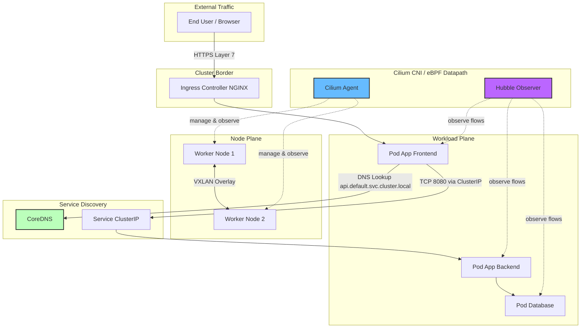

# Minggu 16 — Networking (Cilium, Hubble, DNS, NetworkPolicy, Egress)

## 🎯 Gambaran Umum Materi

Minggu 16 membawa kita menyelami **jaringan internal Kubernetes** (Cluster Networking) hingga level packet — salah satu komponen paling krusial namun paling sering diabaikan oleh pemula. Jika minggu-minggu sebelumnya kita fokus pada *workload* (Pod, Deployment, Service) dan *storage*, minggu ini kita membahas **kabel, switch, router, dan firewall**-nya Kubernetes.

Tujuan utama minggu ini:
1. Memahami mengapa **CNI (Container Network Interface)** adalah "HDMI" antara Kernel Linux dan Pod.
2. Memasang **Cilium** (CNI berbasis eBPF modern) ke cluster k3d/k3s.
3. Menguasai **Service Discovery** dan **DNS Internal** CoreDNS.
4. Mengamati lalu lintas jaringan L3/L4/L7 secara real-time dengan **Hubble**.
5. Menerapkan **NetworkPolicy** (microsegmentation) untuk *Default-Deny* + *Allow-List*.
6. Mengatur **Egress IP Statis** (keluar cluster lewat IP tetap) dengan Cilium Egress Gateway.

---

## 🧭 Peta Arsitektur Networking Kubernetes



---

## 📚 Daftar Modul Pembelajaran

| No | File Modul | Topik Utama | Output Praktis |
| :--- | :--- | :--- | :--- |
| **00** | `README.md` | Overview & Peta Kurikulum | Peta navigasi pekan 16 |
| **01** | `01-cni-cilium-ebpf.md` | **CNI & Cilium eBPF Datapath** | Cilium terinstal, ClusterMesh ready, CiliumNetworkPolicy diterapkan |
| **02** | `02-dns-coredns.md` | **Service Discovery & CoreDNS** | DNS query `curl nslookup`, custom DNSConfig, headless service |
| **03** | `03-hubble-observability.md` | **Hubble Network Observability** | Hubble UI, `hubble observe`, monitoring L7 HTTP/DNS |
| **04** | `04-network-policy.md` | **NetworkPolicy & Microsegmentation** | *Default-Deny + Allow-List*, podSelector, namespaceSelector |
| **05** | `05-egress-gateway-bandwidth.md` | **Cilium EgressGateway & Bandwidth** | Egress IP Statis, BPF Bandwidth Manager, TCP BBR |

---

## 🛠️ Prasyarat (Prerequisites)

Sebelum memulai pekerjaaan laboratorium Minggu 16, pastikan Anda telah memiliki:

1. **Cluster k3d atau k3s Aktif** (minimal 1 server + 1 agent, atau multi-node hasil dari Minggu 13).
   ```bash
   k3d cluster list
   kubectl get nodes -o wide
   ```
2. **Helm 3.x** untuk instalasi Cilium & Hubble.
   ```bash
   helm version
   ```
3. **Cilium CLI (`cilium`)** dan **Hubble CLI (`hubble`)** terpasang di laptop:
   ```bash
   # macOS
   brew install cilium-cli hubble
   ```
4. **Akses Internet** untuk mengambil image Cilium, CoreDNS, dan database eBPF.

---

## 🗓️ Alur Belajar yang Direkomendasikan

1. **Mulai dari Modul 01** untuk memahami *Kenapa perlu CNI*.
2. **Lanjutkan Modul 02** (DNS) karena Service & CoreDNS adalah 'telepon' antar Pod.
3. **Masuk Modul 03** (Hubble) — Anda akan 'melihat' paket data mengalir secara visual.
4. **Terapkan Modul 04** (NetworkPolicy) untuk memahami *firewall* tingkat Pod.
5. **Akhiri Modul 05** (Egress + Bandwidth) untuk mengendalikan Traffic keluar dan mengelola bandwidth.

> **⏱️ Estimasi Waktu**: 8–12 jam (1 minggu pembelajaran).

---

## ✅ Checklist Kelulusan Minggu 16

- [ ] Memahami konsep CNI, eBPF, dan mengapa Cilium lebih cepat dari iptables-aware kube-proxy.
- [ ] Menginstal Cilium pada cluster k3d/k3s tanpa kehilangan Pod.
- [ ] Melakukan DNS Query dari dalam Pod ke Service lain (`busybox nslookup`).
- [ ] Mengamati L7 HTTP traffic di Hubble UI/CLI.
- [ ] Menerapkan *Default-Deny* NetworkPolicy di namespace tertentu dan membuktikan Pod terisolasi.
- [ ] Mengatur egress IP statis agar koneksi keluar cluster memiliki IP publik yang tetap.
- [ ] Mengkonfigurasi Cilium Bandwidth Manager untuk membatasi throughput Pod.

---

## 🔗 Tautan Penting

- [Cilium Documentation](https://docs.cilium.io/)
- [Hubble Documentation](https://docs.cilium.io/en/stable/gettingstarted/hubble/)
- [Kubernetes DNS for Services and Pods](https://kubernetes.io/docs/concepts/services-networking/dns-pod-service/)
- [Network Policies](https://kubernetes.io/docs/concepts/services-networking/network-policies/)
