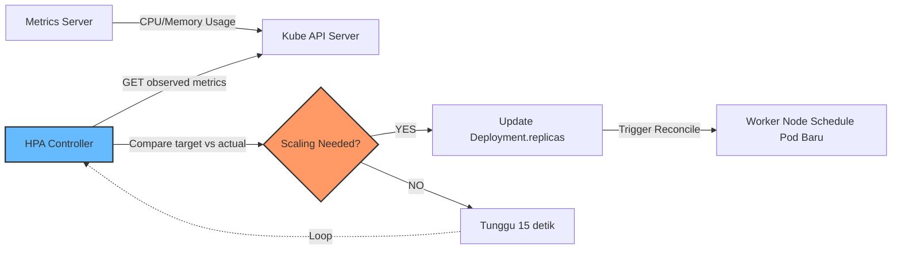

# Modul 01 — HPA (Horizontal Pod Autoscaler)

## 1. Apa Itu HPA?

**Horizontal Pod Autoscaler (HPA)** adalah *control loop* yang **menambah atau mengurangi jumlah replika Pod** sebuah Deployment/ReplicaSet/StatefulSet berdasarkan metrik (CPU, memory, atau *custom metrics*).

HPA diotomasi oleh **Controller Manager** yang berjalan di dalam Control Plane. Ia mengamati metrik setiap 15 detik (default `--horizontal-pod-autoscaler-sync-period`) dan memutuskan apakah perlu scaling.



### Mengapa HPA Bukan Scaling Otomatis Sempurna?
- Butuh **waktu** untuk Pod baru booting (~30-60 detik untuk image pull + start).
- Trafik naik mendadak (*burst*) mungkin **tidak tertangani** dalam 15-30 detik pertama.
- Karena itu, untuk traffic sangat bursty kita perlu **pre-scaling / over-provisioning** atau **KEDA + scaler queue**.

---

## 2. Prasyarat: Metrics Server

HPA **wajib** memiliki sumber data metrik. Untuk metrik CPU & Memory internal Pod, sumbernya adalah **Metrics Server** (komponen Kubernetes official di bawah SIG Instrumentation).

Pada k3d/k3s, Metrics Server sering sudah terinstal otomatis. Cek:

```bash
kubectl get deployment metrics-server -n kube-system
```

*Output yang Diharapkan:*
```text
NAME             READY   UP-TO-DATE   AVAILABLE   AGE
metrics-server   1/1     1            1           10m
```

Jika belum ada, instal secara manual (contoh untuk k3s):

```bash
# k3s: metrics-server sudah built-in. Untuk k3d, kita bisa tambahkan saat create cluster:
k3d cluster create mycluster --servers 1 --agents 2
```

Verifikasi Metrics Server dapat membaca metrik Pod:

```bash
kubectl top pods -A
```

*Output yang Diharapkan:*
```text
NAMESPACE   NAME                              CPU(cores)   MEMORY(bytes)
default     php-apache-7d9d8f9d8-abcde         1m           8Mi
kube-system cilium-xqwert                       78m          250Mi
...
```

---

## 3. Hands-on Lab: Memicu HPA dengan Load Generator

### Langkah 1: Deploy Aplikasi + HPA

```bash
kubectl apply -f minggu-17/manifests/01-hpa-php-apache.yaml
```

*Output yang Diharapkan:*
```text
deployment.apps/php-apache created
service/php-apache created
horizontalpodautoscaler.autoscaling/php-apache-hpa created
```

### Langkah 2: Verifikasi Status HPA

```bash
kubectl get hpa
```

*Output yang Diharapkan:*
```text
NAME              REFERENCE                TARGETS   MINPODS   MAXPODS   REPLICAS   AGE
php-apache-hpa    Deployment/php-apache    0%/50%    1         10        1          30s
```

> Kolom **TARGETS** menunjukkan CPU usage saat ini (0%) vs target (50%).

### Langkah 3: Buka Terminal Baru & Generate Beban CPU

Kita akan menggunakan `busybox` atau `curl loop` dari Pod terpisah untuk membombardir `php-apache`:

```bash
# Buat Pod busybox baru dengan infinite loop request
kubectl run -it --rm load-generator --image=busybox --restart=Never -- /bin/sh -c \
  "while sleep 0.01; do wget -q -O- http://php-apache; done"
```

### Langkah 4: Amati HPA Scale UP (Tunggu ~30-60 detik)

Di terminal pertama, pantau HPA:

```bash
kubectl get hpa -w
```

*Output yang Diharapkan:*
```text
NAME              REFERENCE                TARGETS    MINPODS   MAXPODS   REPLICAS   AGE
php-apache-hpa    Deployment/php-apache    0%/50%     1         10        1          30s
php-apache-hpa    Deployment/php-apache    250%/50%   1         10        1          45s
php-apache-hpa    Deployment/php-apache    250%/50%   1         10        4          60s
php-apache-hpa    Deployment/php-apache    180%/50%   1         10        7          75s
php-apache-hpa    Deployment/php-apache    95%/50%    1         10        10         90s
```

> Perhatikan REPLICAS naik dari 1 → 4 → 7 → 10. HPA memutuskan scale up karena CPU usage > 50% target.

### Langkah 5: Hentikan Load Generator, Amati Scale DOWN

```bash
# Tekan Ctrl+C pada Pod load-generator
```

Setelah beban turun, HPA akan menunggu `stabilizationWindowSeconds: 60` (di manifest kita), lalu mulai scale DOWN:

```bash
kubectl get hpa -w
```

*Output yang Diharapkan:*
```text
NAME              REFERENCE                TARGETS   MINPODS   MAXPODS   REPLICAS
php-apache-hpa    Deployment/php-apache    5%/50%    1         10        10
php-apache-hpa    Deployment/php-apache    5%/50%    1         10        6    <-- Scale down bertahap
php-apache-hpa    Deployment/php-apache    5%/50%    1         10        3
php-apache-hpa    Deployment/php-apache    5%/50%    1         10        1    <-- Kembali ke minReplicas
```

> Perhatikan `policy: Percent 50 / periodSeconds: 30` artinya HPA mengurangi max 50% dari replicas saat ini setiap 30 detik — **graceful & terkontrol**.

---

## 4. Rumus Keputusan HPA

$$\text{desiredReplicas} = \lceil \text{currentReplicas} \times \frac{\text{currentMetricValue}}{\text{targetMetricValue}} \rceil$$

Contoh kasus:
- `currentReplicas = 2`, `currentMetricValue = 80m`, `targetMetricValue = 50m`.
- desiredReplicas = ⌈2 × (80m / 50m)⌉ = ⌈3.2⌉ = **4 Pod**.

> Algoritma ini memastikan HPA tidak pernah menghitung replicas < minReplicas atau > maxReplicas.

---

## 5. Best Practices HPA

1. **Selalu set `resources.requests.cpu/memory`** di Pod — tanpa request, HPA tidak dapat menghitung utilisasi.
2. **Gunakan `behavior` policy** untuk menghindari flapping dan reaksinya berlebihan.
3. **Jangan set CPU target terlalu rendah** (misal 10%) — Pod baru booting butuh waktu untuk warm-up.
4. **Untuk workload memory-bound** (misal JVM, cache), gunakan Memory metric.
5. **Untuk metrik custom** (request per detik dari Nginx, RabbitMQ queue, dll.), gunakan **Prometheus Adapter** atau **KEDA** (Modul 03).

---

## 6. Ringkasan Modul

1. **HPA** men-scale jumlah replika Pod secara horizontal (bukan vertikal) berdasarkan metrik.
2. **Metrics Server** wajib ada agar HPA dapat membaca CPU/memory.
3. Algoritma **desiredReplicas** menggunakan formula proporsional: `currentReplicas × (current / target)`.
4. **Behavior policies** (stabilizationWindow + Percent/Pods policies) menjaga scaling tetap aman & tidak flapping.