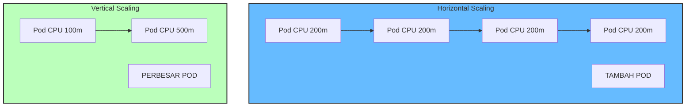
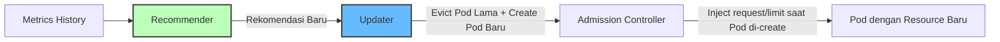

# Modul 02 — VPA (Vertical Pod Autoscaler)

## 1. Apa Itu VPA?

**Vertical Pod Autoscaler (VPA)** melakukan *right-sizing* terhadap **request dan limit CPU/memory** sebuah kontainer secara otomatis. Berbeda dengan HPA yang menambah jumlah replika Pod, VPA mengubah ukuran resource Pod yang sudah ada.

VPA sangat berguna untuk aplikasi yang **sulit di-scale horizontal** (misal database monolith, JVM dengan stateful cache) atau yang **memiliki profil memori tidak terprediksi** (kenaikan tiba-tiba saat traffic meledak).



### Kasus Penggunaan VPA:
1. **JVM / Ruby / Python** dengan heap memory yang tiba-tiba naik drastis.
2. **Stateful workload** (Postgres, Redis) yang tidak boleh di-scale out.
3. **Cost optimization** awal sebelum produksi: temukan ukuran kontainer yang *benar-benar* pas dengan workload.

---

## 2. Komponen Arsitektur VPA

VPA memiliki 3 komponen utama:

| Komponen | Fungsi |
| :--- | :--- |
| **Recommender** | Menganalisis historis pemakaian CPU/memory Pod selama beberapa hari & membuat rekomendasi. |
| **Updater** | Mengevakuasi Pod lama dan menggantinya dengan Pod baru yang sudah memiliki request/limit baru. |
| **Admission Controller** | Webhook yang meng-inject request/limit ke Pod baru pada saat Pod di-create. |



---

## 3. Hands-on Lab: VPA Recommender Mode (Paling Aman untuk Produksi)

### Langkah 1: Instal VPA pada Cluster

```bash
# Clone repository VPA
git clone https://github.com/kubernetes/autoscaler.git
cd autoscaler/vertical-pod-autoscaler

# Deploy VPA components
./hack/vpa-up.sh
```

Verifikasi:

```bash
kubectl get pods -n kube-system | grep vpa
```

*Output yang Diharapkan:*
```text
vpa-admission-controller-6d778d9b8-x29qf   1/1   Running
vpa-recommender-544485bf-jkl89            1/1   Running
vpa-updater-598d9cc9-qwert                1/1   Running
```

### Langkah 2: Deploy Aplikasi dengan Request CPU/Memory Rendah (Under-Provisioned)

```bash
kubectl apply -f minggu-17/manifests/02-vpa-recommender.yaml
```

*Output yang Diharapkan:*
```text
deployment.apps/resource-hungry-app created
verticalpodautoscaler.autoscaling.k8s.io/hungry-app-vpa created
verticalpodautoscaler.autoscaling.k8s.io/hungry-app-vpa-auto created
```

### Langkah 3: Generate Beban Padat untuk Mengumpulkan Data

```bash
# Bikin load 60 detik
kubectl exec -it -n production deploy/resource-hungry-app -- sh -c \
  "yes > /dev/null & sleep 60 && kill %1"
```

### Langkah 4: Cek Rekomendasi VPA

Tunggu 5–10 menit agar Recommender mengumpulkan cukup data historis:

```bash
kubectl describe vpa hungry-app-vpa -n production
```

*Output yang Diharapkan:*
```text
Name:         hungry-app-vpa
Namespace:    production
...
Recommendation:
  Container Recommendations:
    Container Name:  app
    Lower Bound:
      Cpu:     25m
      Memory:  262144k
    Target:
      Cpu:     500m       <-- INI YANG SEBAIKNYA ANDA SET!
      Memory:  524288k
    Uncapped Target:
      Cpu:     500m
      Memory:  524288k
```

> **Rekomendasi VPA**: Pod butuh minimal **500m CPU** dan **524288k Memory** untuk menangani beban puncak. Under-provisioned saat ini (50m/64Mi).

### Langkah 5: Terapkan Rekomendasi (Manual Update Mode)

Jika ingin menerapkan rekomendasi secara **bertahap dan terkontrol**:

1. Update Deployment `resource-hungry-app` dengan nilai rekomendasi.
2. Rollout restart: `kubectl rollout restart deployment -n production resource-hungry-app`.
3. **Hindari menggunakan VPA `updateMode: "Auto"`** tanpa pengujian matang — VPA Auto akan me-recreate Pod setiap kali rekomendasi berubah.

---

## 4. Kapan TIDAK Menggunakan VPA?

| Situasi | Kenapa VPA Tidak Cocok |
| :--- | :--- |
| **HPA Aktif** untuk Pod yang sama | VPA + HPA bersaing mengatur CPU; akan terjadi flapping. |
| **Stateless workload dengan burst tinggi** | HPA (Modul 01) lebih cocok. |
| **Sidecar injection (Istio/Envoy)** | VPA akan me-recreate Pod dan mengganggu inisialisasi mesh. |
| **Production critical yang butuh zero-restart** | Gunakan `updateMode: "Off"` (recommend saja). |

> **Best Practice**: Gunakan VPA **recommend mode** untuk semua workload. Terapkan manual ke Deployment.yaml dan simpan di Git.

---

## 5. Ringkasan Modul

1. **VPA** melakukan *right-sizing* otomatis untuk CPU/memory requests & limits.
2. **3 Komponen**: Recommender (analisis), Updater (evict), Admission Controller (inject).
3. **Mode `Off` (recommend-only)** adalah pilihan paling aman untuk produksi.
4. **Jangan gabungkan VPA Auto + HPA** pada metrik yang sama — saling bertentangan.
5. VPA sangat cocok untuk **stateful app** dan **JVM-style workload** yang sulit di-scale out.