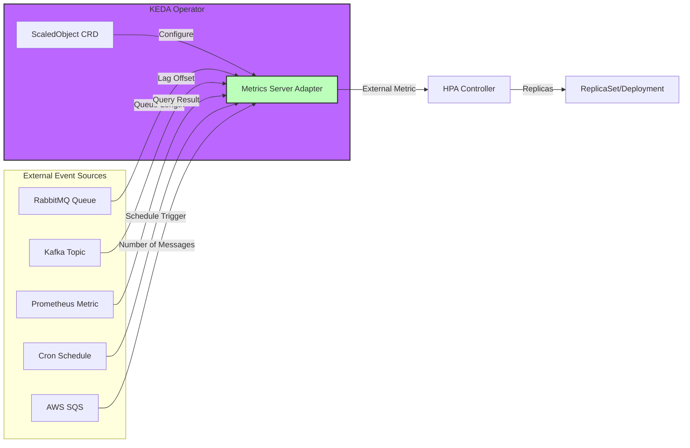
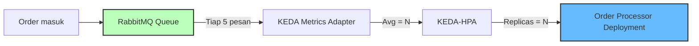

# Modul 03 — KEDA (Kubernetes Event-Driven Autoscaling)

## 1. Apa Itu KEDA?

**KEDA** adalah komponen autoscaling yang bekerja sama dengan HPA (bukan menggantikan) untuk membuat scaling berdasarkan **peristiwa eksternal (event-driven)** — sesuatu yang HPA standar tidak bisa lakukan.

KEDA memiliki 60+ **Scaler** bawaan untuk berbagai sumber event: RabbitMQ, Kafka, Redis Streams, Prometheus, AWS SQS, Azure Service Bus, GCP Pub/Sub, PostgreSQL, dan bahkan Cron (jadwal).



### Mengapa KEDA Powerful?
- **Scale to Zero**: HPA standar tidak mendukung `minReplicaCount: 0`. KEDA menanganinya.
- **60+ Scalers**: Event-driven untuk hampir semua sumber event.
- **Zero Code Change**: Konfigurasi via YAML, tidak perlu ubah aplikasi.
- **Composable dengan HPA**: KEDA = metrics adapter, HPA = decision maker.

---

## 2. Hands-on Lab: Instalasi KEDA via Helm

### Langkah 1: Instal KEDA

```bash
# Tambahkan Helm Repo KEDA
helm repo add kedacore https://kedacore.github.io/charts
helm repo update

# Buat namespace & install KEDA
kubectl create namespace keda
helm install keda kedacore/keda \
  --namespace keda \
  --set prometheus.operator.enabled=false
```

Verifikasi:

```bash
kubectl get pods -n keda
```

*Output yang Diharapkan:*
```text
NAME                                      READY   STATUS    RESTARTS   AGE
keda-operator-7d9d8f9d8-abcde             1/1     Running   0          30s
keda-admission-webhooks-6d778d9b8-jkl89   1/1     Running   0          30s
keda-metrics-apiserver-544485bf-mnopq     1/1     Running   0          30s
```

### Langkah 2: Deploy RabbitMQ ScaledObject (Simulasi)

Untuk demo lokal tanpa RabbitMQ, kita akan gunakan `Cron Scaler` yang tidak butuh message broker.

```bash
kubectl apply -f minggu-17/manifests/03-keda-scaledobjects.yaml
```

*Output yang Diharapkan:*
```text
triggerauthentication.keda.sh/rabbitmq-credentials created
scaledobject.keda.sh/order-processor-scaler created
scaledobject.keda.sh/payment-cron-scaler created
scaledobject.keda.sh/api-prometheus-scaler created
```

### Langkah 3: Amati Status ScaledObject

```bash
kubectl get scaledobject -n production
```

*Output yang Diharapkan:*
```text
NAME                      SCALETARGETKIND      MIN   MAX   TRIGGERS   AUTHENTICATION                READY   ACTIVE
api-prometheus-scaler     apps/v1.Deployment   2     15    prometheus                          True    False
order-processor-scaler    apps/v1.Deployment   0     10    rabbitmq   rabbitmq-credentials          True    False
payment-cron-scaler       apps/v1.Deployment   1     20    cron                              True    False
```

> **Kolom ACTIVE**: apakah ScaledObject aktif mengirim metrik ke HPA.

### Langkah 4: Amati HPA yang Dibuat Otomatis oleh KEDA

```bash
kubectl get hpa -n production
```

*Output yang Diharapkan:*
```text
NAME                      REFERENCE                         TARGETS         MINPODS   MAXPODS   REPLICAS
keda-hpa-order-processor  Deployment/order-processor        0/5 (avg)       0         10        0
keda-hpa-payment-cron     Deployment/payment-service        0/1 (avg)       1         20        1
keda-hpa-api-prometheus   Deployment/api-gateway            0/100 (avg)     2         15        2
```

> KEDA otomatis membuat HPA dengan prefix `keda-hpa-` untuk setiap ScaledObject.

### Langkah 5: Cron Scaler — Demo Tanpa Broker

`payment-cron-scaler` akan menambah replicas ke 5 saat jam 08:00 Asia/Jakarta. Cek apakah Cron trigger aktif:

```bash
kubectl describe scaledobject payment-cron-scaler -n production
```

*Output yang Diharapkan:*
```text
...
Spec:
  Triggers:
    Type:     cron
    Metadata:
      Desired Replicas:  5
      End:               0 10 * * *
      Start:             0 8 * * *
      Timezone:          Asia/Jakarta
Status:
  Active:    true
```

---

## 3. Studi Kasus: E-Commerce Order Processor

Untuk e-commerce dengan traffic spike pada jam makan siang atau promo, kita bisa menggabungkan:

1. **Cron Scaler** jam 11:00 → scale up ke 5 Pod (pre-warm).
2. **RabbitMQ Scaler** → tambah 1 Pod tiap 5 pesan antrian (reactive).
3. **Cooldown 5 menit** → kembali ke 0 saat queue kosong (hemat).



**Pola ini** memastikan biaya infrastruktur tetap rendah saat idle dan mampu menangani lonjakan promo besar.

---

## 4. Daftar Scalers Populer KEDA

| Scaler | Use Case |
| :--- | :--- |
| `rabbitmq` | Antrian pesan RabbitMQ |
| `kafka` | Apache Kafka consumer lag |
| `prometheus` | Metrik dari Prometheus (RPS, latency, etc) |
| `cron` | Jadwal waktu (pre-warm / scale-down terjadwal) |
| `aws-sqs-queue` | AWS Simple Queue Service |
| `aws-cloudwatch` | AWS CloudWatch metrics |
| `azure-service-bus` | Azure Service Bus |
| `gcp-pubsub` | Google Cloud Pub/Sub |
| `redis-streams` | Redis Streams lag |
| `cpu`, `memory` | Standar HPA metrics |

---

## 5. Ringkasan Modul

1. **KEDA** = Event-driven autoscaling, melengkapi HPA dengan kemampuan membaca event eksternal.
2. KEDA menggunakan **Metrics Adapter** agar HPA bisa consume custom metrics.
3. **Scale to Zero** sangat berguna untuk workload batch/queue — hemat biaya saat idle.
4. **Cron Scaler** memungkinkan *pre-warm* terjadwal untuk traffic periodik.
5. KEDA sangat cocok untuk **event-driven microservices** (order, payment, notification, dll.).