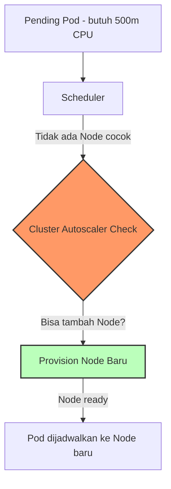
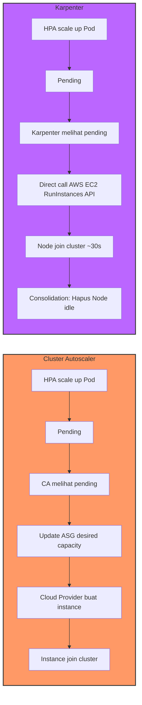

# Modul 04 — Cluster Autoscaler & Karpenter

## 1. Masalah: Pod Tidak Bisa Dijadwalkan karena Node Penuh

HPA men-scale Pod secara horizontal, tapi bagaimana jika **Node cluster sudah penuh**? Scheduler Kubernetes tidak akan bisa me-place Pod baru, dan Pod akan stuck dalam status `Pending`.

```text
0/3 nodes are available: 3 Insufficient cpu, 3 Insufficient memory.
```

**Cluster Autoscaler (CA)** atau **Karpenter** adalah solusi: mereka **menambah Node baru** ke cluster ketika Pod tidak punya tempat.



---

## 2. Perbandingan Cluster Autoscaler vs Karpenter

| Aspek | **Cluster Autoscaler (CA)** | **Karpenter** |
| :--- | :--- | :--- |
| **Tahun Lahir** | 2016 (Kubernetes SIG) | 2021 (AWS, open source 2022) |
| **Cara Provision** | Berdasarkan **Auto Scaling Group (ASG)** AWS, MIG GCP, atau VMSS Azure | **Direct API call** ke cloud provider (no ASG/MIG) |
| **Provisioning Time** | 3-5 menit (butuh template ASG) | **~30-90 detik** (just-in-time, langsung API) |
| **Granularitas** | Terbatas instance type yang ada di ASG | Bebas pilih instance type terbaik dari 500+ SKU |
| **Consolidation** | Tidak otomatis (cuma scale up/down) | **Otomatis** — hapus Node idle, gabungkan workload |
| **Dukungan Cloud** | AWS, GCP, Azure, DigitalOcean, OpenStack | AWS (GA), Azure (preview), GCP (beta) |
| **Kompleksitas Setup** | Tinggi (perlu ASG, IAM, tags) | Rendah (1 NodePool + EC2NodeClass) |
| **Biaya Efisiensi** | Cukup | **Sangat tinggi** (spot interruption handling, bin-packing) |



---

## 3. Hands-on Lab: Cluster Autoscaler (Manifest)

### Langkah 1: Deploy CA (jika di AWS EKS)

```bash
kubectl apply -f minggu-17/manifests/04-cluster-autoscaler-karpenter.yaml
```

*Output yang Diharapkan:*
```text
serviceaccount/cluster-autoscaler created
clusterrolebinding.rbac.authorization.k8s.io/cluster-autoscaler created
clusterrole.rbac.authorization.k8s.io/cluster-autoscaler created
deployment.apps/cluster-autoscaler created
```

### Langkah 2: Tag Auto Scaling Group (Step AWS-Specific)

CA di AWS membutuhkan tag pada ASG agar tahu ASG mana yang boleh di-scale:

```bash
# Format: k8s.io/cluster-autoscaler/<CLUSTER_NAME>=owned
aws autoscaling create-or-update-tags \
  --auto-scaling-group-name my-asg \
  --tags "ResourceId=my-asg,ResourceType=auto-scaling-group,Key=k8s.io/cluster-autoscaler/enabled,Value=true,PropagateAtLaunch=true"
```

### Langkah 3: Trigger Scaling dengan Beban Besar

```bash
# Deploy Deployment besar yang butuh resource banyak
cat <<EOF | kubectl apply -f -
apiVersion: apps/v1
kind: Deployment
metadata:
  name: stress-test
spec:
  replicas: 20
  selector:
    matchLabels:
      app: stress
  template:
    metadata:
      labels:
        app: stress
    spec:
      containers:
      - name: stress
        image: polinux/stress-ng
        args: ["--vm", "1", "--vm-bytes", "2G", "--timeout", "3600"]
        resources:
          requests:
            cpu: 1
            memory: 2Gi
EOF
```

### Langkah 4: Amati Log CA Menambah Node

```bash
kubectl logs -n kube-system -l app=cluster-autoscaler -f
```

*Output yang Diharapkan:*
```text
I0817 10:30:15.234567 1 scale_up.go:111] Scaling up group my-asg from 3 to 5 (max: 10)
I0817 10:30:15.345678 1 scale_up.go:118] Estimated 2 nodes needed
I0817 10:31:30.456789 1 scale_up.go:201] Node i-0abc123 successfully joined
I0817 10:31:30.567890 1 scale_up.go:201] Node i-0def456 successfully joined
```

---

## 4. Hands-on Lab: Karpenter (Manifest)

Karpenter menggunakan pendekatan deklaratif berbasis CRD.

```bash
# Install Karpenter via Helm
helm repo add karpenter https://charts.karpenter.sh
helm repo update

helm install karpenter karpenter/karpenter \
  --namespace kube-system \
  --set settings.clusterName=my-cluster \
  --set settings.interruptionQueue=my-interruption-queue
```

```bash
# Terapkan NodePool & EC2NodeClass
kubectl apply -f minggu-17/manifests/04-cluster-autoscaler-karpenter.yaml
```

*Output yang Diharapkan:*
```text
nodepool.karpenter.sh/default-nodepool created
ec2nodeclass.karpenter.k8s.aws/v1beta1/default-nodeclass created
```

Verifikasi:

```bash
kubectl get nodepool
kubectl logs -n kube-system -l app.kubernetes.io/name=karpenter -f
```

Saat Pod `Pending` muncul, Karpenter akan langsung panggil `RunInstances` AWS API untuk membuat Node baru dalam **~30 detik** (jauh lebih cepat dari CA 3-5 menit).

---

## 5. Kapan Memilih CA vs Karpenter?

| Pilih **Cluster Autoscaler** jika: | Pilih **Karpenter** jika: |
| :--- | :--- |
| Sudah punya ASG template & IAM config | Baru migrasi ke EKS / cluster cloud |
| Butuh kontrol via traditional ASG (governance) | Butuh provisioning super cepat (<1 menit) |
| Multi-cloud (AWS+GCP+Azure) | AWS-only (atau GCP preview) |
| Tim DevOps familiar dengan ASG | Tim Cloud Native modern, suka deklaratif |
| Workload predictable & tidak butuh konsolidasi agresif | Butuh penghematan cost dari bin-packing optimal |

---

## 6. Ringkasan Modul

1. **Cluster Autoscaler** menambah Node ketika Pod tidak punya tempat.
2. **Karpenter** adalah generasi baru — *just-in-time provisioning* dalam hitungan detik, tanpa ASG.
3. Karpenter memiliki fitur **Consolidation** — otomatis menghapus Node idle untuk hemat biaya.
4. Karpenter mendukung **berbagai instance type + spot** secara otomatis (bin-packing terbaik).
5. Untuk cluster baru di AWS, **Karpenter direkomendasikan**; untuk legacy multi-cloud, Cluster Autoscaler masih relevan.