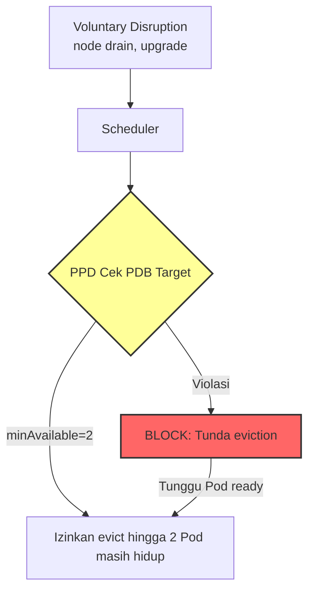
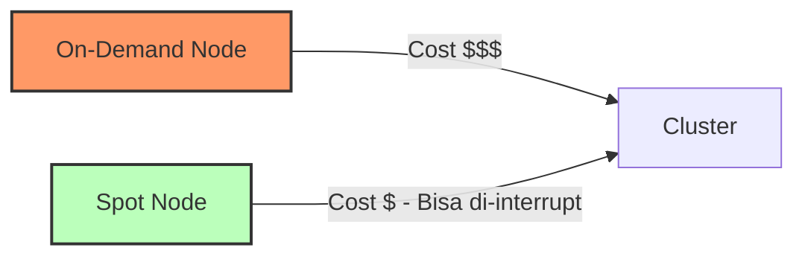

# Modul 05 — Pod Disruption Budget (PDB) & Cost Optimization

## 1. Masalah: Scale-Down Bisa Merusak Availability

HPA, VPA, KEDA, dan Cluster Autoscaler semuanya memiliki kemampuan **scale-down** (mengurangi Pod atau Node). Namun saat scaling-down terjadi, terutama karena:

- **Node upgrade** / kernel patching (drain Node).
- **Cluster Autoscaler** menghapus Node idle.
- **Karpenter Consolidation** menggabungkan Pod ke Node lebih sedikit.
- **HPA scale-down** saat trafik menurun.

…Pod akan dihapus (evicted). Jika evicted Pod ternyata kritikal (misal database primary), aplikasi akan **down**. 

**PodDisruptionBudget (PDB)** adalah "rem darurat" yang memastikan **minimal jumlah Pod tertentu selalu hidup** selama operasi voluntary disruption.



---

## 2. Anatomi PodDisruptionBudget

```yaml
apiVersion: policy/v1
kind: PodDisruptionBudget
metadata:
  name: <nama>
  namespace: <namespace>
spec:
  # Pilih SALAH SATU: minAvailable atau maxUnavailable
  minAvailable: 2          # Atau bisa % (misal: "50%")
  # maxUnavailable: 1     # Atau bisa %
  selector:
    matchLabels:
      app: <label-pod>
```

### Tabel Keputusan:

| Kebutuhan | Setting |
| :--- | :--- |
| **Stateful / DB Primary** | `minAvailable: 1` (selalu ada 1) |
| **Microservice kritikal** | `minAvailable: 2` atau `50%` |
| **Batch worker toleransi tinggi** | `maxUnavailable: 1` |
| **Cache cluster (Redis)** | `minAvailable: 1` |

> **Penting**: PDB tidak melindungi dari **involuntary disruption** (Node hardware failure, kernel panic, OOM). PDB hanya melindungi dari **voluntary** (drain, upgrade).

---

## 3. Hands-on Lab: PDB untuk Payment Service

### Langkah 1: Deploy PDB & Deployment

```bash
kubectl apply -f minggu-17/manifests/05-pdb-cost-optimization.yaml
```

*Output yang Diharapkan:*
```text
poddisruptionbudget.policy/payment-pdb created
poddisruptionbudget.policy/batch-worker-pdb created
poddisruptionbudget.policy/cache-pdb created
horizontalpodautoscaler.autoscaling/payment-hpa-cost-saver created
cronjob.batch/weekend-cost-saver created
```

### Langkah 2: Verifikasi Status PDB

```bash
kubectl get pdb -n production
```

*Output yang Diharapkan:*
```text
NAME             MIN AVAILABLE   MAX UNAVAILABLE   ALLOWED DISRUPTIONS   CURRENT
payment-pdb      2               N/A               1                     3
batch-worker-pdb N/A             1                 0                     5
cache-pdb        1               N/A               0                     1
```

> **ALLOWED DISRUPTIONS** = berapa Pod yang BOLEH di-evict sekarang. `payment-pdb` punya `minAvailable=2` dan 3 replicas → boleh evict 1 Pod.

### Langkah 3: Simulasikan Voluntary Disruption (Cordon & Drain)

Kita akan drain salah satu Node dan melihat bagaimana PDB melindungi Pod payment:

```bash
# 1. Lihat Pod payment ada di mana
kubectl get pods -n production -l app=payment -o wide

# 2. Tandai Node tempat Pod payment berada
export NODE_NAME=$(kubectl get pods -n production -l app=payment -o jsonpath='{.items[0].spec.nodeName}')

# 3. Cordon Node (tandai agar tidak ada Pod baru dijadwalkan)
kubectl cordon $NODE_NAME

# 4. Drain Node (evict semua Pod)
kubectl drain $NODE_NAME --ignore-daemonsets --delete-emptydir-data
```

*Output yang Diharapkan:*
```text
evicting pod payment-7d9d8f9d8-abcde
evicting pod payment-7d9d8f9d8-fghij
evicting pod payment-7d9d8f9d8-klmno
...
```

**Karena PDB `minAvailable: 2`**, Kubernetes Scheduler akan:
- Izinkan evict Pod ke-1 (masih tersisa 2 Pod, masih >= minAvailable).
- **BLOCK** evict Pod ke-2 (jika di-evict, tersisa 1 Pod < 2).
- Drain Node akan **hang** menunggu Pod ke-2 selesai di-schedule di Node lain.

Setelah Node lain menerima Pod payment baru, drain akan dilanjutkan.

### Langkah 4: Verifikasi PDB Masih Mempertahankan 2 Pod

```bash
kubectl get pods -n production -l app=payment
```

*Output yang Diharapkan:*
```text
NAME                       READY   STATUS    NODE
payment-7d9d8f9d8-abcde    1/1     Running   node-2  <-- Baru pindah
payment-7d9d8f9d8-fghij    1/1     Running   node-3  <-- Baru pindah
payment-7d9d8f9d8-klmno    1/1     Running   node-2  <-- Asli, belum di-evict
```

> **Bukti**: Setidaknya 2 Pod selalu hidup selama drain berlangsung.

### Langkah 5: Uncordon Node

```bash
kubectl uncordon $NODE_NAME
```

---

## 4. Strategi Cost Optimization (FinOps for Kubernetes)

Setelah kita menguasai PDB sebagai **safety net**, saatnya menerapkan **cost optimization** untuk autoscaling.

### 4.1 Spot Instances / Preemptible VMs

Spot Instances adalah **kapasitas spare cloud** yang ditawarkan dengan diskon 60-90% dari harga on-demand. Risiko: bisa di-interrupt (diambil kembali) oleh cloud provider dengan peringatan 30 detik - 2 menit.



**Strategi**: Untuk workload stateless & toleran terhadap restart, gunakan spot. Untuk stateful (DB primary), gunakan on-demand.

Karpenter (Modul 04) mendukung **mixed spot + on-demand** secara otomatis:

```yaml
# NodePool Karpenter dari Modul 04 sudah termasuk:
requirements:
- key: karpenter.sh/capacity-type
  operator: In
  values: ["spot", "on-demand"]
```

### 4.2 Rightsizing dengan VPA

Pada Modul 02, kita sudah belajar bahwa VPA merekomendasikan CPU/memory yang **benar-benar dipakai**. Terapkan rekomendasi ke manifest Deployment di Git.

**Contoh savings calculation**:

| Resource | Sebelum | Sesudah VPA | Saving |
| :--- | :--- | :--- | :--- |
| CPU request | 1000m | 300m | 70% |
| Memory request | 1Gi | 512Mi | 50% |
| Cluster monthly cost | $500 | $250 | **$250/month** |

### 4.3 HPA + PDB Minimum Replicas yang Tepat

Jangan set `minReplicas` terlalu tinggi. Gunakan **PDB minimum** + **HPA minimum 1**:

```yaml
# HPA: Skala agresif saat load tinggi, tapi minimum 1 saat idle
minReplicas: 1
maxReplicas: 10

# PDB: JAMIN 1 Pod SELALU hidup saat voluntary disruption
minAvailable: 1
```

### 4.4 Scale-to-Zero dengan KEDA (Modul 03)

Untuk workload batch/queue yang hanya aktif beberapa jam per hari, KEDA `minReplicaCount: 0` + `cooldownPeriod: 300` artinya:
- Queue kosong → 0 Pod → **$0 cost**.
- Queue masuk → scale up ke 1, 2, 10 Pod sesuai beban.
- Queue kosong lagi 5 menit → scale down ke 0.

### 4.5 Weekend Cost Saver CronJob

Manifest `weekend-cost-saver` CronJob (pada file yaml yang sama) akan:
- Setiap hari **Sabtu jam 00:00** → patch HPA `payment` ke `minReplicas=1, maxReplicas=2`.
- Setiap hari **Senin jam 00:00** → patch kembali ke `minReplicas=3, maxReplicas=20`.

```bash
# Lihat CronJob schedule
kubectl get cronjob weekend-cost-saver -n production
```

*Output yang Diharapkan:*
```text
NAME                SCHEDULE      SUSPEND   ACTIVE   LAST SCHEDULE   AGE
weekend-cost-saver  0 0 * * 6     False     0        12s             30s
```

---

## 5. Ringkasan Modul

1. **PDB** adalah "rem darurat" yang melindungi availability saat operasi voluntary disruption.
2. **PDB + HPA minimum 1 Pod** = kombinasi terbaik untuk cost & availability.
3. **Spot Instances** untuk workload stateless (hemat 60-90%).
4. **VPA Rightsizing** bisa menghemat 30-70% biaya cluster.
5. **KEDA scale-to-zero** untuk workload batch/queue = $0 saat idle.
6. **CronJob weekend cost-saver** mengurangi kapasitas saat traffic memang rendah.