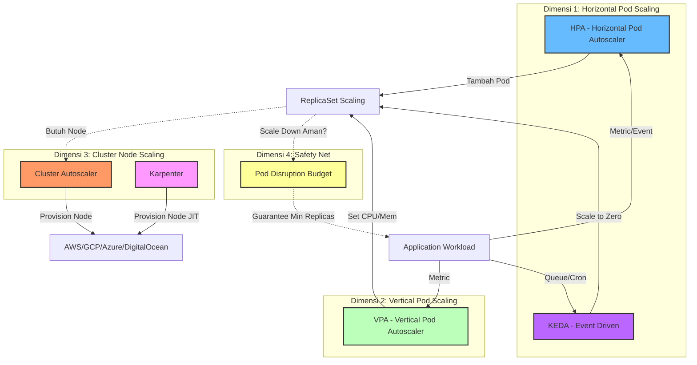

# Minggu 17 — Autoscaling (HPA, VPA, KEDA, Cluster Autoscaler, PDB & Cost)

## 🎯 Gambaran Umum Materi

Minggu 17 membahas **Autoscaling** — kemampuan Kubernetes (dan ekosistem di sekitarnya) untuk **menyesuaikan kapasitas secara otomatis** berdasarkan beban kerja, peristiwa (*event*), atau jadwal. Ini adalah salah satu pilar utama *Cloud Native* dan *SRE (Site Reliability Engineering)*.

Tujuan utama minggu ini:
1. Memahami 4 dimensi autoscaling di Kubernetes: **Pod Horizontal**, **Pod Vertical**, **Event-Driven**, dan **Cluster Node**.
2. Memasang **Metrics Server** dan mengkonfigurasi **HPA** (Horizontal Pod Autoscaler).
3. Mengenal **VPA** (Vertical Pod Autoscaler) untuk right-sizing kontainer.
4. Menginstal **KEDA** untuk autoscaling berbasis *event* (queue length, schedule, dll.).
5. Memahami **Cluster Autoscaler** (lengkap) vs **Karpenter** (modern, just-in-time).
6. Mengelola **Pod Disruption Budget** agar scaling-down tidak merusak availability.

---

## 🧭 Peta 4 Dimensi Autoscaling

---

## 📚 Daftar Modul Pembelajaran

| No | File Modul | Topik Utama | Output Praktis |
| :--- | :--- | :--- | :--- |
| **00** | `README.md` | Overview & Peta 4 Dimensi Autoscaling | Peta navigasi pekan 17 |
| **01** | `01-hpa-horizontal-pod.md` | **HPA — Horizontal Pod Autoscaler** | Metrics Server aktif, HPA scale berdasarkan CPU/memory, load generator |
| **02** | `02-vpa-vertical-pod.md` | **VPA — Vertical Pod Autoscaler** | VPA recommend mode, update mode, eviction rules |
| **03** | `03-keda-event-driven.md` | **KEDA — Event-Driven Autoscaling** | KEDA install, ScaledObject dengan RabbitMQ/Prometheus/Cron scaler |
| **04** | `04-cluster-autoscaler.md` | **Cluster Autoscaler & Karpenter** | CA Deployment untuk AWS/GCP, Karpenter NodePool & EC2NodeClass |
| **05** | `05-pdb-cost-optimization.md` | **PDB & Cost Optimization** | PDB availability guarantee, spot instance, FinOps rightsizing |

---

## 🛠️ Prasyarat (Prerequisites)

1. **Cluster Kubernetes aktif** (k3d/k3s/EKS/GKE/AKS).
2. **`kubectl` & `helm`** terpasang.
3. **Aplikasi Percobaan** (misal `php-apache` atau `nginx` dengan metrics endpoint).
4. Untuk Modul 04, idealnya ada akses ke akun cloud (AWS/GCP) atau simulasi via k3d dengan banyak Node.
5. Untuk Modul 03 (KEDA), diperlukan akses ke sumber event (RabbitMQ/Kafka/Redis/Prometheus).

---

## 🗓️ Alur Belajar yang Direkomendasikan

1. **Mulai dari Modul 01** untuk memahami *control loop* autoscaling.
2. **Lanjutkan Modul 02** untuk *right-sizing* CPU/memory.
3. **Masuk Modul 03** untuk *scale to zero* berdasarkan event queue.
4. **Pelajari Modul 04** untuk *infrastructure elasticity*.
5. **Akhiri Modul 05** untuk *guardrails* (PDB) dan *cost efficiency*.

> **⏱️ Estimasi Waktu**: 10–14 jam (1 minggu pembelajaran).

---

## ✅ Checklist Kelulusan Minggu 17

- [ ] Memahami kontrol loop HPA (observe → compare → act).
- [ ] Menginstal Metrics Server dan memicu load test yang membuat HPA scale up.
- [ ] Menginstal VPA Recommender dan melihat rekomendasi CPU/memory untuk Pod.
- [ ] Menginstal KEDA dengan minimal 1 scaler (Cron atau Prometheus).
- [ ] Memahami konfigurasi Cluster Autoscaler dan kapan memilih Karpenter.
- [ ] Menulis PodDisruptionBudget untuk Deployment kritikal.
- [ ] Menghitung *rightsizing* dan potensi penghematan cost bulanan.

---

## 🔗 Tautan Penting

- [Kubernetes HPA Documentation](https://kubernetes.io/docs/tasks/run-application/horizontal-pod-autoscale/)
- [VPA GitHub](https://github.com/kubernetes/autoscaler/tree/master/vertical-pod-autoscaler)
- [KEDA Documentation](https://keda.sh/docs/latest/)
- [Cluster Autoscaler FAQ](https://github.com/kubernetes/autoscaler/blob/master/cluster-autoscaler/FAQ.md)
- [Karpenter Documentation](https://karpenter.sh/docs/)