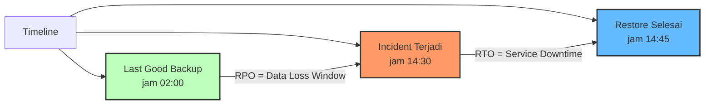
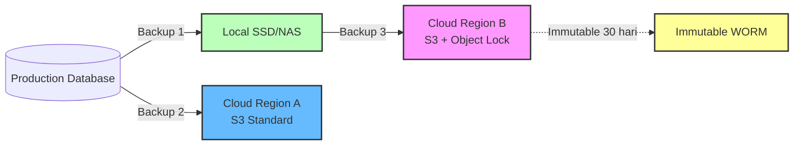

# Modul 01 — Backup Fundamentals: RPO, RTO & 3-2-1 Rule

## 1. Mengapa Backup Itu Krusial?

Realita kelam yang harus kita hadapi:
- **Database corruption** akibat bug aplikasi atau human error (`DROP TABLE`).
- **Ransomware** mengenkripsi data dan meminta tebusan.
- **Cloud region outage** (AWS us-east-1 pernah down beberapa jam).
- **Kubernetes cluster** di-destroy saat eksperimen atau tagihan tak dibayar.
- **Insider threat**: engineer dengan akses destruktif.

> **Tanpa backup yang teruji, data Anda TIDAK benar-benar aman.**

---

## 2. Dua Metrik Paling Penting: RPO & RTO



### RPO (Recovery Point Objective)
**Seberapa banyak data yang boleh hilang?** Diukur dalam **waktu**.
- Backup harian jam 02:00, incident jam 14:30 → RPO = 12 jam 30 menit data hilang.
- Backup setiap 5 menit (WAL streaming) → RPO = max 5 menit data hilang.

### RTO (Recovery Time Objective)
**Berapa lama sistem boleh down?** Diukur dalam **waktu**.
- Restore dari S3 butuh 15 menit → RTO = 15 menit.
- Restore perlu rebuild infrastructure 4 jam → RTO = 4 jam.

### Tabel Contoh SLO

| Kelas Data | RPO | RTO | Contoh |
| :--- | :--- | :--- | :--- |
| **Kritis (Tier 0)** | ≤ 5 menit | ≤ 30 menit | Database transaksi finansial |
| **Penting (Tier 1)** | ≤ 1 jam | ≤ 4 jam | Database user aplikasi |
| **Non-Kritis (Tier 2)** | ≤ 24 jam | ≤ 24 jam | Data analitik, log historis |

---

## 3. Aturan Backup 3-2-1

Aturan emas backup yang telah teruji puluhan tahun:

```
3 salinan data
2 jenis media berbeda (misal disk + cloud)
1 salinan di lokasi offsite (geo-distant / cloud region lain)
```



### Tambahan Praktik Terbaik:
- **3-2-1-1-0**: tambah 1 immutable copy + 0 error setelah verifikasi (NIST 2022 standard).
- **Object Lock / WORM**: bucket S3 yang tidak bisa dihapus selama N hari (anti-ransomware).
- **Encryption at Rest**: backup terenkripsi menggunakan KMS.

---

## 4. Jenis-Jenis Backup

| Jenis | Deskripsi | Kelebihan | Kekurangan |
| :--- | :--- | :--- | :--- |
| **Full Backup** | Salin seluruh data | Restore cepat & sederhana | Butuh storage besar & lama |
| **Incremental** | Hanya salin perubahan sejak backup terakhir | Cepat & hemat storage | Restore perlu rekonstruksi chain |
| **Differential** | Salin perubahan sejak full backup terakhir | Restore lebih cepat dari incremental | Storage membesar seiring waktu |
| **Snapshot** | Point-in-time copy via storage layer | Sangat cepat | Tergantung storage backend |
| **WAL Streaming** (DB only) | Stream transaksi ke remote secara kontinu | RPO sangat kecil (≤ menit) | Hanya untuk database |

---

## 5. Hands-on Lab: pg_dump CronJob S3

### Langkah 1: Setup S3 Bucket

```bash
# Buat bucket (pada MinIO lokal atau AWS S3 nyata)
aws s3 mb s3://db-backups-cluster-01 --region us-east-1

# Atau pada MinIO (jika lokal):
mc alias set local http://minio.minio.svc.cluster.local:9000 $S3_ACCESS $S3_SECRET
mc mb local/db-backups-cluster-01
```

### Langkah 2: Buat Secret untuk Kredensial

```bash
kubectl apply -f minggu-18/manifests/01-pg-dump-cronjob.yaml
```

*Output yang Diharapkan:*
```text
secret/postgres-backup-secrets created
cronjob.batch/postgres-daily-dump created
```

### Langkah 3: Trigger Manual Job untuk Verifikasi

```bash
# Buat Job dari CronJob template (manual trigger)
kubectl create job --from=cronjob/postgres-daily-dump manual-backup-001 -n production

# Pantau progress
kubectl logs -n production -l app=postgres-backup -f
```

*Output yang Diharapkan:*
```text
Backup started: 2026-08-11T19:00:00Z
Compressing done. Size: 245M
upload: /tmp/prod-db-20260811-190000.sql.gz to s3://db-backups-cluster-01/prod-db-20260811-190000.sql.gz
Backup complete: s3://db-backups-cluster-01/prod-db-20260811-190000.sql.gz
```

### Langkah 4: Verifikasi Backup di S3

```bash
aws s3 ls s3://db-backups-cluster-01/ --human-readable
```

*Output yang Diharapkan:*
```text
2026-08-11 19:00:00  245.0 MiB  prod-db-20260811-190000.sql.gz
```

### Langkah 5: Restore Uji Coba (Wajib Sebelum Insiden!)

```bash
# Download backup
aws s3 cp s3://db-backups-cluster-01/prod-db-20260811-190000.sql.gz /tmp/

# Restore ke database kosong
createdb -h postgres-restored.production.svc.cluster.local -U postgres prod_db_restored
pg_restore -h postgres-restored.production.svc.cluster.local -U postgres -d prod_db_restored /tmp/prod-db-20260811-190000.sql.gz

# Verifikasi jumlah row
psql -h postgres-restored.production.svc.cluster.local -U postgres -d prod_db_restored \
  -c "SELECT COUNT(*) FROM users;"
```

> **PRINSIP EMAS**: Backup yang TIDAK PERNAH diuji restore-nya = backup yang tidak ada saat insiden.

---

## 6. Ringkasan Modul

1. **RPO** mengukur toleransi kehilangan data, **RTO** mengukur toleransi downtime.
2. **3-2-1 Rule**: 3 salinan, 2 media, 1 offsite.
3. **Full + Incremental + WAL Streaming** adalah kombinasi ideal untuk database.
4. **pg_dump CronJob** melakukan full logical backup harian ke S3.
5. **Wajib uji restore** secara berkala (quarterly atau monthly).