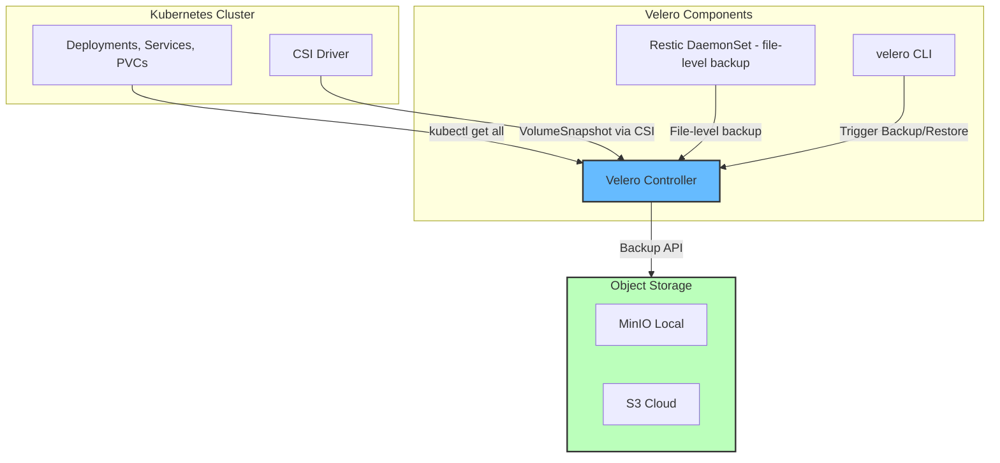

# Modul 02 — Velero: Cluster-Level Backup & Restore

## 1. Apa Itu Velero?

**Velero** (sebelumnya Heptio Ark) adalah tool open-source untuk **backup & restore seluruh objek Kubernetes** — termasuk Deployment, Service, ConfigMap, Secret, CRD, **dan Persistent Volume (PV)** — ke dalam object storage S3-compatible.

Velero sangat penting karena Kubernetes **tidak punya built-in backup mechanism** (etcd backup hanya mencakup metadata K8s, bukan isi Persistent Volume).



### Apa yang Dibackup Velero?
| Disimpan di S3 | Tidak Disimpan |
| :--- | :--- |
| ✅ Semua objek Kubernetes (Deployment, Service, dll.) | ❌ Image container (yang ada di registry) |
| ✅ ConfigMap & Secret (terenkripsi opsional) | ❌ Node configuration (hostname, IP) |
| ✅ Persistent Volume via CSI Snapshot | ❌ Ephemeral disk Pod |
| ✅ RBAC, Network Policies, CRDs | ❌ Helm release info (perlu plugin) |

---

## 2. Hands-on Lab: Instalasi Velero + MinIO

### Langkah 1: Jalankan MinIO Lokal (Docker)

```bash
# Jalankan MinIO sebagai S3-compatible storage
docker run -d --name minio \
  -p 9000:9000 -p 9001:9001 \
  -e MINIO_ROOT_USER=minioadmin \
  -e MINIO_ROOT_PASSWORD=minioadmin \
  quay.io/minio/minio server /data --console-address ":9001"

# Buat bucket
docker exec minio sh -c "mkdir -p /data/velero-backups"
```

Akses MinIO Console di `http://localhost:9001` (user: minioadmin / password: minioadmin).

### Langkah 2: Deploy Velero via Helm

```bash
# Tambah Helm Repo
helm repo add vmware-tanzu https://vmware-tanzu.github.io/helm-charts
helm repo update

# Buat namespace
kubectl create namespace velero

# Buat secret kredensial
kubectl apply -f minggu-18/manifests/02-velero-install-minio.yaml

# Install Velero
helm install velero vmware-tanzu/velero \
  --namespace velero \
  --set credentials.existingSecret=velero-credentials \
  --set deployRestic=true \
  --set configuration.backupStorageLocation[0].name=default \
  --set configuration.backupStorageLocation[0].provider=aws \
  --set configuration.backupStorageLocation[0].bucket=velero-backups \
  --set configuration.backupStorageLocation[0].config.region=minio \
  --set configuration.backupStorageLocation[0].config.s3ForcePathStyle=true \
  --set configuration.backupStorageLocation[0].config.s3Url=http://minio.minio.svc.cluster.local:9000 \
  --set configuration.volumeSnapshotLocation[0].name=default \
  --set configuration.volumeSnapshotLocation[0].provider=aws \
  --set configuration.volumeSnapshotLocation[0].config.region=minio
```

Verifikasi instalasi:

```bash
kubectl get pods -n velero
```

*Output yang Diharapkan:*
```text
NAME                       READY   STATUS    RESTARTS   AGE
velero-7d9d8f9d8-abcde     1/1     Running   0          1m
restic-node1               1/1     Running   0          1m
restic-node2               1/1     Running   0          1m
```

### Langkah 3: Konfigurasi BackupStorageLocation & Schedule

```bash
kubectl apply -f minggu-18/manifests/02-velero-install-minio.yaml
```

*Output yang Diharapkan:*
```text
backupstoragelocation.velero.io/default created
volumesnapshotlocation.velero.io/default created
schedule.velero.io/daily-cluster-backup created
schedule.velero.io/weekly-full-backup created
backup.velero.io/manual-pre-upgrade-2026-08-11 created
```

Verifikasi koneksi ke S3:

```bash
velero backup-location get
```

*Output yang Diharapkan:*
```text
NAME      PROVIDER   BUCKET/PREFIX       STATUS
default   aws        velero-backups      Available
```

### Langkah 4: Backup On-Demand (Pre-Upgrade Test)

```bash
# Jalankan backup manual sebelum deploy besar
velero backup create pre-upgrade-test --include-namespaces production --wait
```

*Output yang Diharapkan:*
```text
Backup request "pre-upgrade-test" submitted successfully.
Waiting for backup to complete. Remaining time: 2m30s
Backup completed with status: Completed. You may check for more details using `velero backup describe pre-upgrade-test`
```

Lihat detail backup:

```bash
velero backup describe pre-upgrade-test --details
```

*Output yang Diharapkan:*
```text
Name:         pre-upgrade-test
Namespace:    velero
Status:       Completed
Total items to be backed up: 42
Items backed up: 42
Backup Size:   1.2Gi
```

---

## 3. Hands-on Lab: Restore Drill (Latihan Pemulihan)

**Ini adalah langkah paling krusial — backup tanpa restore drill = backup palsu!**

### Langkah 1: Buat Namespace "Latihan" & Deploy Uji

```bash
kubectl create namespace restore-drill
kubectl run test-nginx --image=nginx --namespace=restore-drill
kubectl run test-redis --image=redis --namespace=restore-drill

# Buat PVC dan tulis data uji
cat <<EOF | kubectl apply -f -
apiVersion: v1
kind: PersistentVolumeClaim
metadata:
  name: test-pvc
  namespace: restore-drill
spec:
  accessModes: [ReadWriteOnce]
  resources:
    requests:
      storage: 1Gi
EOF

# Tulis data penting ke PVC
kubectl run -n restore-drill data-writer --image=busybox --rm -it --restart=Never \
  -- sh -c "echo 'CRITICAL DATA 2026-08-11' > /data/marker.txt && sleep 30"
```

### Langkah 2: Hapus Namespace (Simulasi Disaster)

```bash
kubectl delete namespace restore-drill --wait=false
```

*Output yang Diharapkan:* `namespace/restore-drill deleted`

### Langkah 3: Restore dari Backup

```bash
velero restore create restore-drill-01 --from-backup pre-upgrade-test --wait
```

*Output yang Diharapkan:*
```text
Restore request "restore-drill-01" submitted successfully.
Waiting for restore to complete. Remaining time: 30s
Restore completed with status: Completed. You may check for more details.
```

### Langkah 4: Verifikasi Hasil Restore

```bash
# Cek namespace kembali
kubectl get all -n restore-drill

# Verifikasi PVC dan data kritis
kubectl exec -n restore-drill -it $(kubectl get pod -n restore-drill -o name | head -1) -- cat /data/marker.txt
```

*Output yang Diharapkan:*
```text
CRITICAL DATA 2026-08-11  <-- Data berhasil dikembalikan!
```

---

## 4. Velero Backup Modes

### Mode 1: CSI Snapshot (Default & Recommended)

Menggunakan VolumeSnapshot CRD dari CSI Driver. Snapshot disimpan di cloud (EBS, GCP PD, Azure Disk).
- ✅ Cepat (second-level).
- ✅ Incremental.
- ❌ Tergantung CSI driver cloud.

### Mode 2: Restic (File-Level Backup)

DaemonSet Restic di setiap Node yang membaca file di dalam Pod & mengirim ke S3.
- ✅ Bekerja tanpa CSI Snapshot.
- ✅ Bisa backup database files yang sedang ditulis.
- ❌ Lambat untuk volume besar.

### Mode 3: Kopia (Modern, Ringan)

Penerus Restic dari Velero 1.10+ dengan kompresi & dedup lebih baik.

---

## 5. Ringkasan Modul

1. **Velero** adalah solusi backup & restore standar untuk Kubernetes.
2. **MinIO** (S3-compatible) adalah target backup lokal yang ideal untuk latihan.
3. **Backup harian terjadwal** via Schedule CRD dengan `ttl` untuk retention otomatis.
4. **Restore drill** wajib dilakukan rutin untuk membuktikan backup benar-benar bisa dipulihkan.
5. **CSI Snapshot** lebih cepat, **Restic** lebih universal, **Kopia** modern dan efisien.