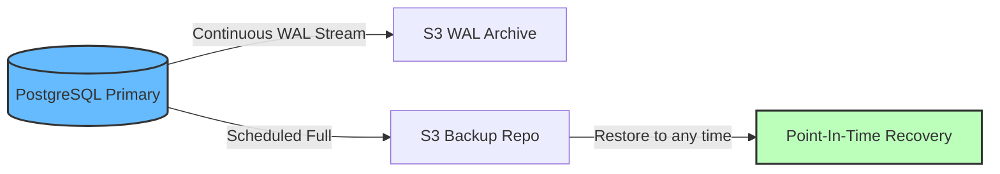
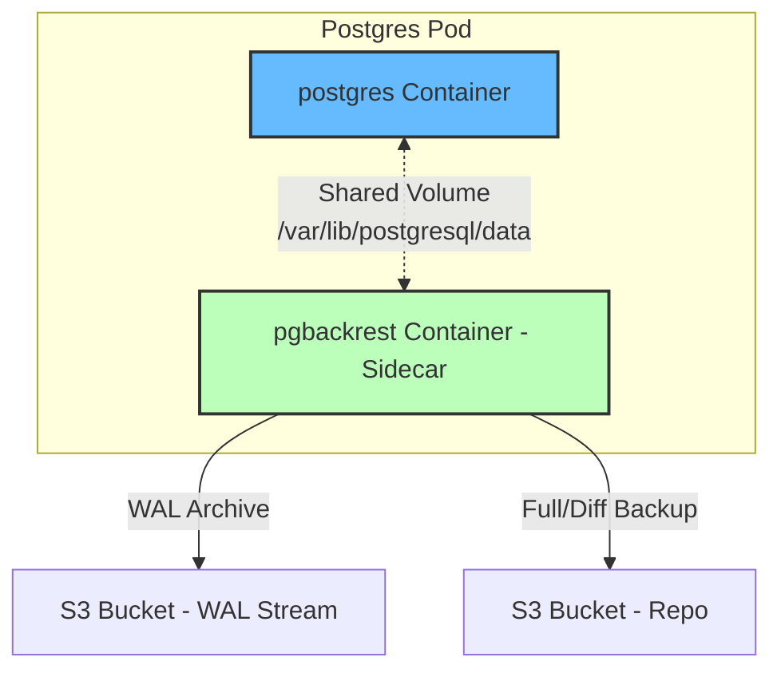

# Modul 03 — PgBackRest: PostgreSQL Point-In-Time-Recovery (PITR)

## 1. Mengapa pg_dump Saja Tidak Cukup?

`pg_dump` dari Modul 01 menghasilkan **logical backup** (SQL statements) yang diambil pada satu titik waktu. Kelemahannya:

1. **RPO Tinggi**: Backup harian = RPO 24 jam data hilang.
2. **Restore Lambat**: pg_restore butuh reconstruct semua SQL → restore database 100 GB bisa berjam-jam.
3. **Tidak Bisa PITR**: Tidak ada cara restore ke "jam 14:30:15 sebelum incident", hanya bisa ke "snapshot kemarin jam 02:00".

**PgBackRest** menyelesaikan semua ini dengan fitur:

| Fitur | Penjelasan |
| :--- | :--- |
| **WAL Archiving** | Setiap transaksi ditulis ke Write-Ahead Log dan dikirim ke S3 secara *real-time*. |
| **Full Backup** | Snapshot konsisten seluruh database. |
| **Differential Backup** | Hanya blok yang berubah sejak full backup terakhir. |
| **Incremental Backup** | Hanya blok yang berubah sejak backup terakhir (full atau diff). |
| **PITR (Point-In-Time Recovery)** | Restore ke titik waktu manapun dalam rentang WAL archive. |
| **Encryption** | Backup terenkripsi AES-256. |
| **Parallel Backup/Restore** | Multi-process untuk backup & restore cepat. |



---

## 2. Arsitektur PgBackRest



**Cara kerja**: pgbackrest container berjalan sebagai sidecar di Pod Postgres, sharing volume data, lalu mengirim WAL ke S3 *setiap transaksi*.

---

## 3. Hands-on Lab: Setup PgBackRest

### Langkah 1: Deploy ConfigMap & StatefulSet Postgres

```bash
kubectl apply -f minggu-18/manifests/03-pgbackrest-config.yaml
```

*Output yang Diharapkan:*
```text
configmap/pgbackrest-config created
secret/pgbackrest-s3-credentials created
statefulset.apps/postgres-primary created
cronjob.batch/pgbackrest-full-weekly created
cronjob.batch/pgbackrest-diff-daily created
```

### Langkah 2: Inisialisasi Stanza

Masuk ke pod postgres dan jalankan stanza-create:

```bash
kubectl exec -n production -it sts/postgres-primary -c pgbackrest -- \
  pgbackrest --stanza=production_db stanza-create
```

*Output yang Diharapkan:*
```text
stanza-create command begin
...
stanza-create command end: completed successfully
```

### Langkah 3: Verifikasi WAL Archiving Aktif

```bash
kubectl exec -n production -it sts/postgres-primary -c postgres -- \
  psql -U admin -c "SHOW archive_command;"
```

*Output yang Diharapkan:*
```text
              archive_command
-------------------------------------------
 /usr/bin/pgbackrest --stanza=production_db archive-push %p
```

Buat transaksi uji untuk memastikan WAL ter-archive:

```bash
kubectl exec -n production -it sts/postgres-primary -c postgres -- \
  psql -U admin -d production_db -c "CREATE TABLE test_wal(id SERIAL PRIMARY KEY, ts TIMESTAMP DEFAULT NOW());"
kubectl exec -n production -it sts/postgres-primary -c postgres -- \
  psql -U admin -d production_db -c "INSERT INTO test_wal DEFAULT VALUES;"
```

Cek WAL yang ter-archive di S3:

```bash
kubectl exec -n production -it sts/postgres-primary -c pgbackrest -- \
  pgbackrest --stanza=production_db info
```

*Output yang Diharapkan:*
```text
stanza: production_db
    status: ok
    cipher: aes-256-cbc
    
    wal archive min/max (15):
        0000000500000000000000A1/0000000500000000000000A8
    ...
    
    full backup: 20250811-180000F
        timestamp start/stop: 2025-08-11 18:00/2025-08-11 18:15
        wal start/stop: 0000000500000000000000A0/0000000500000000000000A8
        database size: 245MB, database backup size: 245MB
```

### Langkah 4: Trigger Backup Manual (Type Full)

```bash
kubectl exec -n production -it sts/postgres-primary -c pgbackrest -- \
  pgbackrest --stanza=production_db backup --type=full
```

*Output yang Diharapkan:*
```text
backup command begin
P00   INFO: backup command begin
P00   WARN: no prior backup exists, setting backup type to full
P01   INFO: backup file 100% complete (245MB) - ETA 0s
P00   INFO: backup command end: completed successfully
```

### Langkah 5: Trigger Differential Backup

```bash
kubectl exec -n production -it sts/postgres-primary -c pgbackrest -- \
  pgbackrest --stanza=production_db backup --type=diff
```

Diff backup hanya menyimpan perubahan sejak full backup terakhir — jauh lebih cepat & kecil.

---

## 4. Point-In-Time Recovery (PITR) — Fitur Paling Krusial

### Langkah 1: Catat Waktu "Before Incident"

Misalnya, kita tahu bahwa bug aplikasi menghapus tabel `users` pada **2026-08-11 14:30:00 WIB** (= 07:30:00 UTC).

```bash
# Catat timestamp target recovery
export TARGET_TIME="2026-08-11 07:29:55"
```

### Langkah 2: Hentikan Postgres (Critical Step!)

```bash
kubectl scale sts postgres-primary -n production --replicas=0
```

### Langkah 3: Restore ke Titik Waktu Tertentu

```bash
kubectl run pg-restore-temp -n production \
  --image=pgbackrest/pgbackrest:latest \
  --rm -it --restart=Never -- \
  pgbackrest --stanza=production_db \
    --type=time \
    --target="2026-08-11 07:29:55" \
    --target-action=promote \
    restore
```

*Output yang Diharapkan:*
```text
restore command begin
P00   INFO: restore command begin
P00   INFO: restore command end: completed successfully
```

### Langkah 4: Start Postgres & Verifikasi Data

```bash
kubectl scale sts postgres-primary -n production --replicas=1
kubectl wait pod -n production -l app=postgres-primary --for=condition=Ready

# Verifikasi data users KEMBALI (sesuai waktu sebelum incident)
kubectl exec -n production sts/postgres-primary -c postgres -- \
  psql -U admin -d production_db -c "SELECT COUNT(*) FROM users;"
```

*Output yang Diharapkan:*
```text
 count
--------
  15234
```

Data kembali ke titik waktu sebelum tabel dihapus!

---

## 5. Restore ke Cluster Berbeda (DR Use Case)

Untuk restore ke cluster DR (region lain), cukup:

```bash
# 1. Deploy StatefulSet Postgres baru di cluster DR (dengan volume kosong)
# 2. Restore dari S3 backup
kubectl exec -n dr-cluster -it sts/postgres-dr -c pgbackrest -- \
  pgbackrest --stanza=production_db \
    --repo1-path=/pgbackrest \
    --type=immediate \
    restore
```

---

## 6. Ringkasan Modul

1. **PgBackRest** = backup PostgreSQL enterprise-grade dengan WAL archiving + PITR.
2. **WAL streaming real-time** = RPO mendekati 0 (hilang < 1 menit).
3. **Full + Differential Backup** = hemat storage & cepat restore.
4. **PITR** memungkinkan restore ke detik manapun dalam rentang WAL archive.
5. **Multi-repo** (repo1 S3 primary + repo2 S3 DR) mendukung strategi 3-2-1 langsung di level aplikasi.