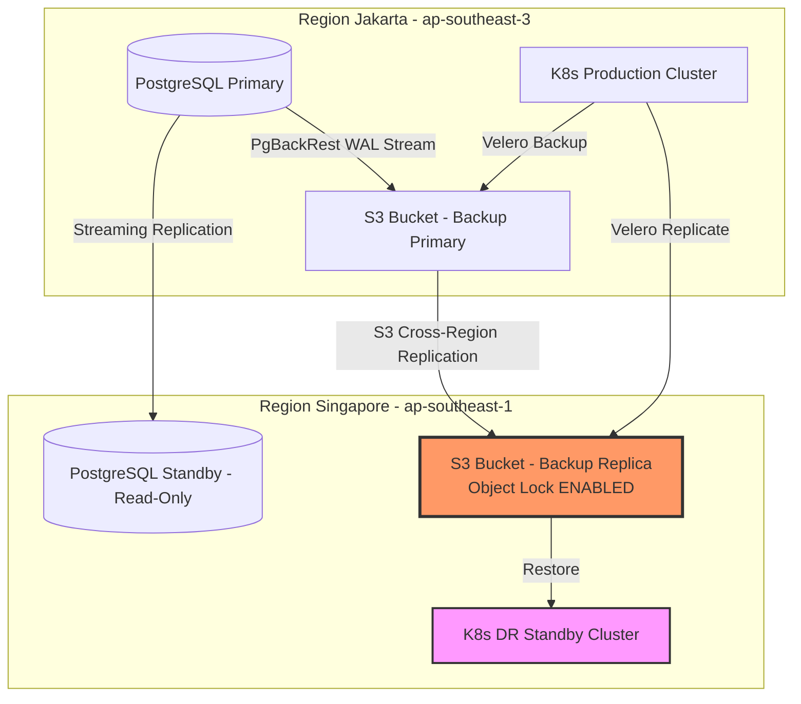
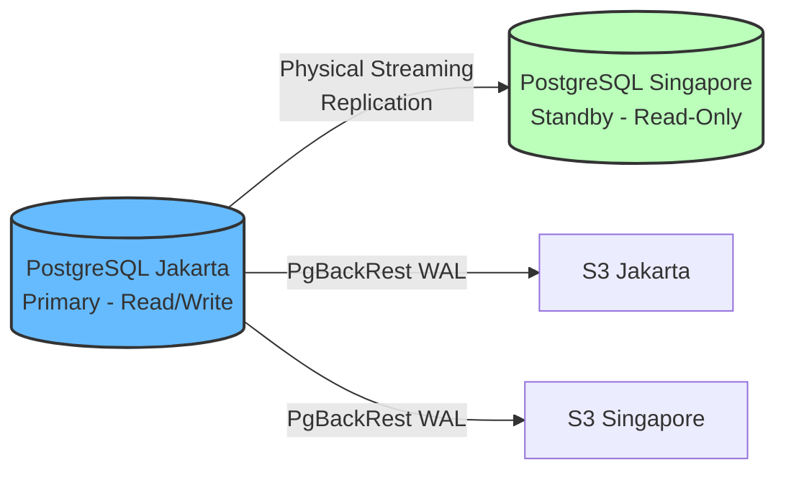
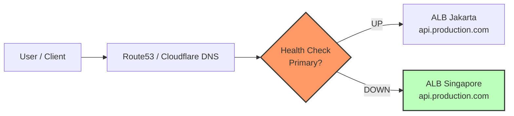

# Modul 04 — Disaster Recovery Strategy & Multi-Region Replication

## 1. Mengapa Multi-Region DR Itu Wajib?

Banyak tim berpikir "backup sudah ada di S3, jadi aman." Kenyataannya:

1. **Regional outage AWS/GCP/Azure** bisa berlangsung berjam-jam — seluruh region mati, termasuk backup di region tersebut.
2. **S3 bucket deletion** (disengaja atau tidak) menghilangkan semua backup dalam sekejap.
3. **Ransomware modern** menargetkan snapshot cloud sebelum mengenkripsi data.
4. **Regulasi** (ISO 27001, PCI DSS, HIPAA) mewajibkan *geographic redundancy* untuk data kritikal.



---

## 2. Pilar Strategi Disaster Recovery

### Pilar 1: Replikasi Backup Offsite (Velero Multi-Region)

**BackupStorageLocation** Velero bisa dikonfigurasi untuk mengirim backup ke **beberapa region** secara paralel.

```yaml
# Primary: Jakarta
apiVersion: velero.io/v1
kind: BackupStorageLocation
metadata:
  name: primary-region-jkt
  namespace: velero
spec:
  provider: aws
  objectStorage:
    bucket: velero-prod-backups-jkt
  config:
    region: ap-southeast-3
---
# DR: Singapore
apiVersion: velero.io/v1
kind: BackupStorageLocation
metadata:
  name: dr-region-sg
  namespace: velero
spec:
  provider: aws
  objectStorage:
    bucket: velero-prod-backups-sg-dr
  config:
    region: ap-southeast-1
```

### Pilar 2: Database Replikasi (Streaming + WAL)



**Konfigurasi `recovery.conf` di Standby:**

```conf
primary_conninfo = 'host=postgres-primary-jkt.production.svc.cluster.local port=5432 user=replicator password=secret'
restore_command = 'pgbackrest --stanza=production_db archive-get %f "%p"'
recovery_target_timeline = 'latest'
```

### Pilar 3: Object Lock / WORM (Anti-Ransomware)

**Object Lock** pada S3 membuat backup **immutable** — tidak bisa dihapus atau ditimpa oleh siapa pun (bahkan root account) selama periode retention yang ditentukan.

```bash
# Aktifkan Object Lock pada bucket DR (harus saat bucket creation!)
aws s3api create-bucket \
  --bucket velero-prod-backups-sg-dr-locked \
  --region ap-southeast-1 \
  --object-lock-enabled-for-bucket

# Terapkan default retention 30 hari COMPLIANCE mode
aws s3api put-object-lock-configuration \
  --bucket velero-prod-backups-sg-dr-locked \
  --object-lock-configuration '{
    "ObjectLockEnabled": "Enabled",
    "Rule": {
      "DefaultRetention": {
        "Mode": "COMPLIANCE",
        "Days": 30
      }
    }
  }'
```

> **COMPLIANCE vs GOVERNANCE**: COMPLIANCE tidak bisa di-override bahkan oleh root; GOVERNANCE bisa di-override dengan permission khusus.

### Pilar 4: Infrastructure as Code (DR Cluster Deployable Instan)

DR cluster harus **bisa di-deploy ulang dari nol** dalam hitungan menit. Semua disimpan sebagai Infrastructure as Code:

- **Terraform** — VPC, Subnet, EKS cluster, IAM roles.
- **Helm / ArgoCD** — Semua aplikasi & dependensi.
- **Velero Restore** — Objek K8s + PVC dari backup terakhir di region DR.

---

## 3. Pola Strategi DR: Active-Passive vs Active-Active

| Pola | Deskripsi | RTO | Biaya | Kompleksitas |
| :--- | :--- | :--- | :--- | :--- |
| **Cold Standby** | Infra DR di-deploy hanya saat bencana | Jam | Rendah | Rendah |
| **Warm Standby** | Infra DR selalu hidup, aplikasi STOP | Menit | Sedang | Sedang |
| **Hot Standby / Active-Passive** | Infra + DB hidup, tapi tidak menerima traffic | Detik-Menit | Tinggi | Sedang-Tinggi |
| **Active-Active** | Kedua region melayani traffic | Detik | Sangat Tinggi | Sangat Tinggi |

### Rekomendasi berdasarkan Tier:

| Tier | Pola DR | RTO Target |
| :--- | :--- | :--- |
| Tier 0 (Kritis) — Database finansial | **Hot Standby** + Streaming Replication | ≤ 5 menit |
| Tier 1 (Penting) — Backend API | **Warm Standby** + Velero Restore | ≤ 30 menit |
| Tier 2 (Non-Kritis) — Analytics | **Cold Standby** | ≤ 24 jam |

---

## 4. Hands-on Lab: Setup Multi-Region Backup

### Langkah 1: Deploy Multi-Region BackupStorageLocation

```bash
kubectl apply -f minggu-18/manifests/04-velero-multi-region.yaml
```

*Output yang Diharapkan:*
```text
backupstoragelocation.velero.io/primary-region-jkt created
backupstoragelocation.velero.io/dr-region-sg created
schedule.velero.io/dr-multi-region-daily created
configmap/dr-runbook created
```

### Langkah 2: Verifikasi Kedua BackupStorageLocation

```bash
velero backup-location get
```

*Output yang Diharapkan:*
```text
NAME                PROVIDER   BUCKET/PREFIX                   STATUS
primary-region-jkt  aws        velero-prod-backups-jkt         Available
dr-region-sg        aws        velero-prod-backups-sg-dr       Available
```

### Langkah 3: Aktifkan S3 Cross-Region Replication (CRR)

```bash
# Konfigurasi CRR dari Jakarta ke Singapore
aws s3api put-bucket-replication \
  --bucket velero-prod-backups-jkt \
  --replication-configuration '{
    "Role": "arn:aws:iam::123456789:role/s3-crr-role",
    "Rules": [{
      "Status": "Enabled",
      "Priority": 1,
      "DeleteMarkerReplication": {"Status": "Disabled"},
      "Filter": {"Prefix": ""},
      "Destination": {
        "Bucket": "arn:aws:s3:::velero-prod-backups-sg-dr",
        "StorageClass": "STANDARD_IA"
      }
    }]
  }'
```

### Langkah 4: Buat Backup dan Verifikasi di Kedua Region

```bash
# Trigger backup untuk mengirim ke kedua lokasi
velero backup create multi-region-test \
  --storage-location primary-region-jkt \
  --include-namespaces production \
  --wait

# Cek backup muncul di PRIMARY
velero backup describe multi-region-test

# Cek backup sudah ada di bucket Singapore (via S3 CRR)
aws s3 ls s3://velero-prod-backups-sg-dr/backups/ --region ap-southeast-1 --recursive
```

*Output yang Diharapkan:*
```text
2026-08-11 19:45:02  156.3 MiB  backups/multi-region-test/multi-region-test.tar.gz
2026-08-11 19:45:02      1.2 KiB  backups/multi-region-test/velero-backup.json
```

### Langkah 5: Deploy DR Runbook sebagai ConfigMap

```bash
# Runbook sudah ter-deploy dari manifests/04-velero-multi-region.yaml
kubectl get configmap dr-runbook -n velero -o jsonpath='{.data.runbook\.md}'
```

*Output yang Diharapkan:* Isi runbook DR lengkap (prosedur langkah-demi-langkah).

---

## 5. Database DR: PostgreSQL Streaming Replication

### Setup PostgreSQL Standby di Cluster DR

```yaml
# StatefulSet Postgres Standby di cluster Singapore
apiVersion: apps/v1
kind: StatefulSet
metadata:
  name: postgres-dr-standby
  namespace: production
spec:
  serviceName: postgres-dr-standby
  replicas: 1
  selector:
    matchLabels:
      app: postgres-dr-standby
  template:
    metadata:
      labels:
        app: postgres-dr-standby
    spec:
      containers:
      - name: postgres
        image: postgres:16
        env:
        - name: POSTGRES_PASSWORD
          valueFrom:
            secretKeyRef:
              name: postgres-dr-secrets
              key: password
        - name: PGDATA
          value: /var/lib/postgresql/data/pgdata
        volumeMounts:
        - name: postgres-data
          mountPath: /var/lib/postgresql/data
        - name: pgbackrest-config
          mountPath: /etc/pgbackrest
      - name: pgbackrest
        image: pgbackrest/pgbackrest:latest
        envFrom:
        - secretRef:
            name: pgbackrest-s3-credentials-dr
        volumeMounts:
        - name: postgres-data
          mountPath: /var/lib/postgresql/data
        - name: pgbackrest-config
          mountPath: /etc/pgbackrest
      volumes:
      - name: pgbackrest-config
        configMap:
          name: pgbackrest-config
  volumeClaimTemplates:
  - metadata:
      name: postgres-data
    spec:
      accessModes: ["ReadWriteOnce"]
      resources:
        requests:
          storage: 200Gi
```

---

## 6. DNS Failover Strategy

### Global Traffic Management



**Konfigurasi failover dengan Route53:**

```bash
# Primary record (Jakarta)
aws route53 change-resource-record-sets \
  --hosted-zone-id Z123456789ABC \
  --change-batch '{
    "Changes": [{
      "Action": "UPSERT",
      "ResourceRecordSet": {
        "Name": "api.production.com",
        "Type": "A",
        "SetIdentifier": "primary-jkt",
        "Failover": "PRIMARY",
        "TTL": 60,
        "AliasTarget": {
          "HostedZoneId": "Z2PCDNR3VC2JQN",
          "DNSName": "alb-jkt-123456789.ap-southeast-3.elb.amazonaws.com",
          "EvaluateTargetHealth": true
        }
      }
    }]
  }'

# Secondary record (Singapore)
aws route53 change-resource-record-sets \
  --hosted-zone-id Z123456789ABC \
  --change-batch '{
    "Changes": [{
      "Action": "UPSERT",
      "ResourceRecordSet": {
        "Name": "api.production.com",
        "Type": "A",
        "SetIdentifier": "secondary-sg",
        "Failover": "SECONDARY",
        "TTL": 60,
        "AliasTarget": {
          "HostedZoneId": "Z2PCDNR3VC2JQN",
          "DNSName": "alb-sg-987654321.ap-southeast-1.elb.amazonaws.com",
          "EvaluateTargetHealth": true
        }
      }
    }]
  }'
```

---

## 7. Metrik Kunci untuk Monitoring DR Readiness

| Metrik | Sumber | Target | Alert |
| :--- | :--- | :--- | :--- |
| **Backup Age** (`velero_backup_last_success_timestamp`) | Velero Prometheus metrics | ≤ 25 jam sejak terakhir | P1 — backup gagal > 24 jam |
| **WAL Archive Lag** (`pgbackrest_wal_archive_lag_bytes`) | PgBackRest info | ≤ 50 MB | P1 — lag > 100 MB |
| **Replication Lag** (`pg_stat_replication.replay_lag`) | PostgreSQL | ≤ 10 detik | P2 — lag > 60 detik |
| **DR Cluster Health** (kubectl get nodes) | Kube-state-metrics | Semua Ready | P2 — node NotReady |
| **S3 Object Lock Compliance** | AWS Config | Bucket DR LOCKED | P1 — Object Lock disabled |
| **Last DR Drill Date** | Manual / Calendar | ≤ 90 hari sejak terakhir | P3 — drill overdue |

---

## 8. Ringkasan Modul

1. **Multi-region backup** adalah lapisan pertahanan terakhir dari regional outage.
2. **Velero BackupStorageLocation** mendukung backup ke beberapa region paralel.
3. **S3 Cross-Region Replication** + **Object Lock** = anti-ransomware & anti-regional-outage.
4. **PostgreSQL streaming replication** ke cluster DR memberikan RTO < 5 menit untuk database.
5. **DNS failover** (Route53/Cloudflare) menangani traffic switch otomatis.
6. **Monitoring DR readiness** sama pentingnya dengan backup itu sendiri — backup yang stale = tidak berguna saat bencana.
7. **Runbook DR** harus didokumentasikan sebagai ConfigMap di cluster dan diuji berkala.
