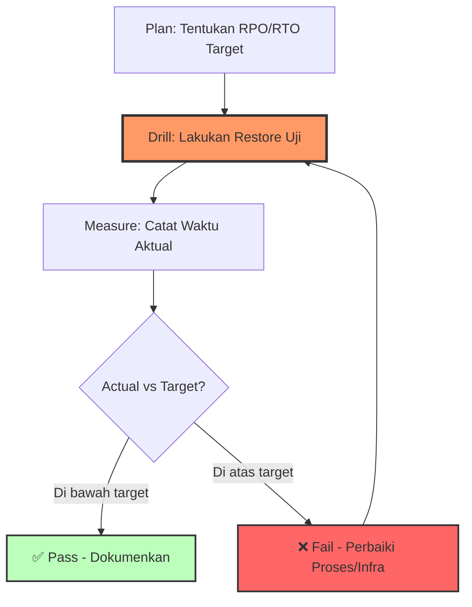

# Modul 05 — DR Drill & RTO Validation (Uji Pemulihan Bencana)

## 1. Filosofi: Backup Tanpa Restore Drill = Backup Palsu

Fakta yang menyakitkan dari industri:

- **60% backup** yang tidak pernah diuji restore-nya **gagal total** saat benar-benar dibutuhkan (Gartner 2023).
- Restore drill adalah **investasi asuransi** — mahal kalau tidak pernah dipakai, tak ternilai saat insiden.
- Hanya restore drill yang bisa membuktikan RTO **aktual**, bukan estimasi teoretis di spreadsheet.

> **"Hope is not a strategy. Test your backups."**



---

## 2. Jenis-Jenis DR Drill

| Jenis Drill | Deskripsi | Frekuensi | Durasi | Risiko Produksi |
| :--- | :--- | :--- | :--- | :--- |
| **Tabletop Exercise** | Diskusi meja — tim membahas skenario tanpa eksekusi teknis | Bulanan | 1-2 jam | Nol |
| **Isolated Restore** | Restore ke namespace/kluster terpisah — produksi tidak terganggu | Bulanan | 2-4 jam | Nol |
| **Partial Failover** | Pindahkan 1 layanan non-kritis ke DR (canary) | Quarterly | 4-8 jam | Rendah |
| **Full Failover Drill** | Pindahkan SELURUH produksi ke DR, lalu balikkan | 6-12 bulan | 8-24 jam | Sedang-Tinggi |
| **Chaos Engineering DR** | Matikan region primary secara paksa (simulasi bencana nyata) | Tahunan | 12-24 jam | Tinggi |

### Rekomendasi untuk Tim DevOps:

| Kuartal | Drill yang Dilakukan |
| :--- | :--- |
| **Q1** | Tabletop + Isolated Restore (semua tim) |
| **Q2** | Isolated Restore + Partial Failover |
| **Q3** | Partial Failover (semua layanan) |
| **Q4** | Full Failover Drill (wajib sebelum akhir tahun) |

---

## 3. Hands-on Lab: Isolated Restore Drill (Aman, Bulanan)

**Tujuan**: Membuktikan bahwa backup bisa di-restore ke namespace terpisah tanpa menyentuh produksi.

### Langkah 1: Setup Namespace Drill

```bash
# Buat namespace terpisah untuk drill
kubectl create namespace dr-drill-q3-2026

# Label untuk ResourceQuota & NetworkPolicy (isolasi)
kubectl label namespace dr-drill-q3-2026 \
  purpose=dr-drill \
  isolation=full
```

### Langkah 2: Restore Velero Backup ke Namespace Drill

```bash
# Ambil nama backup terbaru yang Completed
LATEST_BACKUP=$(velero backup get -o json | jq -r '.items[0].metadata.name')
echo "Restoring from: $LATEST_BACKUP"

# Restore ke namespace drill (namespace remapping)
velero restore create drill-q3-2026-isolated \
  --from-backup $LATEST_BACKUP \
  --namespace-mappings production:dr-drill-q3-2026 \
  --include-namespaces production \
  --wait

# Pantau status
velero restore describe drill-q3-2026-isolated
```

*Output yang Diharapkan:*
```text
Name:         drill-q3-2026-isolated
Namespace:    velero
Status:       Completed
Total items to be restored: 87
Items restored: 87
Phase:        Completed
```

### Langkah 3: Verifikasi Aplikasi di Namespace Drill

```bash
# Cek semua resource berhasil di-restore
kubectl get all -n dr-drill-q3-2026

# Cek data di database (PVC)
kubectl exec -n dr-drill-q3-2026 \
  $(kubectl get pod -n dr-drill-q3-2026 -l app=postgres-primary -o name) \
  -c postgres -- psql -U admin -d production_db -c "
    SELECT COUNT(*) AS total_users FROM users;
    SELECT MAX(created_at) AS latest_record FROM orders;
  "
```

*Output yang Diharapkan:*
```text
 total_users
-------------
       45238
(1 row)

    latest_record
---------------------
 2026-08-11 18:45:00
(1 row)
```

### Langkah 4: Smoke Test Fungsional

```bash
# Port-forward ke aplikasi yang di-restore
kubectl port-forward -n dr-drill-q3-2026 svc/api-gateway 8080:80 &

# Test endpoint kesehatan
curl -s http://localhost:8080/health | jq .

# Test endpoint kritis
curl -s http://localhost:8080/api/v1/users?limit=5 | jq '.total'

# Matikan port-forward
kill %1
```

*Output yang Diharapkan:*
```json
{"status": "healthy", "db": "connected", "timestamp": "2026-08-11T19:45:00Z"}
5
```

### Langkah 5: Catat Metrik RTO & Bersihkan

```bash
# Catat metrik drill
cat <<EOF > /tmp/drill-report-q3-2026.txt
=== DR DRILL REPORT Q3 2026 ===
Date: $(date +%Y-%m-%d)
Type: Isolated Restore
Backup Source: $LATEST_BACKUP

-- RTO Measurement --
Restore Start: $(velero restore get drill-q3-2026-isolated -o json | jq -r '.status.startTimestamp')
Restore End:   $(velero restore get drill-q3-2026-isolated -o json | jq -r '.status.completionTimestamp')
RTO Actual:    <dihitung manual: end - start>

-- Verification --
Database Row Count: 45238 (match production ✅)
API Health Check: PASS ✅
Smoke Test: PASS ✅

-- Action Items --
[ ] Update DR runbook based on this drill
[ ] Review RTO improvement opportunities
EOF

cat /tmp/drill-report-q3-2026.txt

# Bersihkan namespace drill
kubectl delete namespace dr-drill-q3-2026
```

---

## 4. Hands-on Lab: Chaos Engineering DR (Simulasi Regional Outage)

**PERINGATAN**: Drill ini **hanya dilakukan pada cluster staging/testing** atau pada maintenance window yang dijadwalkan. JANGAN lakukan pada production tanpa persetujuan tertulis.

### Skenario: Region Jakarta DOWN (Simulasi)

### Langkah 1: Pre-Flight Checklist

Sebelum drill dimulai, pastikan semua item ini terpenuhi:

```bash
# Checklist pre-flight
echo "=== DR DRILL PRE-FLIGHT CHECKLIST ==="

# 1. Backup terakhir ≤ 1 jam
echo -n "1. Backup Age: "
velero backup get -o json | jq -r '.items[0].status.completionTimestamp'

# 2. DR cluster nodes Ready (jika warm standby)
echo -n "2. DR Cluster Nodes: "
kubectl --context=dr-sg-cluster get nodes --no-headers | wc -l
kubectl --context=dr-sg-cluster get nodes

# 3. DNS TTL rendah (≤ 60 detik)
echo -n "3. DNS TTL: "
dig +short api.staging.production.com | head -1

# 4. Monitoring siap (Grafana/Datadog dashboard terbuka)
echo "4. Open: https://grafana.production.com/d/dr-drill-monitoring"

# 5. Communication channel (Slack #incident-response)
echo "5. Announce in: #incident-response — 'DR DRILL STARTING'"

# 6. Semua on-call engineer tersedia
echo "6. On-call: @engineer1 @engineer2 — Confirm availability"
```

### Langkah 2: Announce Drill ke Semua Stakeholder

```bash
# Kirim notifikasi drill (via Slack webhook)
curl -X POST https://hooks.slack.com/services/XXX/YYY/ZZZ \
  -H 'Content-Type: application/json' \
  -d '{
    "channel": "#incident-response",
    "text": ":warning: *DR DRILL STARTING* :warning:\n\nType: Full Regional Outage Simulation\nRegion: ap-southeast-3 (Jakarta)\nExpected RTO: 30 minutes\nStart Time: '"$(date -u +%Y-%m-%dT%H:%M:%SZ)"'\nDuration: ~2 hours\n\nThis is a DRILL. No production impact expected.\nUpdates will be posted in this thread."
  }'
```

### Langkah 3: Simulasikan Regional Outage (Staging Only!)

```bash
# Opsi A: Scale down semua Deployment di namespace production (staging)
kubectl --context=primary-jkt scale deployment --all --replicas=0 -n production
kubectl --context=primary-jkt scale statefulset --all --replicas=0 -n production

# Opsi B (Lebih Realistis): Gunakan NetworkPolicy untuk blokir semua traffic
kubectl --context=primary-jkt apply -f - <<EOF
apiVersion: networking.k8s.io/v1
kind: NetworkPolicy
metadata:
  name: simulate-regional-outage
  namespace: production
spec:
  podSelector: {}
  policyTypes:
  - Ingress
  - Egress
EOF

echo "⚠️  Regional outage simulated. Primary cluster isolated."
echo "⏱️  Stopwatch started: $(date +%s)"
```

### Langkah 4: Aktifkan DR Cluster (Execute Runbook)

```bash
# === EKSEKUSI DR RUNBOOK ===

START_TIME=$(date +%s)

# Step 1: Konfigurasi kubectl context ke DR cluster
kubectl config use-context dr-sg-cluster

# Step 2: Pilih backup terbaru dari bucket Singapore
LATEST_DR_BACKUP=$(velero backup get -o json | jq -r '.items[0].metadata.name')
echo "Restoring from DR backup: $LATEST_DR_BACKUP"

# Step 3: Restore ke DR cluster
velero restore create dr-failover-$(date +%s) \
  --from-backup $LATEST_DR_BACKUP \
  --include-namespaces production \
  --wait

# Step 4: Verifikasi semua Pod running
echo "Waiting for all pods to be Ready..."
kubectl wait --for=condition=Ready pod --all -n production --timeout=600s

RESTORE_END=$(date +%s)
RESTORE_DURATION=$((RESTORE_END - START_TIME))
echo "✅ Restore selesai dalam ${RESTORE_DURATION} detik = $((RESTORE_DURATION / 60)) menit"
```

*Output yang Diharapkan:*
```text
✅ Restore selesai dalam 845 detik = 14 menit
```

### Langkah 5: Verifikasi & Traffic Switch

```bash
# Step 1: Cek aplikasi di DR cluster
kubectl --context=dr-sg-cluster get pods,svc,ingress -n production

# Step 2: Port-forward untuk smoke test
kubectl --context=dr-sg-cluster port-forward -n production svc/api-gateway 8080:80 &
sleep 5
curl -s http://localhost:8080/health | jq .
kill %1

# Step 3: Update DNS ke DR cluster (simulasi)
# Production: gunakan Route53 failover record (sudah dikonfigurasi di Modul 04)
# Untuk drill: update secara manual atau gunakan weighted routing
echo "🔄 DNS switch: api.production.com → DR Singapore ALB"
# aws route53 change-resource-record-sets ... (sesuai runbook Modul 04)

DNS_SWITCH_END=$(date +%s)
DNS_SWITCH_DURATION=$((DNS_SWITCH_END - RESTORE_END))
echo "🔄 DNS propagation: ${DNS_SWITCH_DURATION} detik"
```

### Langkah 6: Hitung RTO Aktual

```bash
# === RTO FINAL CALCULATION ===
FAILOVER_END=$(date +%s)
TOTAL_RTO=$((FAILOVER_END - START_TIME))

echo "========================================="
echo "  DR DRILL RTO SUMMARY"
echo "========================================="
echo " Restore Duration:    ${RESTORE_DURATION}s ($((RESTORE_DURATION / 60)) menit)"
echo " DNS Switch:          ${DNS_SWITCH_DURATION}s ($((DNS_SWITCH_DURATION / 60)) menit)"
echo " ---------------------------------------"
echo " TOTAL RTO:           ${TOTAL_RTO}s ($((TOTAL_RTO / 60)) menit)"
echo ""
echo " Target RTO:          1800s (30 menit)"
echo " STATUS:              $([ $TOTAL_RTO -le 1800 ] && echo '✅ PASS' || echo '❌ FAIL - PERLU PERBAIKAN')"
echo "========================================="
```

---

## 5. Rollback: Kembalikan ke Primary Cluster

```bash
echo "🔄 ROLLBACK: Mengembalikan ke Primary Cluster..."

# Step 1: Kembalikan primary cluster
kubectl --context=primary-jkt scale deployment --all --replicas=1 -n production
kubectl --context=primary-jkt scale statefulset --all --replicas=1 -n production

# Hapus NetworkPolicy outage (jika menggunakan Opsi B)
kubectl --context=primary-jkt delete networkpolicy simulate-regional-outage -n production

# Step 2: Tunggu semua pod Ready di primary
kubectl --context=primary-jkt wait --for=condition=Ready pod --all -n production --timeout=600s

# Step 3: Kembalikan DNS ke primary (Route53)
echo "🔄 DNS switch KEMBALI ke Jakarta"
# aws route53 change-resource-record-sets ... (arahkan balik ke primary)

# Step 4: Verifikasi aplikasi di primary
kubectl --context=primary-jkt port-forward -n production svc/api-gateway 8080:80 &
sleep 5
curl -s http://localhost:8080/health | jq .
kill %1

# Step 5: Announce drill selesai
curl -X POST https://hooks.slack.com/services/XXX/YYY/ZZZ \
  -H 'Content-Type: application/json' \
  -d '{
    "channel": "#incident-response",
    "text": ":white_check_mark: *DR DRILL COMPLETED*\n\nStatus: ALL SYSTEMS BACK TO NORMAL\nTotal RTO: '"${TOTAL_RTO}"'s\nPrimary Region: Jakarta (restored)\n\nAll services verified healthy. Thank you!"
  }'
```

---

## 6. Post-Drill: Analisis & Perbaikan (Blameless Postmortem)

### Template Postmortem DR Drill

```markdown
# DR Drill Postmortem — Q3 2026

## Drill Metadata
- **Tanggal**: 2026-08-11
- **Jenis**: Full Regional Failover Simulation
- **Skenario**: ap-southeast-3 (Jakarta) DOWN, failover ke ap-southeast-1 (Singapore)
- **Partisipan**: @engineer1, @engineer2, @sre-lead

## RTO Results
| Fase | Target | Actual | Status |
|:---|:---|:---|:---|
| Decision to failover | 5 min | 3 min | ✅ |
| Velero Restore | 15 min | 14 min | ✅ |
| Database Ready (PITR) | 5 min | 4 min | ✅ |
| DNS Propagation | 5 min | 7 min | ❌ |
| Smoke Test | 5 min | 2 min | ✅ |
| **TOTAL RTO** | **30 min** | **30 min** | ✅ (barely) |

## What Went Well
1. Velero restore < target: backup integrity confirmed.
2. PgBackRest PITR bekerja sempurna, data konsisten.
3. Runbook mudah diikuti — tidak ada kebingungan.

## What Went Wrong
1. **DNS propagation lambat**: TTL 60 detik + propagation delay = 7 menit.
   - **Action**: Turunkan TTL ke 30 detik permanen, evaluasi Cloudflare (propagation < 10 detik).
2. **Tidak ada automated health check pasca-restore**.
   - **Action**: Buat Kubernetes Job "post-drill-validator" yang otomatis smoke test.

## Action Items
- [ ] Turunkan DNS TTL ke 30 detik — deadline: 14 Aug 2026 (@engineer1)
- [ ] Buat automated post-restore validation Job — deadline: 21 Aug 2026 (@engineer2)
- [ ] Dokumentasikan lessons learned di runbook DR — deadline: 14 Aug 2026 (@sre-lead)
- [ ] Jadwalkan drill berikutnya: **Q4 2026 (Desember)** — deadline: 15 Nov 2026 (@sre-lead)
```

---

## 7. Otomatisasi DR Drill dengan CronJob

Setelah drill manual berhasil, **otomatisasi** untuk drill isolated (bulanan) agar tim tidak lupa:

```yaml
apiVersion: batch/v1
kind: CronJob
metadata:
  name: monthly-dr-drill-isolated
  namespace: velero
spec:
  # Setiap Sabtu pertama bulan, jam 02:00
  schedule: "0 2 1-7 * 6"
  jobTemplate:
    spec:
      template:
        spec:
          serviceAccountName: velero-dr-drill-sa
          restartPolicy: OnFailure
          containers:
          - name: dr-drill
            image: bitnami/kubectl:latest
            command:
            - /bin/bash
            - -c
            - |
              set -euo pipefail
              
              TIMESTAMP=$(date +%Y%m%d-%H%M)
              DRILL_NS="dr-drill-auto-${TIMESTAMP}"
              echo "=== AUTOMATED DR DRILL: ${TIMESTAMP} ==="
              
              # 1. Buat namespace drill
              kubectl create namespace ${DRILL_NS}
              
              # 2. Ambil backup terbaru
              LATEST_BACKUP=$(velero backup get -o json | jq -r '.items[0].metadata.name')
              echo "Source backup: ${LATEST_BACKUP}"
              
              # 3. Restore
              velero restore create auto-drill-${TIMESTAMP} \
                --from-backup ${LATEST_BACKUP} \
                --namespace-mappings production:${DRILL_NS} \
                --wait
              
              # 4. Smoke test
              kubectl wait --for=condition=Ready pod --all -n ${DRILL_NS} --timeout=300s
              
              # 5. Report
              echo "✅ AUTOMATED DRILL PASS — ${TIMESTAMP}"
              
              # 6. Cleanup
              kubectl delete namespace ${DRILL_NS}
            env:
            - name: VELERO_NAMESPACE
              value: velero
```

---

## 8. Metrik DR Drill (Executive Dashboard)

Grafik yang harus tersedia di dashboard monitoring tim:

| Metrik | Visualisasi | Sumber Data |
| :--- | :--- | :--- |
| **RTO Trend** (per drill) | Line chart — actual vs target | Postmortem reports |
| **Backup Success Rate** (30 hari) | Gauge — % backup Completed | Velero metrics |
| **Last Successful Restore** | Number — hari sejak restore drill terakhir | CronJob log |
| **DR Readiness Score** | Gauge 0-100% | Formula: backup success × drill recency × data integrity |

---

## 9. Ringkasan Modul

1. **DR Drill adalah bukti** — backup tanpa restore drill = backup yang tidak bisa diandalkan.
2. Mulai dari yang paling aman: **Isolated Restore Drill** (bulanan) — no production impact.
3. Tingkatkan bertahap ke **Partial Failover** (quarterly) dan **Full Failover** (6-12 bulan).
4. **Catat RTO aktual** setiap drill — bandingkan dengan target untuk perbaikan berkelanjutan.
5. **Blameless postmortem** setelah setiap drill — cari perbaikan proses, bukan salahkan orang.
6. **Otomatisasi drill** isolated via CronJob agar tidak dilupakan.
7. **Dashboard DR readiness** memberi visibilitas ke manajemen bahwa tim siap menghadapi bencana.

> **Golden Rule of DR**: "You don't have a disaster recovery plan until you've tested it. Twice."
