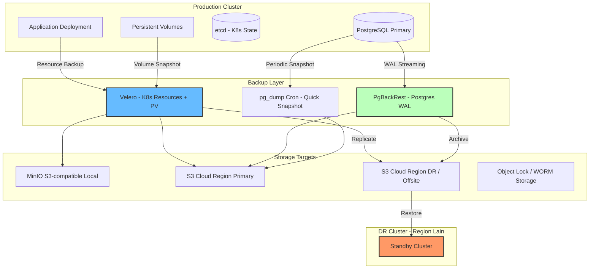

# Minggu 18 — Backup & Disaster Recovery (Velero, PgBackRest, DR Drill)

## 🎯 Gambaran Umum Materi

Minggu 18 membahas **Backup & Disaster Recovery (DR)** — kemampuan paling kritis namun paling sering diabaikan hingga insiden terjadi. Banyak engineer baru berpikir "data sudah di Cloud, jadi aman", padahal:

1. Database yang ter-hapus karena bug aplikasi **bukan kesalahan cloud provider**.
2. Cluster Kubernetes yang di-destroy saat eksperimen perlu *restore* cepat.
3. **Ransomware** mengenkripsi data, backup adalah harapan terakhir.
4. **Regional outage** mengharuskan kita failover ke region lain.

Tujuan utama minggu ini:
1. Memahami konsep **RPO** (Recovery Point Objective) dan **RTO** (Recovery Time Objective).
2. Memahami aturan backup **3-2-1** (3 salinan, 2 media, 1 offsite).
3. Menginstal **Velero** untuk backup seluruh objek Kubernetes + Persistent Volume.
4. Memahami **PgBackRest** untuk backup PostgreSQL yang mendukung Point-In-Time-Recovery.
5. Mendesain strategi **Multi-Region DR** dengan Velero BackupStorageLocation.
6. Melakukan **DR Drill** (latihan pemulihan) untuk mengukur RTO aktual.

---

## 🧭 Peta Backup & DR Stack

---

## 📚 Daftar Modul Pembelajaran

| No | File Modul | Topik Utama | Output Praktis |
| :--- | :--- | :--- | :--- |
| **00** | `README.md` | Overview & Peta Backup & DR | Peta navigasi pekan 18 |
| **01** | `01-backup-fundamentals-rpo-rto.md` | **Backup Fundamentals: RPO, RTO, 3-2-1 Rule** | Definisi metrik DR, pg_dump CronJob harian |
| **02** | `02-velero-cluster-backup.md` | **Velero: Cluster-Level Backup & Restore** | Velero + MinIO, Schedule harian, restore drill |
| **03** | `03-pgbackrest-postgres.md` | **PgBackRest: PostgreSQL PITR** | WAL archiving aktif, full+incremental backup |
| **04** | `04-disaster-recovery-strategy.md` | **DR Strategy & Multi-Region Replication** | Velero BackupStorageLocation multi-region, runbook |
| **05** | `05-dr-drill-rto-validation.md` | **DR Drill & RTO Validation** | Chaos engineering DR drill, RTO aktual terukur |

---

## 🛠️ Prasyarat (Prerequisites)

1. **Cluster Kubernetes aktif** (k3d/k3s/EKS/GKE/AKS) — minimal 1 cluster, idealnya 2 untuk simulasi DR.
2. **`kubectl` & `helm`** terpasang.
3. **MinIO Server** (S3-compatible) — untuk backup target lokal. Bisa via Docker atau Helm chart.
4. **PostgreSQL Cluster** (StatefulSet) — target backup PgBackRest.
5. **Persistent Volume** (PVC) — untuk testing Velero VolumeSnapshot.

---

## 🗓️ Alur Belajar yang Direkomendasikan

1. **Mulai dari Modul 01** untuk memahami terminologi & keputusan desain.
2. **Lanjutkan Modul 02** untuk backup objek K8s + Volume (Velero).
3. **Masuk Modul 03** untuk backup database (PgBackRest) dengan PITR.
4. **Pelajari Modul 04** untuk replikasi multi-region.
5. **Akhiri Modul 05** untuk **uji DR Drill** — yang paling krusial dari semua backup adalah *bisa di-restore*.

> **⏱️ Estimasi Waktu**: 12–16 jam (1 minggu pembelajaran).

---

## ✅ Checklist Kelulusan Minggu 18

- [ ] Mendefinisikan RPO & RTO untuk setiap kelas data (kritis, penting, non-kritis).
- [ ] Menginstal MinIO dan Velero pada cluster.
- [ ] Membuat schedule backup harian Velero.
- [ ] Melakukan **restore drill** Velero pada namespace test.
- [ ] Menginstal PgBackRest, mengaktifkan WAL archiving.
- [ ] Mendesain strategi 3-2-1 (local + cloud + cold storage).
- [ ] Melakukan DR Drill dan mengukur RTO aktual.
- [ ] Membuat runbook DR yang siap digunakan saat insiden.

---

## 🔗 Tautan Penting

- [Velero Documentation](https://velero.io/docs/main/)
- [PgBackRest Documentation](https://pgbackrest.org/)
- [Kubernetes Backup Best Practices](https://kubernetes.io/docs/tasks/backup-application/)
- [AWS S3 Object Lock](https://docs.aws.amazon.com/AmazonS3/latest/userguide/object-lock.html)