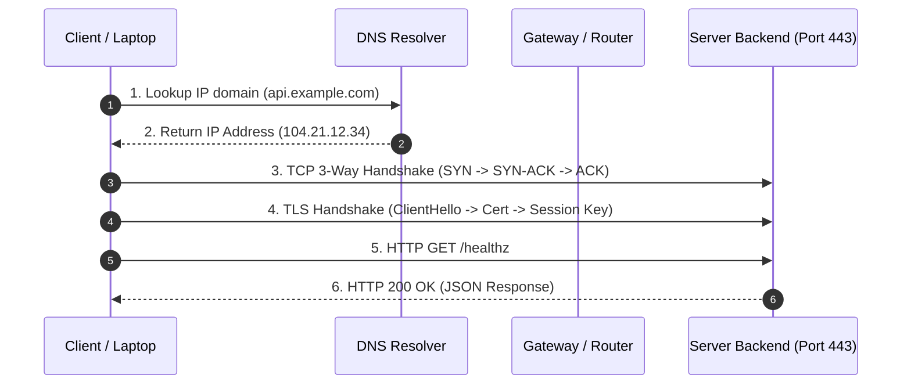

# Modul 02: Networking Fundamental & Diagnostic Tools

> **Target Pembelajaran:** Memahami alur perjalanan data di jaringan (IP, Subnet, DNS, TCP/UDP, HTTP/TLS) serta menguasai tools diagnosis CLI (ping, traceroute, dig, curl, ss) untuk memecahkan kendala konektivitas.

---

## 1. Anatomi Perjalanan Request di Jaringan

Saat Anda mengakses URL `https://api.example.com/healthz` dari laptop atau pod Kubernetes, data melewati serangkaian alur jaringan yang terstruktur.



Jika aplikasi mengalami error, kegagalan bisa terjadi di salah satu tahap di atas:
- **Langkah 1-2 gagal:** Masalah DNS / Resolusi Nama Host (`Could not resolve host`).
- **Langkah 3-4 gagal:** Masalah Port, Firewall, atau Network Routing (`Connection refused` / `Connection timed out`).
- **Langkah 5-6 gagal:** Masalah Aplikasi Backend (`500 Internal Server Error` / `502 Bad Gateway`).

---

## 2. Identitas & Routing Jaringan (IP, Subnet, CIDR, Gateway)

### A. IP Address & Range IP Private

Setiap perangkat di jaringan membutuhkan **IP Address** sebagai identitas unik.

- **IPv4:** Format 32-bit (Contoh: `192.168.1.50`).
- **Loopback Address:** `127.0.0.1` (atau `localhost`), merujuk ke mesin Anda sendiri.
- **Range IP Private (RFC 1918):** Alamat IP khusus untuk jaringan lokal / internal cloud yang tidak bisa diakses langsung dari internet publik:
  - `10.0.0.0 – 10.255.255.255` (Sering digunakan di VPC Cloud & Pod Kubernetes)
  - `172.16.0.0 – 172.31.255.255` (Sering digunakan oleh Docker Network)
  - `192.168.0.0 – 192.168.255.255` (Sering digunakan di WiFi Rumah / Kantor)

### B. Subnetting & CIDR Notation

CIDR (*Classless Inter-Domain Routing*) menentukan jumlah IP dalam sebuah subnet:
- `/32` = 1 IP tunggal (Contoh: `192.168.1.10/32`)
- `/24` = 256 IP (`192.168.1.0` s/d `192.168.1.255`)
- `/16` = 65,536 IP (`10.0.0.0` s/d `10.0.255.255`)

### C. Tools Diagnosis Layer 3 (Network Layer)

```bash
# 1. Melihat alamat IP interface di mesin lokal
ip addr show
# (atau pada macOS: ifconfig)

# 2. Melihat tabel routing dan default gateway
ip route show

# 3. Uji konektivitas dasar ICMP (kirim 4 paket)
ping -c 4 8.8.8.8

# 4. Melacak rute hop/router yang dilalui data ke server tujuan
traceroute google.com
```

**Contoh Output `ping -c 4 8.8.8.8`:**
```text
PING 8.8.8.8 (8.8.8.8) 56(84) bytes of data.
64 bytes from 8.8.8.8: icmp_seq=1 ttl=117 time=14.2 ms
64 bytes from 8.8.8.8: icmp_seq=2 ttl=117 time=13.8 ms

--- 8.8.8.8 ping statistics ---
4 packets transmitted, 4 received, 0% packet loss, time 3004ms
rtt min/avg/max/mdev = 13.812/14.050/14.210/0.180 ms
```

---

## 3. Sistem Nama Domain (DNS Resolution)

DNS (*Domain Name System*) bertindak sebagai "buku telepon internet" yang menerjemahkan nama domain (`github.com`) menjadi alamat IP (`140.82.121.4`).

### A. Konfigurasi DNS di Linux

- `/etc/hosts`: File pemetaan DNS lokal manual (berprioritas tertinggi).
- `/etc/resolv.conf`: Menentukan alamat DNS Resolver IP yang digunakan sistem (misal `nameserver 1.1.1.1`).

### B. Tipe Record DNS Utama

- **A Record:** Domain $
ightarrow$ IPv4 (Contoh: `example.com` $
ightarrow$ `93.184.216.34`)
- **AAAA Record:** Domain $
ightarrow$ IPv6
- **CNAME:** Alias Domain $
ightarrow$ Domain Lain (Contoh: `www.example.com` $
ightarrow$ `example.com`)
- **TXT Record:** Berisi data teks (Sering digunakan untuk verifikasi domain & SPF/DKIM security)

### C. Perintah Inspection DNS (`dig` & `nslookup`)

```bash
# 1. Lookup DNS komplit menggunakan dig
dig github.com

# 2. Output singkat hanya IP address saja
dig +short github.com

# 3. Memeriksa CNAME record
dig github.com CNAME

# 4. Memeriksa hasil pemetaan sistem lokal
getent hosts github.com
```

**Contoh Output `dig +short github.com`:**
```text
140.82.121.4
```

---

## 4. Port, Protokol Transport (TCP/UDP), & Layer Aplikasi (HTTP/TLS)

### A. TCP vs UDP

- **TCP (Transmission Control Protocol):** Andal, berurutan, dan menggunakan *3-Way Handshake* (SYN, SYN-ACK, ACK). Digunakan oleh HTTP, HTTPS, SSH, PostgreSQL.
- **UDP (User Datagram Protocol):** Sangat cepat, tanpa garansi pengiriman paket. Digunakan oleh DNS queries, Video Streaming, VoIP.

### B. Port Standar yang Wajib Diketahui

| Port | Protokol | Kegunaan |
| :---: | :---: | :--- |
| `22` | SSH | Remote terminal access |
| `80` | HTTP | Web biasa (unencrypted) |
| `443` | HTTPS | Web aman dengan sertifikat TLS |
| `53` | DNS | Domain Resolution |
| `5432` | PostgreSQL | Database SQL |
| `6379` | Redis | In-Memory Cache |

### C. Memeriksa Port Terbuka dengan `ss` / `netstat`

```bash
# Menampilkan semua socket listening TCP (-t) & UDP (-u) beserta PID (-p) dan port angka (-n)
ss -tulpen
```

**Contoh Output `ss -tulpen`:**
```text
Netid  State   Recv-Q  Send-Q   Local Address:Port   Peer Address:Port  Process
tcp    LISTEN  0       128          0.0.0.0:80          0.0.0.0:*      users:(("nginx",pid=1234,fd=6))
tcp    LISTEN  0       128          0.0.0.0:22          0.0.0.0:*      users:(("sshd",pid=850,fd=3))
```

### D. Perintah Handal HTTP CLI (`curl`)

`curl` adalah senjata utama SRE untuk menguji Web API dan HTTP Endpoint.

```bash
# 1. Mengirim HTTP GET request dan menampilkan response body
curl https://httpbin.org/get

# 2. Menampilkan HTTP Response Header saja (gaya verbose / I: head only)
curl -I https://httpbin.org/get

# 3. Mode Verbose (-v) untuk melihat seluruh detail TLS handshake dan header
curl -v https://httpbin.org/get

# 4. Mengukur waktu respon HTTP dalam hitungan detik
curl -sS -o /dev/null -w 'Status Code: %{http_code}
Total Time: %{time_total}s
' https://httpbin.org/get
```

**Contoh Output `curl -I https://httpbin.org/get`:**
```text
HTTP/2 200
date: Sat, 15 Aug 2026 10:45:00 GMT
content-type: application/json
content-length: 305
server: gunicorn/19.9.0
access-control-allow-origin: *
```

---

## 5. Konsep Dasar Jaringan dalam Kubernetes

Pemahaman networking dasar di atas terhubung langsung dengan komponen arsitektur Kubernetes:

```
[ Internet ] ──> [ Ingress Controller (L7 Routing) ]
                          │
                          ▼
                 [ ClusterIP Service (Virtual IP Stabil) ]
                          │
            ┌─────────────┴─────────────┐
            ▼                           ▼
  [ Pod A (IP: 10.42.0.5) ]   [ Pod B (IP: 10.42.0.6) ]
```

- **Pod IP:** IP internal sementara yang diberikan ke setiap Pod.
- **Service (ClusterIP):** Alamat IP virtual dan DNS stabil yang men-balance lalu lintas data ke Pod.
- **Ingress:** Entry point HTTP/HTTPS dari luar cluster menuju ke Service internal.

---


### E. Bare-Metal & On-Premise Load Balancing dengan MetalLB

Di cloud publik (AWS/GCP), memprovisi Service `type: LoadBalancer` akan secara otomatis membuat Cloud Load Balancer. Namun pada infrastruktur **On-Premise** (seperti server fisik atau VM di **vCenter vSphere** dan **Proxmox VE**), tidak ada controller cloud otomatis bawaan.

**MetalLB** hadir sebagai solusi On-Premise Load Balancer yang mengalokasikan IP Virtual (VIP) dari pool IP private perusahaan:
- **Layer 2 Mode (ARP/NDP):** Satu node bertindak sebagai penyedia ARP untuk IP virtual LoadBalancer. Cocok untuk jaringan subnet lokal sederhana.
- **BGP Mode:** Node Kubernetes membentuk sesi BGP dengan Router fisik On-Premise (MikroTik, Cisco, Juniper) untuk mengumumkan IP Virtual secara dinamis.

## 6. Lab Hands-on: Diagnostic & Troubleshooting Connectivity

Pada latihan ini, Anda akan mendiagnosis kesehatan endpoint HTTP publik secara sistematis.

### Langkah 1: Jalankan Pengujian Bertahap

```bash
# 1. Uji Resolusi DNS
dig +short httpbin.org

# 2. Uji Konektivitas Port 443 (HTTPS)
curl -vI https://httpbin.org/status/200 2>&1 | grep "SSL connection"

# 3. Simulasikan Pengujian Response Code 404 & 500
curl -sS -o /dev/null -w "HTTP Status: %{http_code}
" https://httpbin.org/status/404
curl -sS -o /dev/null -w "HTTP Status: %{http_code}
" https://httpbin.org/status/500
```

**Hasil Expected Output:**
```text
SSL connection using TLSv1.3 / TLS_AES_256_GCM_SHA384
HTTP Status: 404
HTTP Status: 500
```

---

## 7. Target & Checklist Capaian Pembelajaran

Gunakan checklist ini untuk memverifikasi pemahaman Anda:

- [ ] Mampu menjelaskan alur request dari DNS lookup hingga HTTP Response.
- [ ] Memahami perbedaan IP Public vs IP Private dan penulisan subnet CIDR.
- [ ] Mampu melakukan lookup DNS menggunakan `dig` dan membaca file `/etc/hosts`.
- [ ] Memahami perbedaan TCP vs UDP serta port standar (`22`, `80`, `443`, `5432`).
- [ ] Mampu memeriksa listening port di server menggunakan `ss -tulpen`.
- [ ] Menguasai perintah `curl` dengan flag `-v`, `-I`, dan `-w` untuk mendiagnosis HTTP Response Code.
