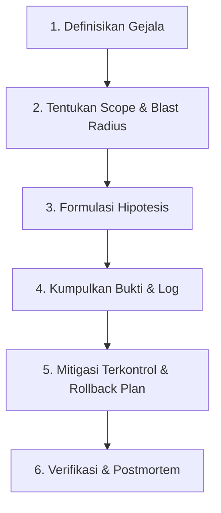

# Modul 05: Metode Troubleshooting & Incident Response

> **Target Pembelajaran:** Menguasai filosofi penyelidikan berbasis bukti, metodologi troubleshooting 6 langkah SRE, penulisan mini runbook/postmortem, serta mempraktikkan diagnosis service bermasalah secara langsung.

---

## 1. Filosofi Troubleshooting SRE: Bukti vs Tebakan

Troubleshooting dalam dunia SRE dan DevOps adalah proses ilmiah untuk mengurangi ketidakpastian secara sistematis.

```
┌────────────────────────────────────────────────────────┐
│ ❌ PENDEKATAN TEBAKAN (Trial & Error Blindly)         │
│  "Main restart server, hapus config, ubah-ubah kode   │
│   tanpa membaca log. Hasil: Masalah makin parah!"     │
├────────────────────────────────────────────────────────┤
│ ✅ PENDEKATAN BERBASIS BUKTI (Evidence-Based SRE)      │
│  "Kumpulkan log -> Cek metrik -> Formulasi hipotesis  │
│   -> Mitigasi terkontrol -> Verifikasi pemulihan."    │
└────────────────────────────────────────────────────────┘
```

---

## 2. Metodologi Troubleshooting 6 Langkah

Saat menerima laporan bahwa sistem mengalami kendala, ikuti **6 Langkah Standar SRE** berikut:



### Penjelasan Detail Setiap Langkah:

1. **Definisikan Gejala (Symptom):** Apa persisnya masalah yang terjadi? (Contoh: "User mendapat error `502 Bad Gateway` saat checkout").
2. **Tentukan Scope & Blast Radius:** Berapa banyak user yang terdampak? Apakah masalah terjadi di semua server atau 1 instance saja?
3. **Formulasi Hipotesis:** Buat daftar kemungkinan penyebab utama berdasarkan perubahan terakhir (misal: "Database kehabisan memori" atau "Service backend down").
4. **Kumpulkan Bukti (Gather Evidence):** Periksa log (`journalctl`), status proses (`ps`), port (`ss`), dan respon jaringan (`curl`).
5. **Lakukan Mitigasi Terkontrol:** Terapkan perbaikan terkecil yang bisa dibalikkan (*rollbackable*). **DILARANG** melakukan banyak perubahan sekaligus!
6. **Verifikasi & Dokumentasi:** Pastikan error hilang dari sisi user, lalu tulis catatan insiden (*postmortem*).

---

## 3. Template Mini Runbook & Postmortem Insiden

Gunakan format standar ini saat menginvestigasi dan mendokumentasikan insiden:

```markdown
# 📋 Incident Postmortem Report

- **Judul Insiden:** HTTP 502 Bad Gateway pada User Service
- **Waktu Kejadian:** 15 Aug 2026, 10:00 WIB - 10:15 WIB (Durasi: 15 menit)
- **Tingkat Keparahan:** High (P1)

### 1. Gejala & Dampak
Aplikasi frontend menampilkan error 502 saat memanggil API backend. Sebanyak 15% transaksi checkout gagal.

### 2. Hasil Penyelidikan & Bukti
- `curl -I http://localhost:8080/healthz` mengembalikan `Connection Refused`.
- `ss -tulpen | grep 8080` menunjukkan tidak ada proses yang mendengarkan di port 8080.
- Log aplikasi (`/var/log/app.log`) menunjukkan: `Out of Memory: Killed process 4321`.

### 3. Root Cause (Penyebab Utama)
Aplikasi mengalami Memory Leak setelah deployment versi v1.2.0.

### 4. Mitigasi & Rollback
- Melakukan rollback deployment kembali ke versi stabil v1.1.0.
- Restart service backend.

### 5. Tindakan Pencegahan (Action Items)
- [ ] Tambahkan Memory Limit pada spesifikasi container.
- [ ] Pasang alert Prometheus jika memori melebihi 80%.
```

---

## 4. Lab Hands-on: Diagnosis & Pemulihan Service Lokal

Pada lab ini, Anda akan mendiagnosis aplikasi lokal yang sengaja mengalami gangguan.

### Langkah 1: Buat Scenario Service Bermasalah

```bash
mkdir -p ~/tahap-0-lab/troubleshoot
cd ~/tahap-0-lab/troubleshoot

# Buat file konfigurasi yang salah (port diblokir / invalid)
cat << 'EOF' > app.conf
PORT=8080
DB_HOST=127.0.0.1
ENABLE_LOG=true
EOF
```

### Langkah 2: Jalankan Penyelidikan Sistematis

Jalankan 4 perintah diagnosis wajib SRE:

```bash
# 1. Cek Port 8080 apakah listening
ss -tulpen | grep 8080 || echo "STATUS: Port 8080 TIDAK AKTIF!"

# 2. Cek apakah ada proses app berjalan
pgrep -af "python" || echo "STATUS: Proses Aplikasi TIDAK BERJALAN!"

# 3. Uji Endpoint lokal dengan curl
curl -v http://localhost:8080/healthz || echo "STATUS: HTTP Request Gagal!"
```

**Hasil Expected Output:**
```text
STATUS: Port 8080 TIDAK AKTIF!
STATUS: Proses Aplikasi TIDAK BERJALAN!
* Connect to localhost port 8080 failed: Connection refused
STATUS: HTTP Request Gagal!
```

---

## 5. Etika & Keselamatan Operasional (Safety Rules)

> ⚠️ **Aturan Keselamatan Utama SRE:**
> 1. **Jangan Berasumsi:** Selalu verifikasi status dengan perintah CLI sebelum mengambil tindakan.
> 2. **Siapkan Langkah Rollback:** Sebelum menjalankan perintah perbaikan atau merestart service, ketahui cara mengembalikannya jika situasi memburuk.
> 3. **Batasi Blast Radius:** Lakukan pengujian perbaikan di lingkungan staging / lab sebelum menyentuh server produksi.

---

## 6. Target & Acceptance Gate Tahap 0

Selamat! Ini adalah **Acceptance Gate Akhir** untuk memastikan Anda siap melangkah ke Tahap 1.

Gunakan checklist evaluasi mandiri berikut:

- [ ] **Linux:** Mampu membuat script bash, menavigasi filesystem, dan membaca log proses.
- [ ] **Networking:** Mampu mendiagnosis masalah jaringan dari layer DNS hingga HTTP response code (`curl`).
- [ ] **Git:** Mampu bekerja dengan branch, melakukan rebase/merge, dan menyelesaikan conflict.
- [ ] **Otomasi:** Memahami sintaks YAML/JSON dan penulisan skrip Bash aman (`set -euo pipefail`).
- [ ] **Troubleshooting:** Mampu mengikuti metodologi diagnosis 6 langkah berbasis bukti.

---

## ⏭️ KELULUSAN TAHAP 0

Jika seluruh checklist modul 01 s/d 05 telah tercentang, **Selamat!** Anda telah memiliki fondasi SRE & DevOps yang kuat.

Silakan melanjutkan ke **[Tahap 1: Minggu 01 — Fundamental Container & Kubernetes](../README.md#tahap-1-fondasi-platform-minggu-01-12)**.
